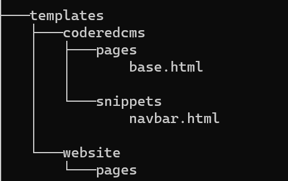

Customizing HTML/CSS in Templates
==================================

Overview
---------
Wagtail CRX is an extension of Wagtail. You can further customize your site by overriding the
built-in templates to suit your needs. For this tutorial, we will assume that you have basic knowledge
of the Django templating system. You can read more about it by visiting
`Django template language <https://docs.djangoproject.com/en/stable/ref/templates/language/>`_.

The templating language uses a series of ```` to pull in content from your page models (found in
the ``models.py`` file) and add minimal logic to the page. This allows it to render the page after content
is added in the CMS and allows you to create multiple pages with the same layout. At the top of the page,
you also want to make sure to either specify that you are **extending a page template** and that you are
pulling in Wagtail tags to make your template work the way it should.

.. note::
    If you are completely overriding a template, you will not use the ````
    at the top of your template. You do, however, need to make sure to use the appropriate template
    tags at the top of the template or your template will not render.

The templates directory inside your ``website`` app is empty by default. Any templates you put
in here will override the default coderedcms templates if they follow the same name and directory
structure. This uses the standard Django template rendering engine. For example, to change the
formatting of the article page, copy ``coderedcms/templates/coderedcms/pages/article_page.html``
to ``website/templates/coderedcms/pages/article_page.html`` and modify it.
The `source code for built-in templates can be found on GitHub
<https://github.com/coderedcorp/coderedcms/blob/main/coderedcms/templates/coderedcms/>`_.

Example 1: Navbar Customization
-------------------------------

The built-in template for the navbar can be found in ``templates/coderedcms/snippets/navbar.html``. This
file may not actually be in your installation folders for your site; however, you can see its contents
by visiting the Wagtail CRX source code here: `navbar.html <https://github.com/coderedcorp/coderedcms/blob/main/coderedcms/templates/coderedcms/snippets/navbar.html>`_.

Let’s say that you want to have a 2-tiered navbar with the logo on the top tier and the menu items on the
second tier. The default navbar does not have that as an option, so you will want to override this template.

Look at your folder structure for your project. In the ``website`` folder, you should see another folder
called ``templates``. In there are two folders as well: ``website`` and ``coderedcms``. The ``coderedcms`` template
folder is likely empty at this point because the CMS is pulling in the default templates from source, but you can
add templates to the ``coderedcms`` folder **if you are overriding the default templates**.

Most of your custom templates will go into your ``website`` folder because they are not overriding the
default templates in the CMS but either extending them or creating completely new ones specific to
your site.

.. note::
    Adding templates to the ``coderedcms`` templates folder does not change the default templates
    throughout all of Wagtail CRX but does override those specific templates for your website app.

Your ``website`` folder currently only has a folder for ``coderedcms`` in the ``templates`` folder.
You can add a new ``website`` folder in ``templates`` (because we will use it in another tutorial),
but for now, you will want to add a ``snippets`` folder inside the ``templates\coderedcms`` folder
so that your folder structure looks something like this:

    Our folder structure for templates within our website app.

The folder structure needs to be the same as the default folder structure in the CMS if you want to
override the navbar template. Now you should have ``templates\coderedcms\snippets``. Navigate to
the ``snippets`` folder and create a ``navbar.html`` file inside of that folder.

**You are now ready to begin customizing the navbar template!**

1. Examine the default template for the navbar. What code will we want to use from it? You can use
   what’s there in your customization.

2. We will need the Wagtail tags at the top, so copy those and paste them into
   your ``navbar.html`` file.

.. code-block:: Django

    

3. Next, we need to figure out how to move the logo (aka the ``navbar-brand``) into its own section for
   the navbar. Maybe we could essentially create two navbars, one that just has the logo and one that has
   the menu. Hmm, let’s try that!

4. We want to preserve the basic functionality of the navbar, so we should keep the tags for CMS settings
   and the overall layout inside of a container.

5. The 2-tiered navbar will have two navbars on top of each other but one will only have the
   ``navbar-brand`` (logo) while the other will allow for adding menu items via the CMS. So, the top
   navbar is not going to have access to CSS settings in the CMS that are reserved for the main navbar –-
   which means that you will need to add any custom classes to the top navbar, such as the background
   color or where you want the logo to be placed. Keep that in mind.

   .. code-block:: Django

      

      
      

      
      <nav class="navbar navbar-header bg-warning">

      
      

      
         

         <a class="navbar-brand" href="/">
               
               
               
               
               {{site.site_name}}
               
         </a>
         

      
      
<!-- /.container -->
      

      </nav>

   We have set the foundation for the top navbar, which will be the banner section for the logo. Instead of
   ``<nav class="navbar ">``, we have added our own Bootstrap classes since this part of the
   navbar will not be getting its CSS settings from the CMS.

   However, we did keep the `` `` block because we want
   to show the name of the site **if no logo is uploaded in the CMS**.

6. Now we can include the code block for the normal navbar beneath it. Place this code below the ``</nav>`` in
   your template. We want to preserve majority of the navbar as-is (without the block for ``navbar-brand``) so that
   when we add menu items in the CMS, those items will show up as navigation links.

   .. code-block:: Django

      <!--Put this below the previous nav closing tag -->

      <nav class="navbar ">

      
      

      
         <button class="navbar-toggler" type="button" data-toggle="collapse" data-target="#navbar" aria-controls="navbar" aria-expanded="false" aria-label="Toggle navigation">
               
         </button>

         

         
         
         <ul class="navbar-nav {{navbar.custom_css_class}}"
               id="{{navbar.custom_id}}" >
               
                  
               
         </ul>
         
         
         <form class="ml-auto form-inline" action="" method="GET">
               
               
               
               

                  <button class="btn btn-outline-primary ml-2" type="submit"></button>
               

         </form>
         

         

      
      
<!-- /.container -->
      

      </nav>

      
      
<!-- /.container -->
      

      {# Navbar offset #}
      
         
         

         
         

         
      

   Let's talk about what is happening here. So, we pulled in the code for the navbar a second time, with the removal of
   ``navbar-brand`` section from the original template, but preserved majority of the default code for this section.
   The ``if`` statements refer to whether or not some settings are chosen in the CMS and tells the template what to do in those
   cases. We also needed to close to top-level ``container``.

   Another section that we kept was for the ``navbar-toggler``, which sets the hamburger menu when the screen sizes change.
   Finally, we also kept the ```` tag in the class for the ``nav`` because we can use CSS classes for this
   navbar from the CMS.

.. note::
    To add classes in the CMS, look for the line **Custom CSS Class**, which can be found as a field in sections of
    the admin for a snippet or page, or in the **Advanced** section of a Layout Block. This is where you would put a class
    like ``bg-warning`` from Bootstrap or a class that you created yourself, like ``logo-banner``.

Adding Custom CSS to the Navbar
'''''''''''''''''''''''''''''''

If you noticed, we have a few custom classes that are not found in Bootstrap. To style our navbar with these classes,
we need to include them in our CSS file and set the styles the way we want. Once you've done that and saved your work,
your navbar is ready to show the world!

CSS files will be found in **website > static > css** in your project folder. Unless you are using SASS, you
will be editing the ``custom.css`` file. For those using SASS, you will want to create a ``navbar.scss`` file in your ``src``
folder and add a link to it in your ``custom.scss`` file.

.. note::
    If you want to learn how to use SASS, we really like this tutorial:
    `SASS Guide <https://sass-lang.com/guide>`_.

This is the CSS that we used for our navbar:

.. code-block:: CSS

    .navbar .nav-link {
        font-family: 16px;
        text-transform: uppercase;
    }

As you can see, you may not need to use a lot of custom CSS. Sometimes a Bootstrap class will work perfectly.
Sometimes all you need to do is customize your template HTML and then add Bootstrap classes as needed. It all
depends on your use case.

For our custom navbar, we needed to un-check the "fixed navbar" option in the CMS via **Settings > CRX Settings** in
order for it to work. Check out what our 2-tiered navbar looks like:

.. figure:: img/advanced_two_tiered_navbar.png
    :alt: Our 2-tiered navbar.

    Our custom 2-tiered navbar on our website.

Example 2: Footer Customization
-------------------------------

Our footer does not need a customized HTML template; however, we think it does need some custom CSS to make it
look the way we want. Some of our CSS can easily be done in the CMS -- without even touching our CSS file!

First, go to the Footer Snippet in the **Snippets > Footers** admin in CMS. We had previously added a Bootstrap
class of ``bg-warning`` to the Attributes section in the Main Footer, but now we want to add CSS classes to each
of the Layout Blocks for the footer as well.

1. All of our footer menu items brush up against the top of the footer block. We can add some padding to
   the footer using `Bootstrap spacing utilities <https://getbootstrap.com/docs/4.0/utilities/spacing/>`_.

2. Let's add the padding class ``pt-5`` (which means "padding-top spacer 5") in the Attributes section of
   the Main Footer. Save and check it out.

   .. figure:: img/advanced_footer_overall_padding.png
      :alt: We added padding to the Attributes section of footer.

      Our footer with pt-5 added as a class in Attributes section.

3. We want to change the way that the links look, but it doesn't seem as if there is a Bootstrap class for that.
   That means that it's time to go into our CSS file.

4. We want our links to be that cherry-red, so we will need to use custom CSS and include it in our CSS file.
   But we also don't want to make ALL of our links this color. That means we should create a class that can be used
   to specify the link. For example, we could add a class called ``cherry-links`` and target the ``a`` tag.

   .. code:: CSS

      .cherry-links a {
      color: #f75990;
      }

   Then we place the ``cherry-links`` class in the **Advanced** section of the Layout Block that contains the text
   for the links, like this:

   .. figure:: img/advanced_customcss1.png
      :alt: Adding a custom class to the Layout Block

      Our custom class added to the Layout Block in CMS

   We add it to every Layout Block that needs it. In this case, we have three blocks with links.

   .. figure:: img/advanced_footer_front.png
      :alt: Our footer right now

      Our footer with the custom classes

.. note::
    We changed the ``pt-5`` class to ``py-5`` to add padding to the top and bottom. Sometimes you will need to try and
    see which classes will give you the results that you want.

What else could we do to make the footer look better? Take some time to play around with Bootstrap classes in the
CMS or create some of your own classes to target elements in the footer.

Making More Drastic CSS Changes Sitewide
----------------------------------------

**What we did:** So, we went back and changed some of our classes in the HTML template and in the CMS to reflect some
new classes that we created, such as ``bg-lightyellow`` and ``bg-cherry``.

We've also added some additional padding classes in places where we thought it would look good.

Finally, we decided that our logo needed an update as well. So, we swapped our original logo for one
that fit our new color scheme.

This is what our website looks like now with all of our customizations and updates:

.. figure:: img/advanced_improved_website1.png
    :alt: Our customized website so far

    Our updated and customized website so far

And this is our CSS file at the moment:

.. code:: CSS

    /*Navbar */
    .navbar .nav-link {
        font-family: 16px;
        text-transform: uppercase;
    }

    /* Custom CSS classes */
    .cherry-links a {
        color: #f75990;
    }

    .bg-lightyellow {
        background-color: #fff685;
    }

    .bg-cherry {
        background-color: #f75990;
    }

With the combination of using Bootstrap classes directly in the CMS and making our own classes, which we can use in the CMS
and in custom templates, we can quickly update our site with our changes. There's more that we want to do, but now
we have a good start on a beautiful, customized website!
