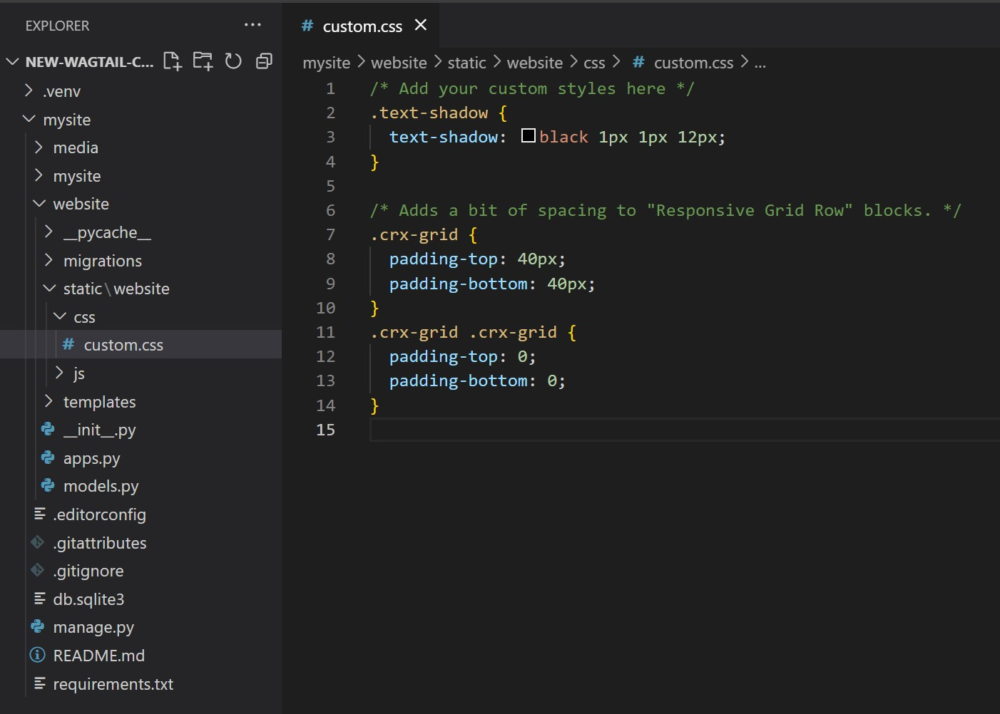

Customizing Templates & CSS
===========================

Overview
---------
Wagtail CRX is an extension of Wagtail. You can further customize your site by overriding the
built-in templates to suit your needs. For this tutorial, we will assume that you have basic knowledge
of the Django templating system. You can read more about it by visiting
`Django template language <https://docs.djangoproject.com/en/stable/ref/templates/language/>`_.

The templating language uses a series of ```` to pull in content from your page models (found in
the ``models.py`` file) and add minimal logic to the page. This allows it to render the page after content
is added in the CMS and allows you to create multiple pages with the same layout. At the top of the page,
you also want to make sure to either specify that you are **extending a page template** and that you are
pulling in Wagtail tags to make your template work the way it should.

.. note::
    If you are completely overriding a template, you will not use the ````
    at the top of your template. You do, however, need to make sure to use the appropriate template
    tags at the top of the template or your template will not render.

The templates directory inside your ``website`` app will override the default coderedcms templates if they follow the same name and directory
structure. This uses the standard Django template rendering engine. For example, to change the
formatting of the article page, copy ``coderedcms/templates/coderedcms/pages/article_page.html``
to ``website/templates/coderedcms/pages/article_page.html`` and modify it.
The `source code for built-in templates can be found on GitHub
<https://github.com/coderedcorp/coderedcms/blob/dev/coderedcms/templates/coderedcms/>`_.

Example 1: Navbar Customization
-------------------------------

The built-in template for the navbar can be found in ``templates/coderedcms/snippets/navbar.html``. This
file may not actually be in your installation folders for your site; however, you can see its contents
by visiting the Wagtail CRX source code here: `navbar.html <https://github.com/coderedcorp/coderedcms/blob/dev/coderedcms/templates/coderedcms/snippets/navbar.html>`_.

Let’s say that you want to have a 2-tiered navbar with the logo on the top tier and the menu items on the
second tier. The default navbar does not have that as an option, so you will want to override this template.

Look at your folder structure for your project. By default, your project starts with a "website" folder (also known as a directory).
In that directory there will be this path to base.html `templates/coderedcms/pages/base.html.`.  This file is here for your convenience,
you can add imports (like a google font) and it will override the default ``coderedcms`` base.html template.  In the `website/templates/coderedcms` folder
you are able override other ``coderedcms`` templates.  To do this, the file structure and name must match the default templates.
The `source code for built-in templates can be found on GitHub <https://github.com/coderedcorp/coderedcms/blob/dev/coderedcms/templates/coderedcms/>`_.

Many of your custom templates will go into your ``website`` folder because they are not overriding the
default templates in the CMS but either extending them or creating completely new ones specific to
your site.

.. note::
    Adding templates to the ``coderedcms`` templates folder does not change the default templates
    throughout all of Wagtail CRX but does override those specific templates for your website app.

Your ``website`` folder currently only has a folder for ``coderedcms`` in the ``templates`` folder.
You can add a new ``website`` folder in ``templates`` (because we will use it in another tutorial),
but for now, you will want to add a ``snippets`` folder inside the ``templates\coderedcms`` folder
so that your folder structure looks something like this:

.. figure:: img/advanced_folder_structure1.png
    :alt: Our folder structure for templates.

    Our folder structure for templates within our website app.

The folder structure needs to be the same as the default folder structure in the CMS if you want to
override the navbar template. Now you should have ``templates\coderedcms\snippets``. Navigate to
the ``snippets`` folder and create a ``navbar.html`` file inside of that folder.  With your server running and the newly created file navbar.html file in place,
look at your website.  The navbar should be gone.  The empty file is now overriding the default template.

**You are now ready to begin customizing the navbar template!**

1. Let's copy and paste the `navbar.html template from github. <https://github.com/coderedcorp/coderedcms/blob/dev/coderedcms/templates/coderedcms/snippets/navbar.html>`_.

2. Look at your homepage, and you'll see the navbar is back to normal.
3. To make a two 2-tiered Navbar lets move the logo <a> tag above the <nav> tag.
4. In our navbar.html file, Highlight from line 5 to 12. Use control + x to cut the code out of the document.
5. Move your cursor to the end of line 2, hit enter to create a new line and control + C to paste the code we just cut.
6. Copy the <nav class="navbar "> tag.
7. Use <nav class="navbar "> to wrap the logo <a> tag we just moved.  Remember the closing </nav> tag
8. We also need to add a Bootstrap class for the logo to be in the center.  Use `justify-content-center` in <nav> wrapper.

9. Be sure to save the template, then refresh your browser.

Adding Custom CSS
-----------------

Basic installation:

If you are using the basic installation version, a custom.css file will be found in **website > static > css** in your project folder.  There you can add custom CSS.
After you add code, all you need to do is save the file and hard refresh your browser to see the changes.
This is a great option if are using a built in theme, the default color theme, a purchased theme, or don't want to deal with compiling the sass for every CSS change.
Once you create a class you can use it anywhere by adding it using the advanced setting on a block and the custom CSS class field.  This is also where you can add any bootstrap class.
Be Sure to check which bootstrap version your project is on and to look at the correct documentation.  There are a fair number of changes from 4.5 to 5.2.

Let's look at adding a CSS class on a basic install version of `coderedcms`.

* First let's make a class.
* We make a class with text-shadow that can be used anywhere see fit on the site.
* Open **website > static > css > custom.css** in an editor.  (I'm using VS code, which is free)
* Add the following code:

.. code-block:: CSS

    .text-shadow {
        text-shadow: black 1px 1px 12px;
    }

    A screen shot of custom.css with the above code added. (screen shot in VS code)

* Save the file.
* Open the admin screen for your page.
* Find where you need the class.
* Open Advanced Settings and type in the class name.
* **Save** and **Publish** or **Preview**

In this example I made a **Hero Unit** with a **Responsive Grid Row** and put my class on the **Column**.

    Before custom css class

    After custom css class

This is a relatively simple example.  You can also use any of the bootstrap utility classes when constructing your site.

Sass installation:
------------------

We used sass for the tutorial. It goes over how to change :ref:`global-sass-colors` in the _variables.scss.
It also covers adding your own :ref:`custom_css` in the custom.scss file.
The most important things to remember are compile the sass after changes are made and hard refresh the browser after the sass compiles.

Here are the steps to compile the sass.  In an activated terminal:

* Stop the server if it's running (control + c)
* Compile the sass with this command:
* ``python manage.py sass website/static/website/src/custom.scss website/static/website/css/custom.css``
* If there are any errors with compiling fix the errors and re-compile.
* Once the sass is compiled (it will say "done" in the terminal) restart the server.
* ``python manage.py runserver``
* Go back to your browser and hard refresh the page.  (I usually hold control and click the refresh)

.. note::
    If you want to learn more about SASS, we really like this tutorial:
    `SASS Guide <https://sass-lang.com/guide>`_
