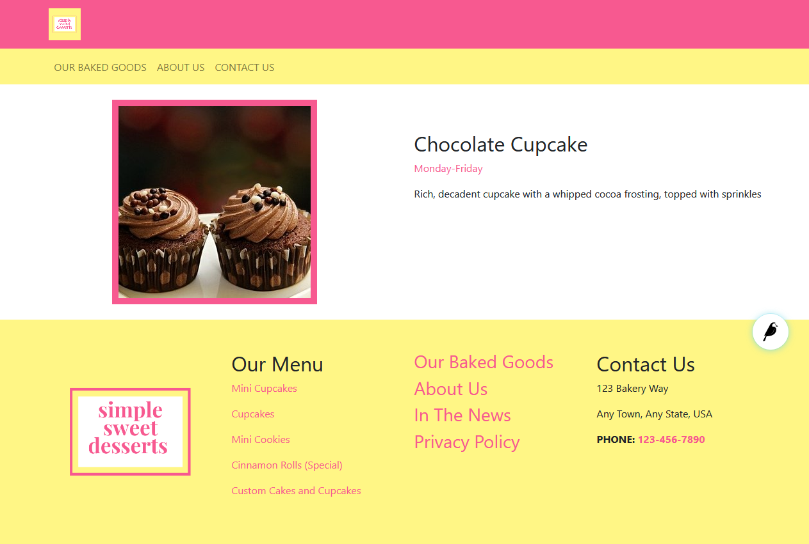
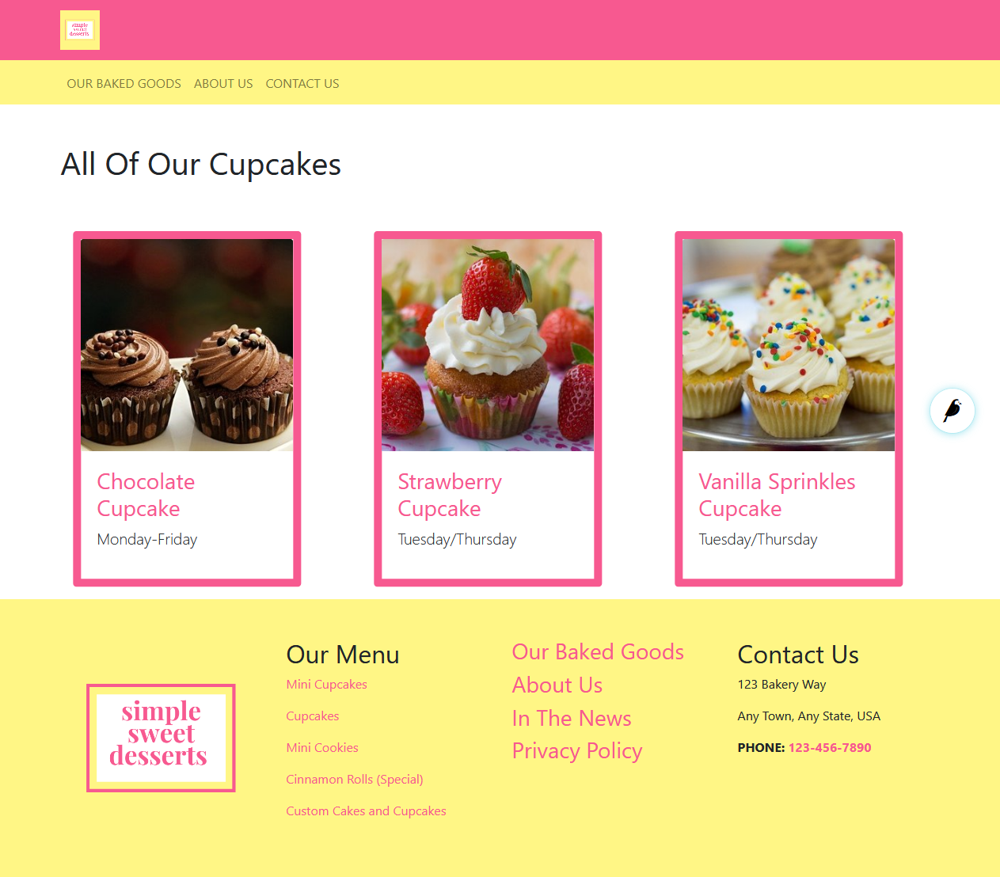

Custom Page Types
=================

In many cases, the built-in page types will be exactly what you need. There are, however,
several reasons why you may need a custom page type. This tutorial will show you an example
for creating a custom page type.

Let's say that we need to make a special product page for all of our cupcakes. While our real bakery
may have over 100 different types, we will limit this example to a small handful but enough to show
how this works.

Before we begin, you should have a general understanding of `Django models <https://docs.djangoproject.com/en/stable/topics/db/models/>`_
and some Python skills. You can still follow along for an introduction to these concepts even without this knowledge.

We are also going to be unable to cover every potential use case or scenario in this tutorial, but we hope that it will springboard
any ideas that you have for your own website.

Prep work for custom pages
--------------------------

We need to plan our page ahead of time. What fields will our custom page need, and what will we need our page
to do? Take the time to write down the answer to these questions before you even touch the code. This is what
we are writing down for Simple Sweet Dessert's custom cupcake page:

**Our Prep Notes**

1. We want our page to page to list the attributes and descriptions of individual cupcakes.

2. We want to be able to display the cupcakes in cards automatically on a landing page.

**Cupcake Page Fields:**

* Name of cupcake (This could be the title of the page)

* Photo of cupcake

* Description of cupcake

* Days when these cupcakes are made

**Cupcake Landing Page Fields:**

* Needs to be the parent page for the cupcake pages

Setting up the page models
--------------------------

Just like in Django or Wagtail, you will need to set up your page models in the ``models.py`` file of your
project. Navigate to ``mysite\website\models.py`` in your code editor and open up the ``models.py`` file.
You should already see a few page models in there from CodeRed CMS, as well as imports at the top from the
frameworks that we are using.

.. code-block:: python

    """
    Creatable pages used in CodeRed CMS.
    """
    from modelcluster.fields import ParentalKey
    from coderedcms.forms import CoderedFormField
    from coderedcms.models import (
        CoderedArticlePage,
        CoderedArticleIndexPage,
        CoderedEmail,
        CoderedFormPage,
        CoderedWebPage
    )

    class ArticlePage(CoderedArticlePage):
        """
        Article, suitable for news or blog content.
        """
        class Meta:
            verbose_name = 'Article'
            ordering = ['-first_published_at']

        # Only allow this page to be created beneath an ArticleIndexPage.
        parent_page_types = ['website.ArticleIndexPage']

        template = 'coderedcms/pages/article_page.html'
        search_template = 'coderedcms/pages/article_page.search.html'

    class ArticleIndexPage(CoderedArticleIndexPage):
        """
        Shows a list of article sub-pages.
        """
        class Meta:
            verbose_name = 'Article Landing Page'

        # Override to specify custom index ordering choice/default.
        index_query_pagemodel = 'website.ArticlePage'

        # Only allow ArticlePages beneath this page.
        subpage_types = ['website.ArticlePage']

        template = 'coderedcms/pages/article_index_page.html'

    class FormPage(CoderedFormPage):
        """
        A page with an html <form>.
        """
        class Meta:
            verbose_name = 'Form'

        template = 'coderedcms/pages/form_page.html'

    class FormPageField(CoderedFormField):
        """
        A field that links to a FormPage.
        """
        class Meta:
            ordering = ['sort_order']

        page = ParentalKey('FormPage', related_name='form_fields')

    class FormConfirmEmail(CoderedEmail):
        """
        Sends a confirmation email after submitting a FormPage.
        """
        page = ParentalKey('FormPage', related_name='confirmation_emails')

    class WebPage(CoderedWebPage):
        """
        General use page with featureful streamfield and SEO attributes.
        Template renders all Navbar and Footer snippets in existence.
        """
        class Meta:
            verbose_name = 'Web Page'

        template = 'coderedcms/pages/web_page.html'

Before we begin adding our fields for our new page models, we should add the page class, meta class,
and template information for our pages.

* We our extending the ``CoderedWebPage`` model which is why it is wrapped in parentheses after we name our page model.

* We are indicating that Cupcake pages are sub-pages of the Cupcake Landing Page.

* We are specifying the template files that the page models should use, which should also be created in our ``templates\website\pages`` folder.

Add this code below the other page models:

.. code:: python

    class CupcakesIndexPage(CoderedWebPage):
        """
        Landing page for Cupcakes
        """
        class Meta:
            verbose_name = "Cupcakes Landing Page"

        # Override to specify custom index ordering choice/default.
        index_query_pagemodel = 'website.CupcakesPage'

        # Only allow CupcakesPages beneath this page.
        subpage_types = ['website.CupcakesPage']

        template = 'website/pages/cupcakes_index_page.html'

    class CupcakesPage(CoderedWebPage):
        """
        Custom page for individual cupcakes
        """

        class Meta:
            verbose_name = "Cupcakes Page"

        # Only allow this page to be created beneath an CupcakesIndexPage.
        parent_page_types = ['website.CupcakesIndexPage']

        template = "website/pages/cupcakes_page.html"

At the top of each ``.html`` template page, we want to add these tags so that we have a basic functioning
template prepared:

.. code:: Django

    
    

Now we can turn our attention back to our page models, specifically the CupcakesPage.
Since the name of the cupcake could just be the title of the page, we don't need to add a custom field
for that information. We do, however, need a few fields.

.. code:: python

    # At top of the file, under the CodeRed CMS import, add these imports
    from django.db import models
    from wagtail.admin.edit_handlers import FieldPanel
    from wagtail.core.fields import RichTextField
    from wagtail.images import get_image_model_string
    from wagtail.images.edit_handlers import ImageChooserPanel

    class CupcakesPage(CoderedWebPage):
        """
        Custom page for individual cupcakes
        """

        class Meta:
            verbose_name = "Cupcakes Page"

        # Only allow this page to be created beneath an CupcakesIndexPage.
        parent_page_types = ['website.CupcakesIndexPage']

        template = "website/pages/cupcakes_page.html"

        # Cupcakes Page model fields
        description = RichTextField(
            verbose_name="Cupcake Description",
            null=True,
            blank=True,
            default=""
        )
        photo = models.ForeignKey(
            get_image_model_string(),
            null=True,
            blank=True,
            on_delete=models.SET_NULL,
            related_name='+',
            verbose_name='Cupcake Photo',
        )
        DAYS_CHOICES = (
            ("Weekends Only", "Weekends Only"),
            ("Monday-Friday", "Monday-Friday"),
            ("Tuesday/Thursday", "Tuesday/Thursday"),
            ("Seasonal", "Seasonal"),
        )
        days_available = models.CharField(
            choices = DAYS_CHOICES,
            max_length=20,
            default=""
        )

        # Add custom fields to the body
        body_content_panels = CoderedWebPage.body_content_panels + [
            FieldPanel("description"),
            ImageChooserPanel("photo"),
            FieldPanel("days_available"),
        ]

**What's happening?**

Okay, we had to add some imports at the top to be able to use these field types in our model.
If we try to makemigrations/migrate without having these imported, it will show an error.

Next, we added the fields we need with the field types that tell it how to function. Our description
will be a RichTextField which is essentially a text box that allows formatting. Then our photo needs to be
able to be associated with the page as well as be uploaded via an ImageChooserPanel -- the popup we get when
we want to add a photo in the CMS.

Finally, we added a field for choosing which days the cupcake is available and we made this a dropdown choice
panel. We had to set the choices first, then include the choices in our field selector.

At the bottom of our model, we are telling it to allow for the standard CMS page builder blocks as well as our custom
fields.

Now we can run ``python manage.py makemigrations website`` and ``python manage.py migrate`` to test our work.
It should migrate successfully. (If not, read what the error says and fix it. A typo can cause huge problems!)

Run the server again with ``python manage.py runserver`` to see how it looks in your CMS admin.

You should now see Cupcake Landing Page as a child page choice under Home page. Choose this, add a title and
publish it. The page does not have a template made; however, it uses the basic CodeRed Web Page so it will display
something.

Now you can add Cupcake Pages, which are sub-pages of the Cupcake Landing Page. While the fields for this page
do not currently show up on the published page, you can add content in the editor mode.

.. note::
    We have to create a custom page template to display the custom fields on the published page.

Building our custom page templates
----------------------------------

Since our models are working and we can add content to the fields, we can begin creating our custom page
template. Navigate to the ``cupcakes_page.html`` file in your project's templates folder. We added the basic
page tags at the top of the page earlier. In case you need to add them, they are:

.. code::

    
    

Now we want to tell the page to not display the page's title where the cover image would be if there is no cover
image (because we plan to use the page's title aka the cupcake name elsewhere on the page).

The standard CodeRed Web Page template has an `` `` statement regarding cover images that says to show the page title when a cover image
is not available. We will add that same code to our page but remove the ``else`` statement so that it does nothing when a cover image is not available.

We will also set up the basic layout for our page: a two half-sized columns in a row. To pull in our field data,
we reference the page and then the field, like this ``{{page.title}}`` or ``{{page.description}}``.

For the image, we specify what size it should be and give it a shorter reference name for the variable.

We added a few Bootstrap classes and custom classes to change the padding a little and some text colors, as well
as add a border around the image that is centered within the column.

**Our template code:**

.. code:: Django

    
    

    
        
        
        

        

        
    

    
    

        

            

                

                    
                    
                    

                        
                    

                    
                

                

                    

                        <h2>{{page.title}}</h2>
                        <lead class="text-cherry">{{page.days_available}}</lead>
                        
                        
{{page.description|richtext}}

                        
                    

                

            

        

    

    

We added some content for a cupcake page in the CMS and published it.

Let's take a look.

    Our customized cupcake page so far

It works! Continue to add cupcake pages until you have a decent amount of them --
five or so would be good.

Building the Cupcake Landing Page
---------------------------------

While we could simply use the the default "Show Child Pages" option for the page, a list of links
is rather boring. We also want the page to automatically update whenever we add a new cupcake to save us lots of time
and trouble. How can we dynamically update our Cupcake Landing Page?

.. code:: Django

    
    

    
    

        

            
            

                

                    
                    
                    
                    
                    

                    

                        <h3><a class="text-cherry" href="{{cupcake.url}}">{{cupcake.title}}</a></h3>
                        
{{cupcake.days_available}}

                    

                    

                

            

            
        

    

    

**What's happening?**

We are using a ```` and a ```` loop that pulls
in content from the child/sub-pages. Our new variable for the sub-pages is ``cupcake``, so we reference the fields like so:
``{{cupcake.title}}``. In the CMS we want to make show that "Show Child Pages" is NOT selected because it will just show
the list of page links in addition to our custom cards. This is what our published landing page looks like now:

    Our customized cupcake landing page dynamically pulling in child pages as cards

Now we can keep customizing our templates until we get the design that we want.
