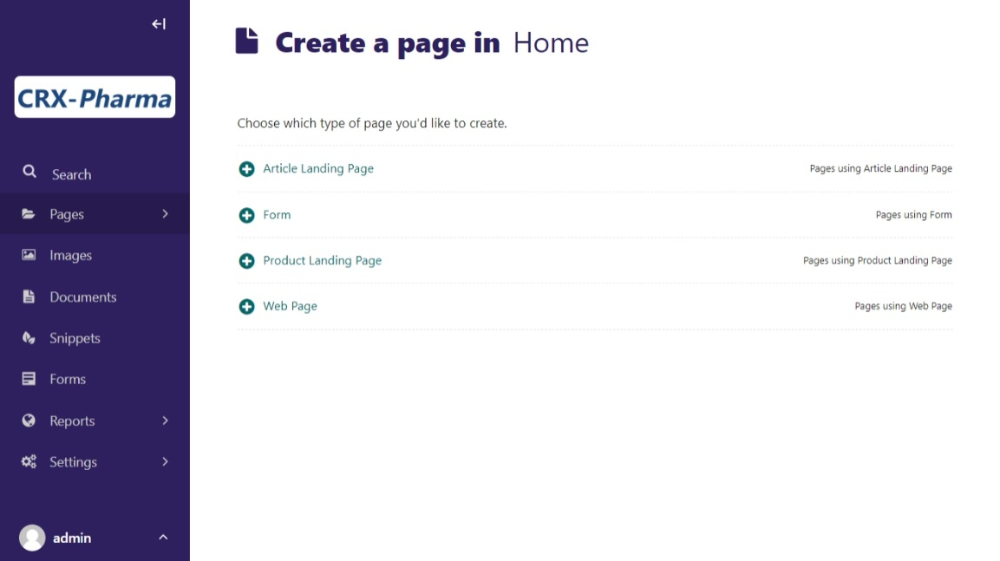
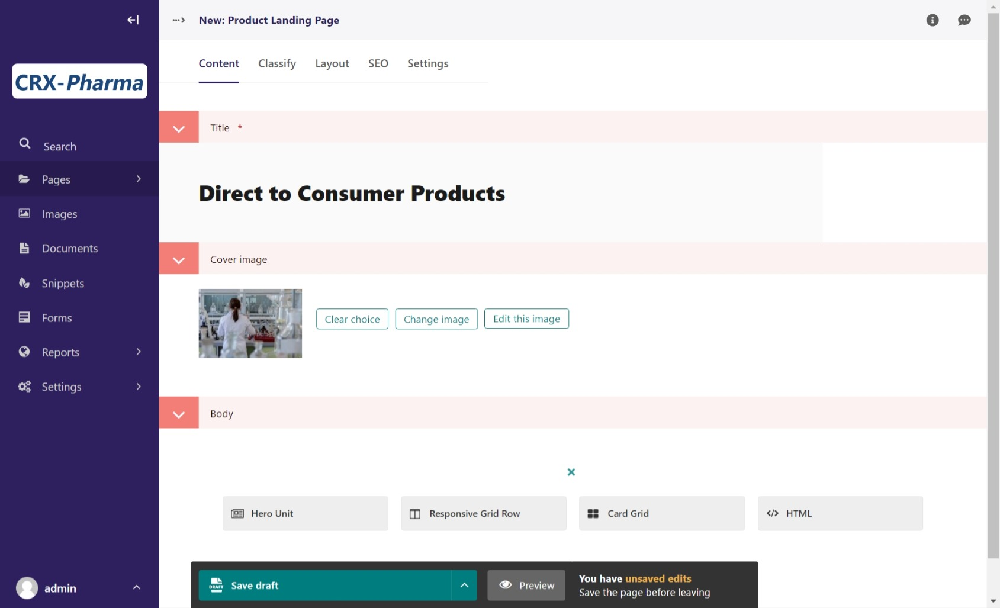
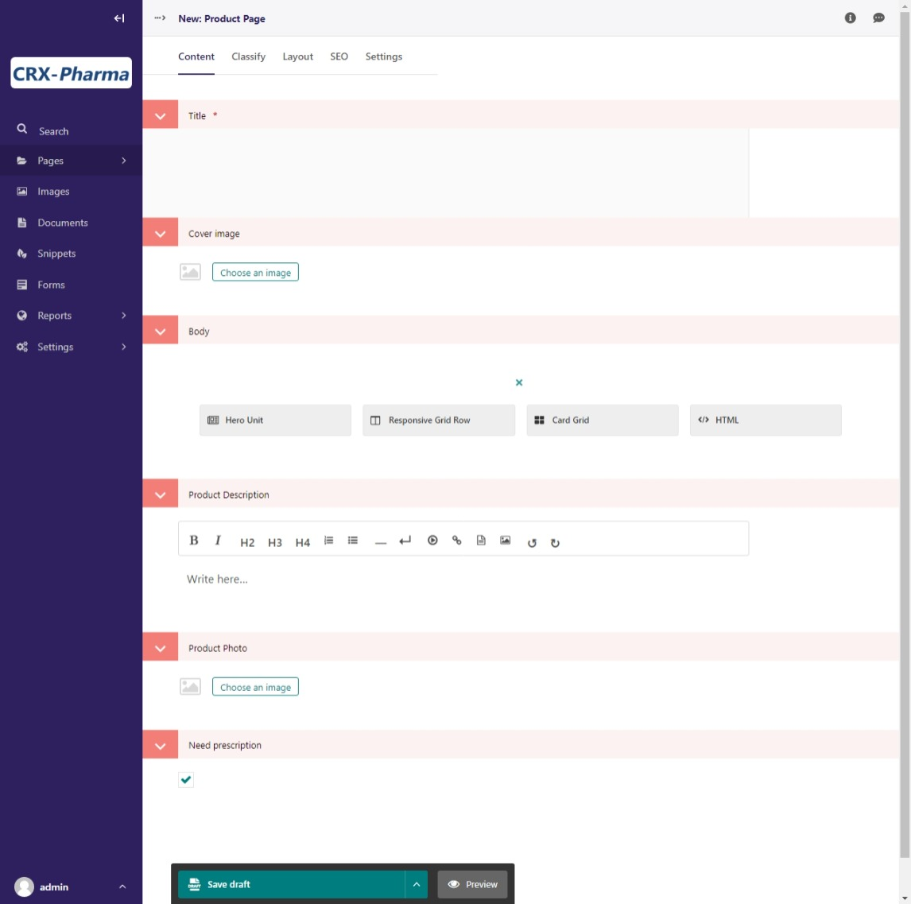

Custom Page Types
=================

In many cases, the built-in page types will be exactly what you need. There are, however,
several reasons why you may need a custom page type. This tutorial will show you an example
for creating a custom page type.

Let's say that we need to make a special product page for all of our cupcakes. While our real bakery
may have over 100 different types, we will limit this example to a small handful but enough to show
how this works.

Before we begin, you should have a general understanding of `Django models <https://docs.djangoproject.com/en/stable/topics/db/models/>`_
and some Python skills. You can still follow along for an introduction to these concepts even without this knowledge.

We are also going to be unable to cover every potential use case or scenario in this tutorial, but we hope that it will springboard
any ideas that you have for your own website.

Prep work for custom pages
--------------------------

We need to plan our page ahead of time. What fields will our custom page need, and what will we need our page
to do? In this example we are going to add a products page and a product landing page.  As we add more products
they will automatically be included on the landing page like articles.  For this example, we have to decide what fields we need.

**Product Page Fields:**

* Name of the product (This will be the title of the page in this instance)

* Photo of the product

* Description of the product

* Does this product require a prescription.

**Product Landing Page Fields:**

* Needs to be the parent page for the product pages

Setting up the page models
--------------------------

Just like in Django or Wagtail, you will need to set up your page models in the ``models.py`` file of your
project. Navigate to ``mysite\website\models.py`` in your code editor and open up the ``models.py`` file.
You should already see a few page models in there from Wagtail CRX, as well as imports at the top from the
frameworks that we are using.

.. code-block:: python

    """
    Create or customize your page models here.
    """
    from modelcluster.fields import ParentalKey
    from coderedcms.forms import CoderedFormField
    from coderedcms.models import (
        CoderedArticlePage,
        CoderedArticleIndexPage,
        CoderedEmail,
        CoderedFormPage,
        CoderedWebPage,
    )

    class ArticlePage(CoderedArticlePage):
        """
        Article, suitable for news or blog content.
        """

        class Meta:
            verbose_name = "Article"
            ordering = ["-first_published_at"]

        # Only allow this page to be created beneath an ArticleIndexPage.
        parent_page_types = ["website.ArticleIndexPage"]

        template = "coderedcms/pages/article_page.html"
        search_template = "coderedcms/pages/article_page.search.html"

    ## OTHER CLASSES

    class WebPage(CoderedWebPage):
        """
        General use page with featureful streamfield and SEO attributes.
        """

        class Meta:
            verbose_name = "Web Page"

        template = "coderedcms/pages/web_page.html"

Before we begin adding our fields for our new page models, we should add the page class, meta class,
and template information for our pages.

* We our extending the ``CoderedWebPage`` model which is why it is wrapped in parentheses after we name our page model.

* We are indicating that Product pages are sub-pages of the Product Landing Page.

* We are specifying the template files the page models use, these need to be created in the ``templates\website\pages`` folder.

Add this code below the other page models:

.. code:: python

    class ProductIndexPage(CoderedWebPage):
        """
        Landing page for Products
        """
        class Meta:
            verbose_name = "Product Landing Page"

        # Override to specify custom index ordering choice/default.
        index_query_pagemodel = 'website.ProductPage'

        # Only allow ProductPages beneath this page.
        subpage_types = ['website.ProductPage']

        template = 'website/pages/product_index_page.html'

    class ProductPage(CoderedWebPage):
        """
        Custom page for individual products
        """

        class Meta:
            verbose_name = "Product Page"

        # Only allow this page to be created beneath an ProductIndexPage.
        parent_page_types = ['website.ProductIndexPage']

        template = "website/pages/product_page.html"

* Create the template pages ``product_page.html`` and ``product_index_page.html`` in the ``templates\website\pages`` folder.

* At the top of these template pages, add these tags to have basic functioning template:

.. code:: Django

    
    

Now we can turn our attention back to our page models, specifically the ProductPage.
In this example the the name of the product will be the title of the Page.
We need to add other fields to be be in alignment with the outline we looked at earlier.

.. code:: python

    # At top of the file add these imports
    from django.db import models
    from wagtail.admin.edit_handlers import FieldPanel
    from wagtail.core.fields import RichTextField
    from wagtail.images import get_image_model_string
    from wagtail.images.edit_handlers import ImageChooserPanel

    # Update the product page with these fields

    class ProductPage(CoderedWebPage):
        """
        Custom page for individual products
        """

        class Meta:
            verbose_name = "Product Page"

        # Only allow this page to be created beneath an ProductIndexPage.
        parent_page_types = ['website.ProductIndexPage']

        template = "website/pages/product_page.html"

        # Product Page model fields
        description = RichTextField(
            verbose_name="Product Description",
            null=True,
            blank=True,
            default=""
        )
        photo = models.ForeignKey(
            get_image_model_string(),
            null=True,
            blank=True,
            on_delete=models.SET_NULL,
            related_name='+',
            verbose_name='Product Photo',
        )
        need_prescription = models.BooleanField(default=True)

        # Add custom fields to the body
        body_content_panels = CoderedWebPage.body_content_panels + [
            FieldPanel("description"),
            FieldPanel("photo"),
            FieldPanel("need_prescription"),
        ]

**What's happening?**

We had to add some imports at the top to be able to use these field types in our model.
If we try to makemigrations/migrate without having these imported, it will show an error.

Next, we added the necessary fields and their field types that specify functionality.

* ``description`` is a RichTextField (essentially a text box) that allows formatting.
* ``photo`` uses a ForeignKey to reference the image_mode. This allows an image to be uploaded via an ImageChooserPanel -- the popup we get when we want to add a photo in the CMS.
* ``need_prescription`` is a Boolean value that tells us if the product requires a prescription.
* ``body_content_panels`` is defining which page builder blocks the editing screen should show. (In this instance, it's using the wagtail-CRX standard blocks, plus the custom fields in the model.)

These changes to the models have to be migrated in the the database. To do so:

* You need to have an active virtual environment. (See :ref:`installation` notes for help)
* (if running) Stop your server with ``control + c``
* Run ``python manage.py makemigrations`` (The makemigrations command uses the models specify changes that are going to be made to the database)
* Run ``python manage.py migrate`` (The migrate command makes those changes)

It should migrate successfully. (If not, read what the error says and fix it. A typo can cause huge problems!)

* Run the server with ``python manage.py runserver`` to see how it looks in your CMS admin.

You should now see Product Landing Page as a page choice.

To be inline with our CRX-pharma design (from the getting started tutorial), we are going to add a **Product Landing Page** as a child of the "Our Products" page **Home > Our Products**.
Hopefully, if you followed the tutorial this is a pretty basic operation.  As a quick "refresher":

* Click **Pages** in the side menu
* Use the arrow and click on the "Our Product Page".  ("If you don't have one, just use Home")
* This opens the page management screen.  Click **Add child page**
* Choose page type **Product Landing Page**
* Give it a title (Direct to Consumer Products)
* (optional) Add a cover image.

* **Save** and **Publish**

.. note::
    We still have to work on the templates for both Product Page and Product Landing Page.  They are placeholders to prevent Django from throwing errors.

Let's add a Product Page to the project:

* Click **Add child page** on the the Product Landing Page we just published (titled "Direct to Consumer Products")

Look at the fields. The page editor has the standard "CoderedWebPage" fields (Title, Cover image, and Body) plus the ones we added to the model (Product Description, Product Photo, and Need prescription).

* Make 3 or 4 Product pages.
* Remember to **Save** and **Publish** each page.

Building our custom page templates
----------------------------------

Navigate to ``templates\website\pages\product_page.html``. This code was added earlier:

.. code::

    
    

These page tags extend the wagtail-CRX page and gives us access to the data in store in the database for each page.

Here is our whole template:

**Our template code:**

.. code:: Django

    
    

    
    
    
    

    

        

        <h1 class="text-white text-shadow">{{page.title}}</h1>
        

    

    

    
    

    
    

        

            

                

                    
                    
                    

                        
                    

                    
                

                

                    

                        
                        
                        <h2 class="text-primary fw-bold fs-1 mb-2">{{page.title}}</h2>
                        

                        
                        {{page.description|richtext}}
                        
                        
                        
 Call your doctor to see if {{page.title}} is right for you!

                        
                        
 No Prescription Needed!

                        
                    

                

            

        

    

    

The ```` tag overrides part of the standard template.  It uses conditional logic  to render the page title {{page.title}} in the header if the user
adds a cover image.  If they don't, the page.title renders in .  There is a basic two column, with the image on the left and a description on the right.  It also uses an
  statement with the {{page.need_prescription}} to render different text based on if the product needs a prescription.

There is a lot to cover in Django templating. Check out the docs for more info `Django Templates <https://docs.djangoproject.com/en/4.1/topics/templates/>`_

Here's the same template with and without a cover image:

No cover image so the page title renders in the body.

With the cover image and the title is centered with a bootstrap class "text-center" in the template.

Building the Product Landing Page
---------------------------------

While we could simply use the the default "Show Child Pages" option for the page, a list of links
is rather boring. We also want the page to automatically update whenever we add a new product to save us lots of time
and trouble. He is our template:

.. code:: Django

    
    

    
    
    
    

    

        

        <h1 class="text-shadow text-white">{{page.title}}</h1>
        

    

    

    
    

    <h1>{{page.title}}</h1>
    

    
    

    
    

        

            
            

                

                    
                    
                    
                    
                    

                    

                        <h5><a href="{{product.url}}">{{product.title}}</a></h5>
                        {{product.description|richtext}}
                        
                        
 Call your doctor to see if {{page.title}} is right for you!

                        
                        
 No Prescription Needed!

                        
                    

                    

                

            

            
        

    

    

**What's happening?**

We are using a ```` and a ```` loop that pulls
in content from the child/sub-pages. Our new variable for the sub-pages is ``product``, so we reference the fields like so:
``{{product.title}}``. The different products are in cards in card-grid, size with different bootstrap breakpoints.

This is what our published landing page looks like now:

Product Landing Page on a large screen.

