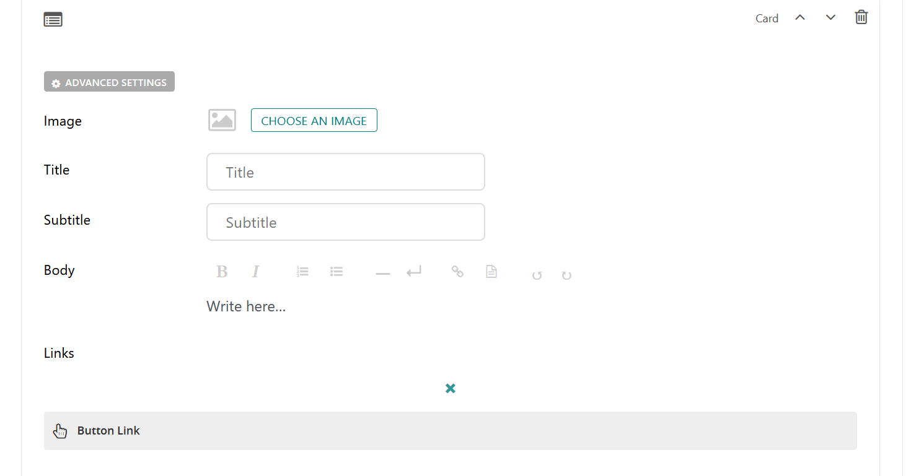

Card Block
==========

Allows the user to fill out information to be displayed in a card. Crops the image to a 3:2 ratio. 

.. note::
    There is also a Card Grid Layout Block which groups cards into a grid and is a LayOut Block; 
    this Card Block only displays a single card.

Field Reference
---------------

Fields and purposes:

* **Image** - Select the image to display in the card

* **Title** - The text to show for the title of the card

* **Subtitle** - The text to show for a subtitle, if desired

* **Body** - The text to show for the body of the card

* **Links > Button Link** - The button link to include at the bottom of the card, set to link to a page or external link

    A card block and its settings