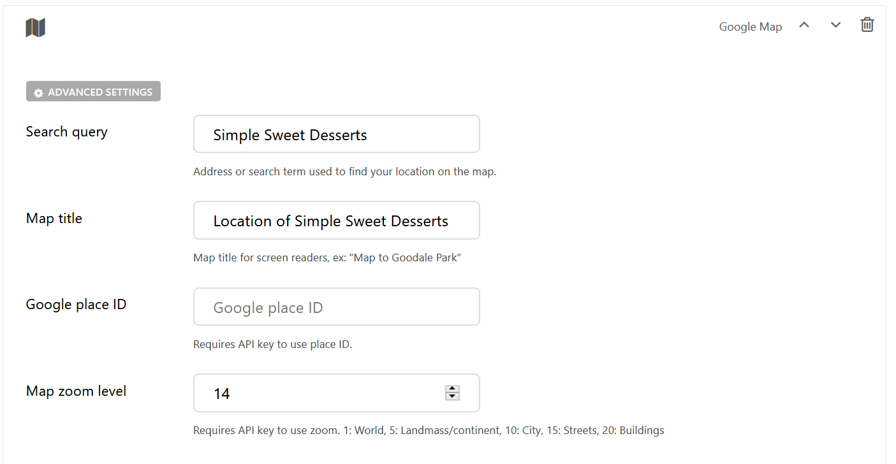
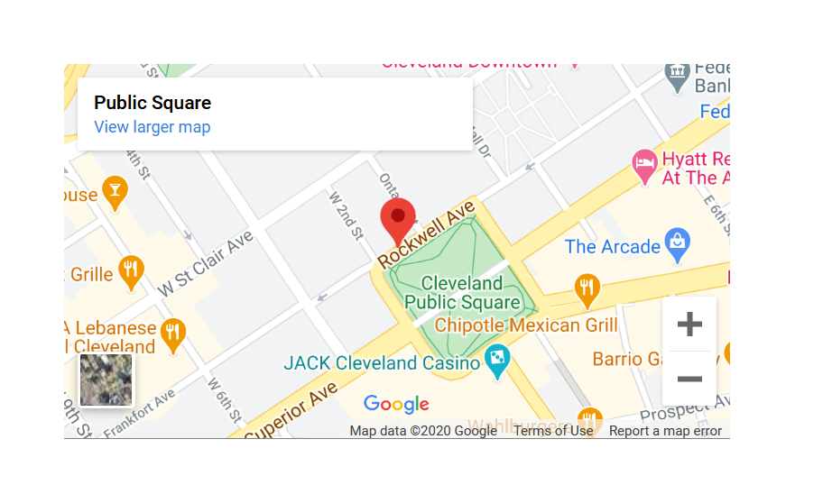

Google Map Block
================

Allows the user to add a Google Map location and display the location on the map. 

Field Reference
---------------

Fields and purposes:

* **Search Query** - Address or search term used to find your location on the map.

* **Map Title** - Map title for screen readers, ex: "Map to Simple Sweet Desserts"

* **Google Place ID** - Place IDs uniquely identify a place in the Google Places database and on Google Maps

* **Map Zoom Level** - Requires API key to use zoom. ex: 1: World, 5: Landmass/continent, 10: City, 15: Streets, 20: Buildings

* **Advanced Settings** - Add custom CSS classes or a CSS ID to style the block with your custom CSS

.. note::
    Google Place IDs and Zoom both require a Google API Key. 
    Read more about `Google Maps API Keys <https://developers.google.com/maps/documentation/javascript/get-api-key>`_ .

    Our Google Map settings for Public Square, Cleveland, OH

    A Google Map of the Public Square offices in Cleveland (where we're located!)

