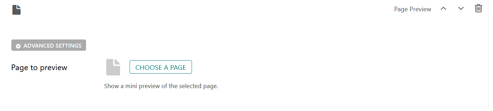

Page Preview Block
==================

Shows a miniview (a condensed version) of a selected Page.

Field Reference
---------------

There is only one field.

**Page to Preview** - Select the page that you want to display a preview

    A Page Preview block and its settings.

The selected page is rendered using the page model's "miniview" template.
The template can be overridden per model with the ``miniview_template`` attribute, the default of which is `coderedcms/pages/page.mini.html <https://github.com/coderedcorp/coderedcms/blob/main/coderedcms/templates/coderedcms/pages/pages.mini.html>`_.

.. versionadded:: 2.1

   Miniview templates were added in Wagtail CRX 2.1
