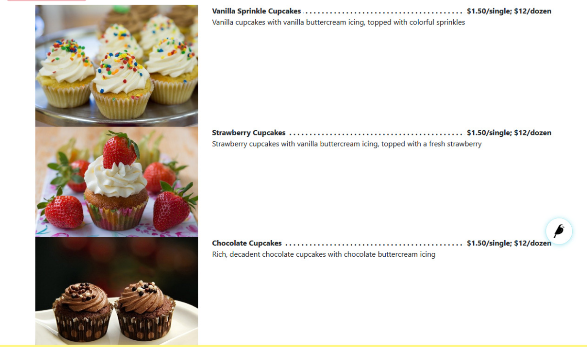

Price List Block
================

Creates a price list with the name of the items and their prices

Field Reference
---------------

Fields and purposes:

* **Heading** - The heading (or title) for the price list

* **Items** - The item builder for the price list

* **Image** - The image chooser for a Price List Item

* **Name** - The name of the Price List Item

* **Description** - The description of the Price List Item

* **Price** - The price for the Price List Item as text (add currency symbols as desired)

    Our published price list