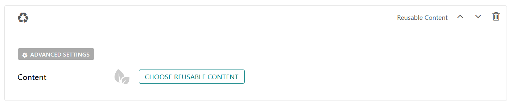

Reusable Content Block
======================

Allows the use of reusable content snippets on any page 

Field Reference
---------------

Fields and purposes:

* **Content** - Chooser for reusable content

    The reusuable content block in page editor

Reusable Content is created in **Snippets >** :ref:`reusable-content`. Once you have created a block of reusable content,
you can choose it for any page on your site with the Reusable Content Block.

Reusable content could be anything that you want to reuse across the site. It has layout blocks and content blocks,
which allows you to make anything from a hero block to a responsive grid row with columns and custom content. 
The benefit is that if you use a particular style on various pages throughout your website, you only need to create it once -- 
**Then you can add it via the Reusable Content Block!**