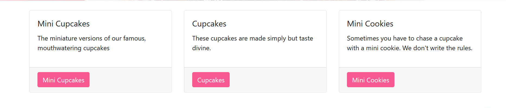
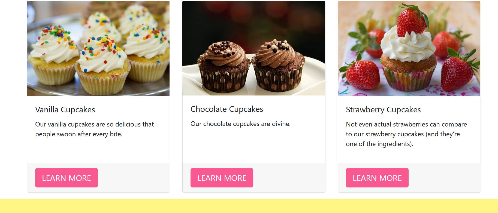

.. _card-grid:

Card Grid Block
===============

Creates a card grid layout with content and button options

Field Reference
---------------

Fields and purposes:

* **Full Width** - If selected, sets whether the card grid spans the entire width of the screen

* **Content** - The individual cards in the grid

In your page editor, choose **Card Grid**. Select the **Card** content block within the Card grid block 
to get started on creating your Card Grid. The grid is designed to automatically create the layout of 
your cards with an image, title, subtitle, body and button links. Create as many cards as you would 
like for your card grid. They will be sized based on available space on the screen. 

We have a card grid on the home page of our tutorial site Simple Sweet Desserts. It looks like this:

    Our sweet card grid on the home page of our tutorial site -- no images

We also created another card grid on a Practice Layout Page on our tutorial site that looks like this:

    Our cupcake card grid, with images

