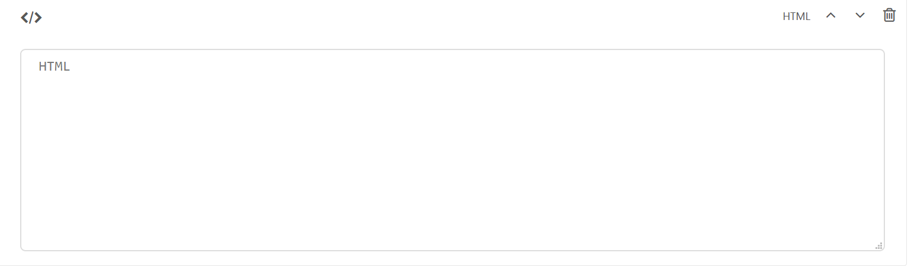

HTML Layout Block
=================

A block for custom HTML

Field Reference
---------------

    The HTML layout block

Add your HTML for a layout component here. If you don't need to create a custom template for your
page that dynamically pulls in content, you can use the HTML layout block in the CMS to add some custom
HTML to your page. This is useful for any layout or content that you want to add that can't be added via 
any of the other content block options.