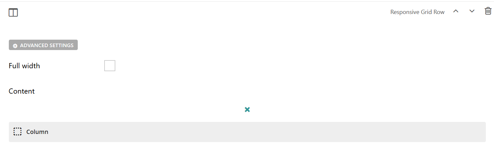

Responsive Grid Row Block
=========================

A block that creates a responsive grid row to hold and organize site content

Field Reference
---------------

Fields and purposes:

* **Full Width** - If selected, sets whether the row spans the entire width of the screen

* **Content** - Starts with a Column (required) with content block choices

You can add as many columns as you would like; however, a responsive grid row requires at least one column with
at least one piece of content. 

    A responsive grid row block ready to add some content

SEE ALSO: :ref:`column-block`, :ref:`content-blocks`
