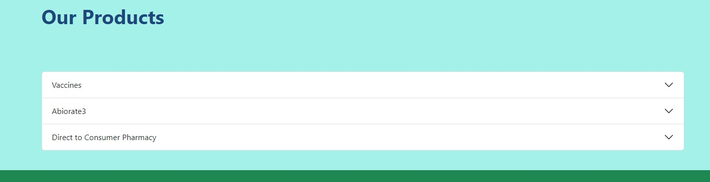

Accordion Block
===============

Creates a collapsible section with a button to toggle.
Each Accordion has multiple sections or panels.
Read More `bootstrap docs <https://getbootstrap.com/docs/5.2/components/accordion/>`_

Field Reference
---------------

Fields and purposes:

* **Accordion** - Choose a preexisting accordion snippet, created under snippets.

Example:

    Demo accordion closed

.. figure:: img/accordion_open.jpeg
    :alt: demo accordion with panel open

    Demo accordion with panel open

Editor:

.. figure:: img/accordion_demo.jpeg
    :alt: Editing screen for accordion

    Editing screen for accordion

Each Accordion panel needs a name and content.  After you make a second panel,
arrows will appear to allow you to change the order of the panels.

.. figure:: img/accordion_arrows.jpeg
    :alt: arrows on the accordion panels

    Arrows on the accordion panels. They appear after you make a second panel.

