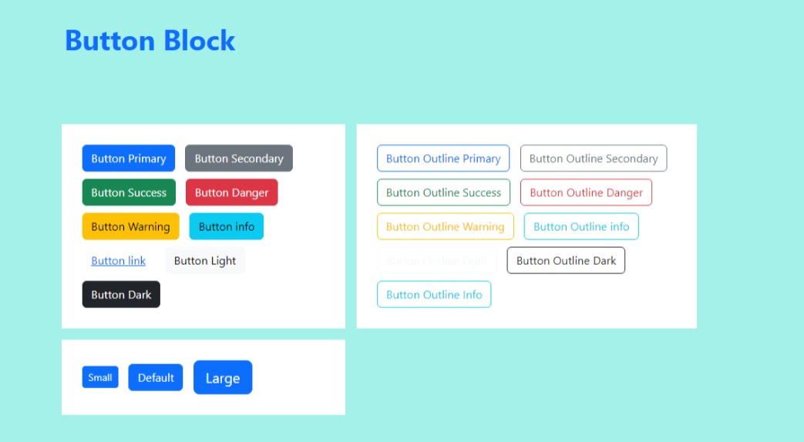

Button Block
============

The button block renders an HTML anchor styled as a button. This can be used to
link to pages, documents, or external links.

Example:

    default button styles

Note this screen shot was taken using the default bootstrap colors.  If you use a theme or change global colors with sass,
they will likely be different colors.

Field Reference
---------------

Fields and purposes:

.. include:: baselink.rst

* **Button Title** - The text to show on the button. You can insert simple HTML
  here as well, such as ``Learn <b>More</b>``.

* **Button Style** - The appearance of the button. This is a choice loaded from
  ``CRX_FRONTEND_BTN_STYLE_CHOICES`` Django setting and is inserted as a
  CSS class in the HTML.

* **Button Size** - The size of button. This is a choice loaded from
  ``CRX_FRONTEND_BTN_SIZE_CHOICES`` Django setting and is inserted as a CSS
  class in the HTML.
