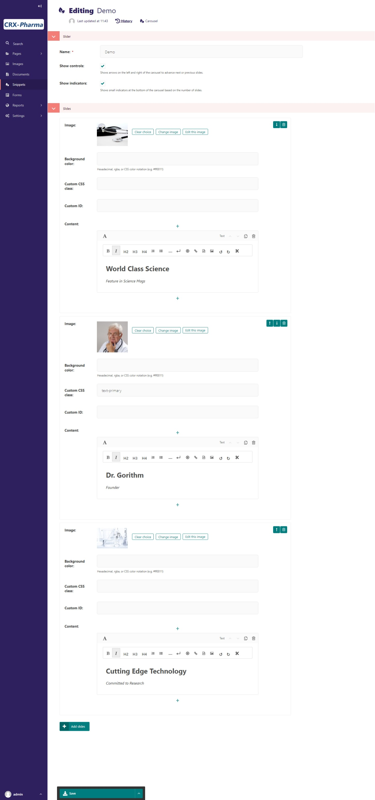

.. _carousel-block:

Carousel Block
==============

Allows the user to create a carousel with image backgrounds and relevant blocks.
Carousels automatically change slides, but also have arrow controls for the user to advance or return to the previous slide.
Make a Carousel by going to **Snippets > Carousels** and clicking Add Carousel.

Example:
    .. figure:: images/carousel_example.jpeg
        :alt:  default button styles

        default button styles

Field Reference
---------------

Fields and purposes:

* **Carousel** - Choose a Carousel

If you don't have any carousels already made, you can build a carousel by clicking **Choose A Carousel** and
clicking on "Why not **create one now**?" in the popup box. This will take you to **Snippets > Carousels** where
you can create a carousel to add to the page.  Here is a carousel editor with three slides; each slide has a caption:

    The edit mode for building a carousel snippet

Save your work and now you can select that carousel in a page editor. This one is named Demo.  Here is a preview of for one of our slides:

    The carousel published on a page

You'll notice it's hard to see the caption because the bootstrap default text is white.  Let's look at customizing our carousel two different ways.

First, you can override the CSS class.  If you look at the `bootstrap docs <https://getbootstrap.com/docs/5.2/components/carousel/>`_ or the template.
You'll find the class for caption is ``carousel-caption``.  For our example, let's add a background-color and border-radius.

.. code:: CSS

        .carousel-caption{
            background-color: rgba(60, 60, 60, 0.5);
            border-radius: 10px;
        }

Add this to your custom.css file (basic installation) or the custom.scss file (sass installation).
Save the file, compile the sass(sass install only), and hard refresh the browser.  See :ref:`adding_custom_css` for more details.

    The carousel published on a page

The second option would be to alter the template.
Looking at the `bootstrap docs <https://getbootstrap.com/docs/5.2/components/carousel/>`_ you can find there is a dark variant.
See :ref:`customizing_templates` for a more detailed tutorial on overriding templates.

* To alter our template you need to copy the template from `github <https://github.com/coderedcorp/coderedcms/blob/dev/coderedcms/templates/coderedcms/blocks/carousel_block.html>`_
* Paste the file in the correct directory so it overrides the default template. Our file path: **mysite>website>templates>coderedcms>blocks>carousel_block.html**
* In carousel_block.html on line 4; add carousel-dark to the class attribute.  The line should now look like this:

.. code:: html

    

* Save the file and refresh the browser.

    The carousel published on a page

(In this example, I removed the custom css for .carousel-caption from the previous example)
