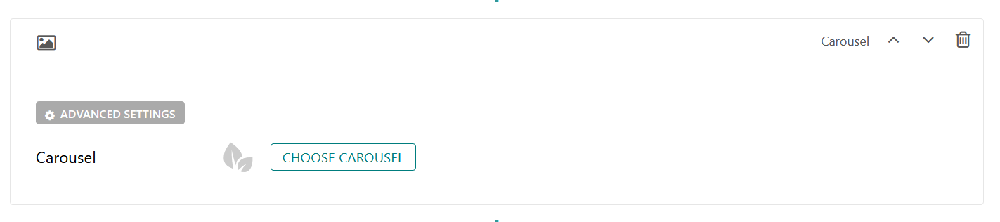
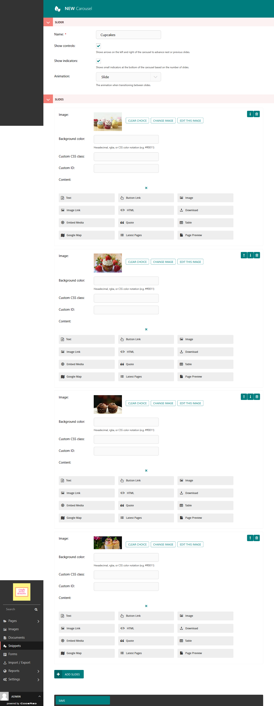

Carousel Block
==============

Allows the user to create a carousel with image backgrounds and relevant blocks. 

Field Reference
---------------

Fields and purposes:

* **Carousel** - Choose a Carousel

    The carousel block

If you don't have any carousels already made, you can build a carousel by clicking **Choose A Carousel** and
clicking on "Why not **create one now**?" in the popup box. This will take you to **Snippets > Carousels** where
you can create a carousel to add to the page. 

    The edit mode for building a carousel snippet

Now you can select your carousel. Ours is named Cupcakes. 

    The carousel published on a page