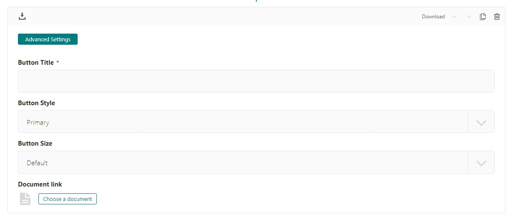
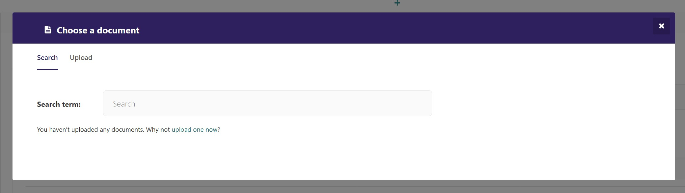

Download Block
==============

The download block enables users to add documents to the CMS which website
visitors can download from the site.  The download block is a button and has the same options.

Example: See Button Block.

Field Reference
---------------

* **Button Title** - The text to show on the button. You can insert simple HTML
  here as well, such as ``Learn <b>More</b>``.

* **Button Style** - The appearance of the button. This is a choice loaded from
  ``CRX_FRONTEND_BTN_STYLE_CHOICES`` Django setting and is inserted as a
  CSS class in the HTML.

* **Button Size** - The size of button. This is a choice loaded from
  ``CRX_FRONTEND_BTN_SIZE_CHOICES`` Django setting and is inserted as a CSS
  class in the HTML.

* **Document Link** - Link to the document, which you will need to upload into the CMS

* **Advanced Settings** - Add custom CSS classes or a CSS ID

    A download block and its settings.

    The modal to search current or upload new documents for users to download.

When a website visitor clicks the button, the document is available for download in a new window.
