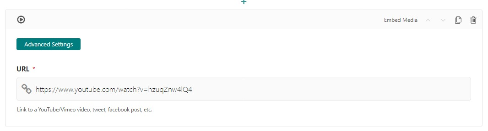

Embed Media Block
=================

The embed media block allows users to embed media like YouTube videos or SoundCloud with just a link
to the external media source.

Example:
  .. figure:: images/embed_media_preview.jpeg
    :alt: How it displays on the page.

Field Reference
---------------

Fields and purposes:

* **URL** - The URL for the external media, whether it's a tweet, Facebook post, YouTube video, etc.

.. note::
    Add an external media link like this YouTube video about a 48 deployment on the CodeRed Hosting platform: `<https://www.youtube.com/watch?v=hzuqZnw4lQ4>`_ .

* **Advanced Settings** - Add custom CSS classes or a CSS ID to style the embed with your custom CSS

    An embed media block with its fields.

.. note::
    You can use Bootstrap utility classes like ``w-50`` on your embeds. The size of the video
    also changes depending on whether it's in a full-width column or a half-column, etc.
