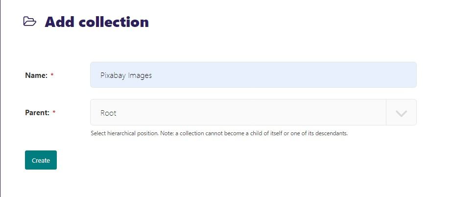
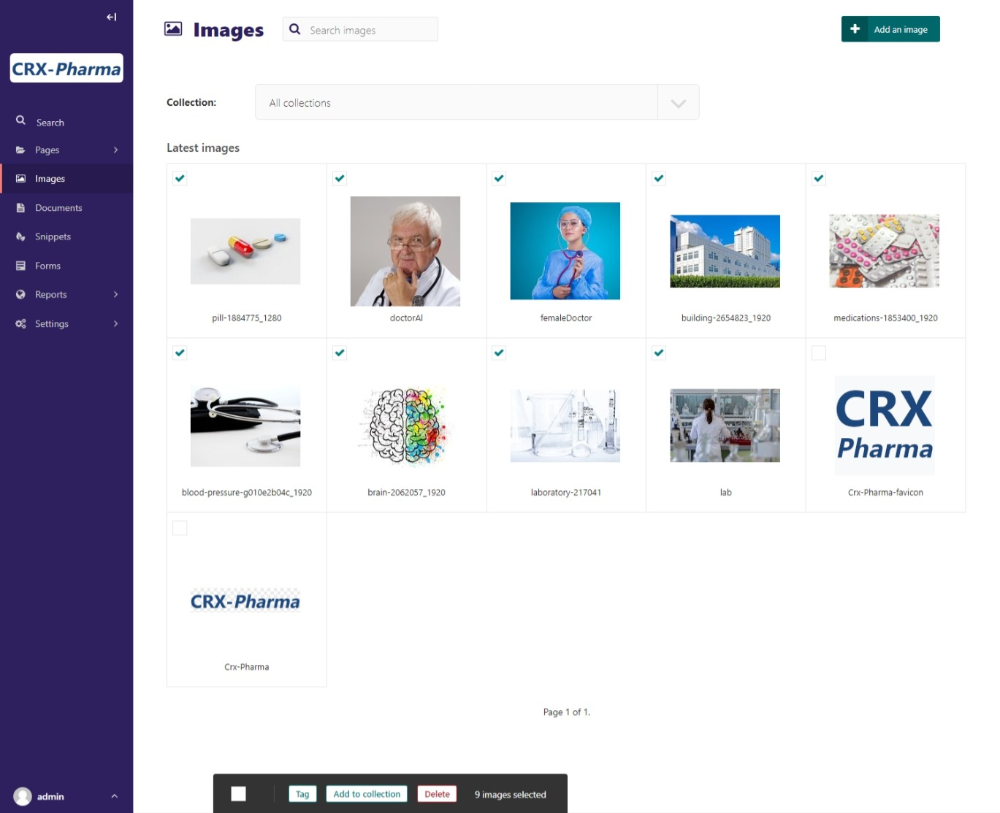
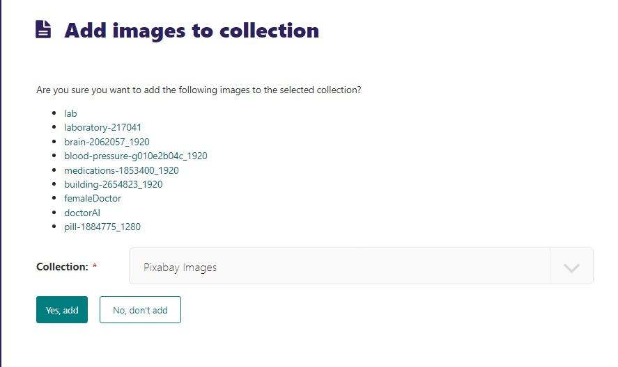
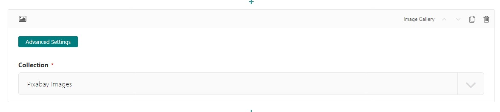
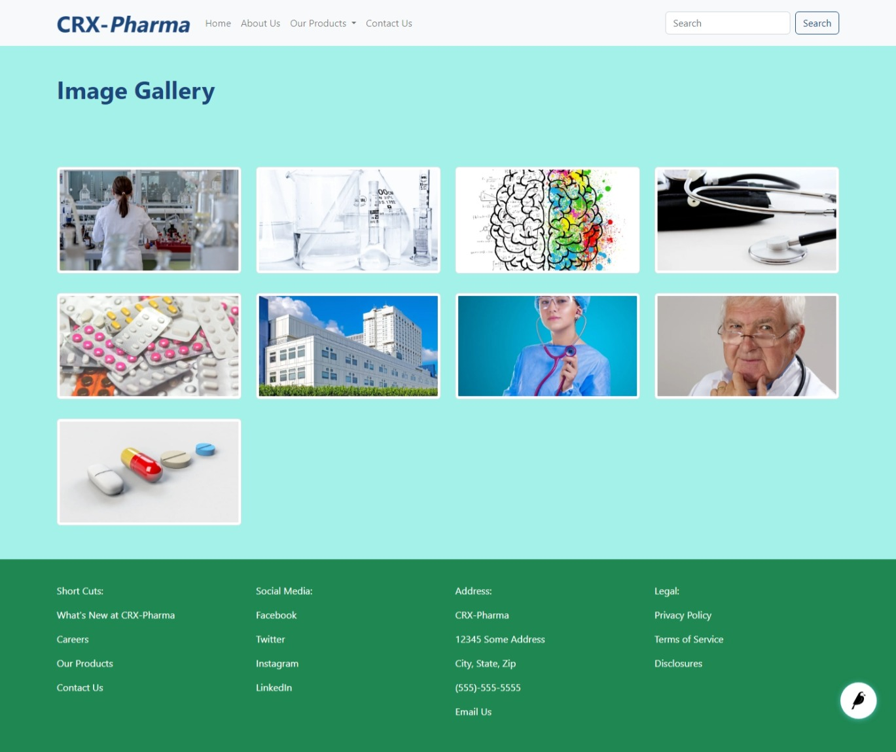
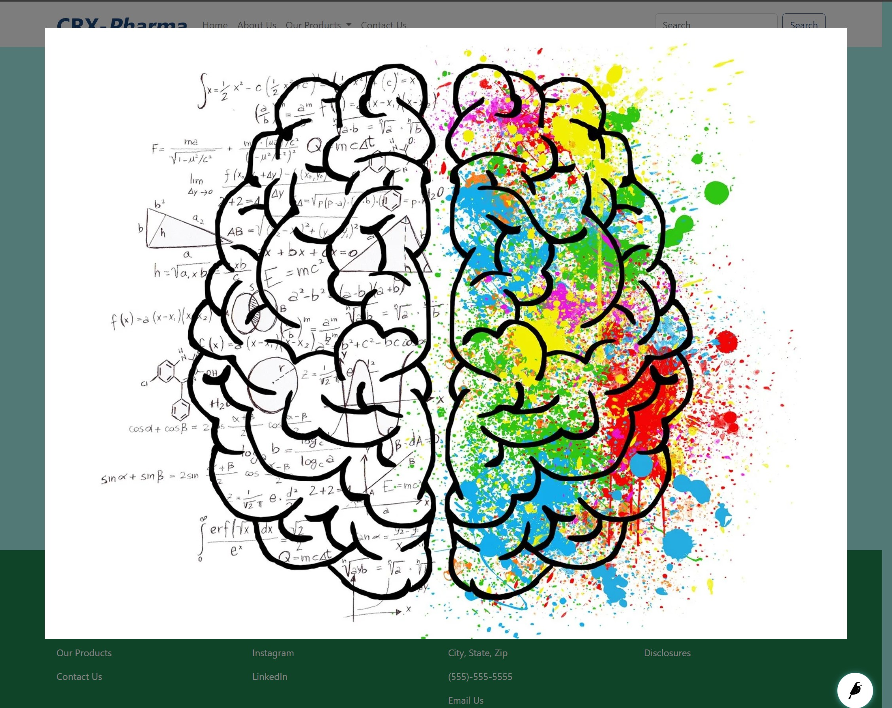

Image Gallery Block
===================

Creates and displays a collage of images from a collection.
Each image in the **Image gallery** is a link that will open a larger version of the image.

Example:
    .. figure:: images/image_gal_example.jpeg
        :alt: A web page with an image gallery block.

        A web page with an image gallery block.

Field Reference
---------------

Fields and purposes:

* **Collection** - Choose the image collection to display as a Gallery

The default collection is ``ROOT`` which will choose all of the images on the site. You can, however, create custom
image collections.

How To Create A Collection
--------------------------

1. Go to **Settings > Collections**.

2. Click the **Add a Collection** button on the top right-hand corner.

3. Name the collection and click create. (This one is called "Pixabay Images")

4. Go to **Images** and click on each image that you want to add to the collection. (We chose all the images we used from `Pixabay <https://pixabay.com/>`_ in the tutorial)

5. Choose **Add to collection** at the bottom of the browser window.  This will redirect you to another page.

6. Choose the collection.

7. Select **Yes, add**.

Once you have created a Collection, it will become available in the Image Gallery block.

    Our collection choice for the image gallery block

The images will display in a row. When the image is clicked on, it will become a popup image for better viewing.

    Our published image gallery

Now you can click on any of the images and it will bring up a large version.

