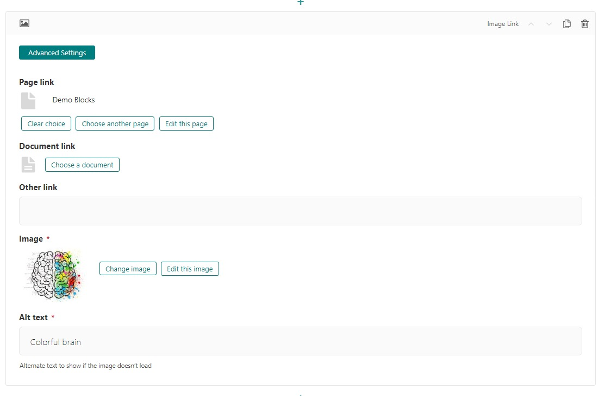

Image Link
==========

The image link block renders an image as an HTML anchor. This can be used to
link to pages, documents, or external links.

Example: This looks the same as an image, however a user can
click on it to invoke an action.  The cursor changes when you hover on it to indicate it's clickable.

Field Reference
---------------

Fields and purposes:

.. include:: baselink.rst

* **Image** - The image to be shown as the content of the anchor.

* **Alt text** - Alternate text to show to search engines and screen readers.

    the image link editor
