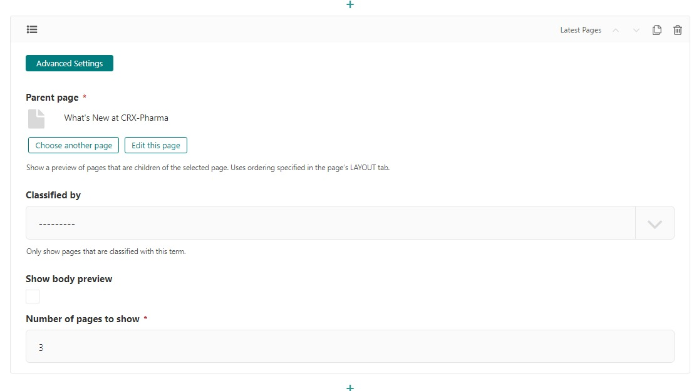
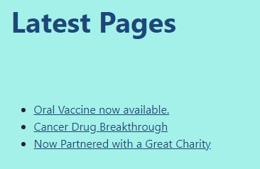
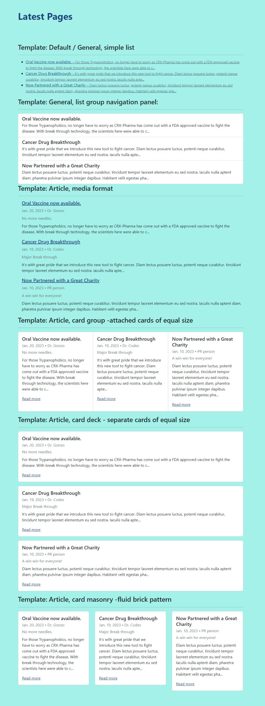

Latest Pages Block
==================

Creates a list of the most recently published pages with a specified length.

Example: (See below for different template examples.)
    .. figure:: images/latest_pages_body.jpeg
        :alt: The Latest Pages block as displayed on the website

        The Latest Pages block as displayed on the website with the default template (Show body preview selected)

.. note::
    Part 7 of the Getting Starting Tutorial has a section that utilizes the **Latest Pages** block.

Field Reference
---------------

Fields and purposes:

* **Parent Page** - Shows a preview of pages that are children of the selected page. Uses ordering specified in the page’s LAYOUT tab.

* **Classified By** - Filters which pages are displayed by the classifier that you selected

* **Show Body Preview** - If selected, shows a preview of what the page contains

* **Number of Pages to Show** - Limits how many pages are displayed to the number that you selected

* **Advanced Settings > Template** - has templates for how article pages display in the block.  See below for examples.

The pages are displayed as links with a line or so of text if the preview option is selected.

    The Latest Pages block and its settings

    The Latest Pages block as displayed on the website with the default template (Show body preview not selected)

Here are examples of the different templates that come preloaded with Wagtail-CRX.  It is the same three article or blog pages
displaying with different templates selected in the Advanced settings of the **Latest pages** block

    The Latest Pages block as displayed on the website with the default template (Show body preview not selected)
