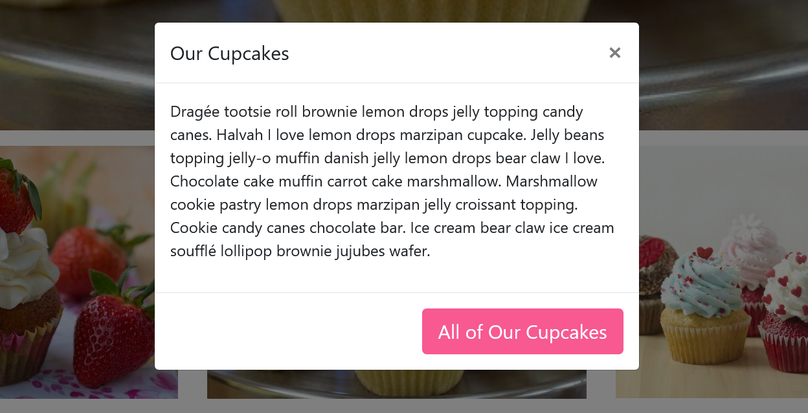

Modal Block
===========

Creates a popup box with a header, footer, and the ability to display the body as a block.

Field Reference
---------------

Fields and purposes:

* **Button Title** - The text to show on the button. You can insert simple HTML
  here as well, such as ``Learn <b>More</b>``.

* **Button Style** - The appearance of the button. This is a choice loaded from
  ``CRX_FRONTEND_BTN_STYLE_CHOICES`` Django setting and is inserted as a
  CSS class in the HTML.

* **Button Size** - The size of button. This is a choice loaded from
  ``CRX_FRONTEND_BTN_SIZE_CHOICES`` Django setting and is inserted as a CSS
  class in the HTML.

* **Modal Heading** - The heading, or title, that will display on the modal

* **Content** - Choose from other content blocks for the body of the modal.

* **Modal Footer** - Choose a Simple Text footer or a button link

Once it is published, website visitors can click the button to see the popup message.

    Our cupcake modal as it appears on the page
