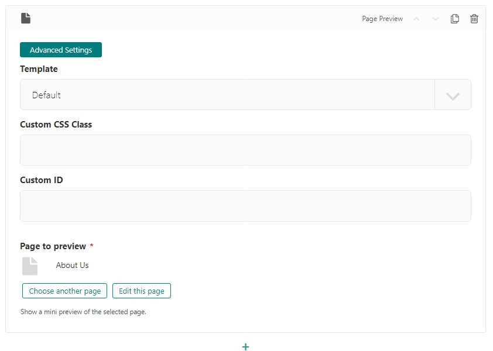
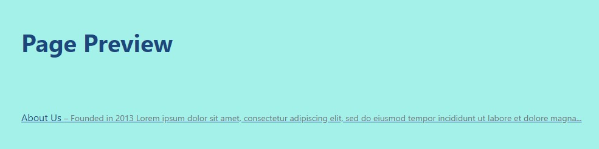
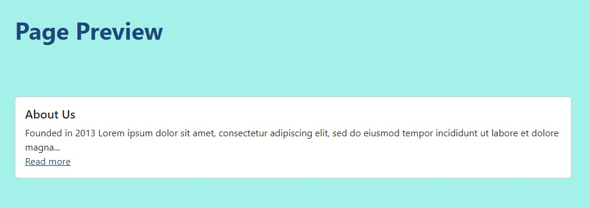
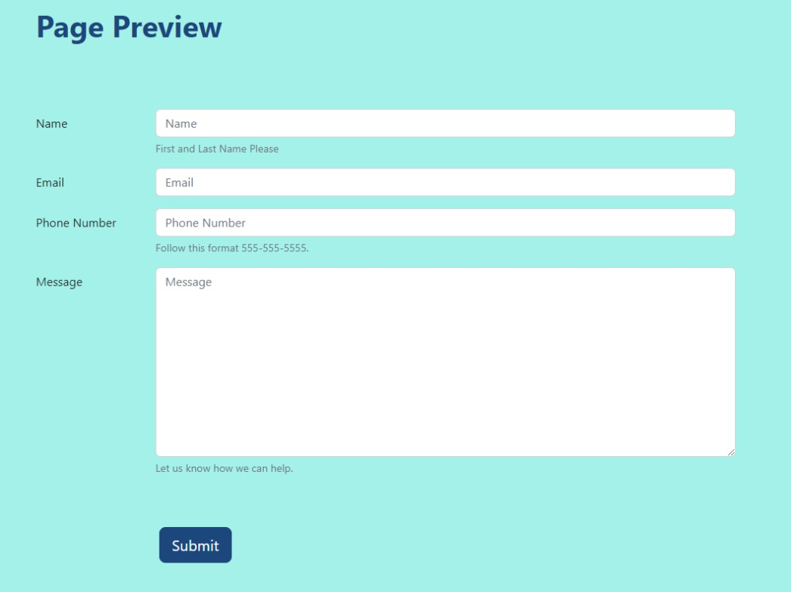

Page Preview Block
==================

Shows a preview of a selected Page

Example: see below

Field Reference
---------------

**Page to Preview** - Select the page that you want to display a preview

**Advanced Settings > Template** Choose different templates to display the child page.

    A Page Preview block and its settings

It looks very similar in design to the Latest Pages block but only displays the one selected page.
It shows a link to the page and a few lines of preview text.

Here are the three templates.  Please note that for the **Form inputs** template, you need to have a form selected as your preview page.

    A Page Preview block using the default template

    A Page Preview block using the card template

    A Page Preview block using the form inputs template.  Note we selected the contact us form for this template.
