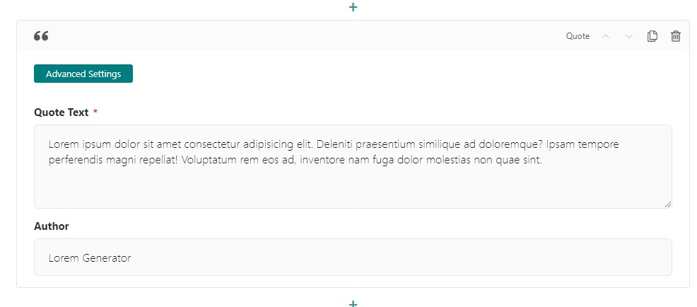

Quote Block
===========

Allows the user to enter a quote and an author.

Example:
    .. figure:: images/quote_example.jpeg
        :alt: A quote block

        A quote block

Field Reference
---------------

Fields and purposes:

* **Quote Text** - The text for the quote

* **Author** - The author of the quote

* **Advanced Settings** - Add custom CSS classes or a CSS ID to style the block with your custom CSS

    A quote block and its settings.
