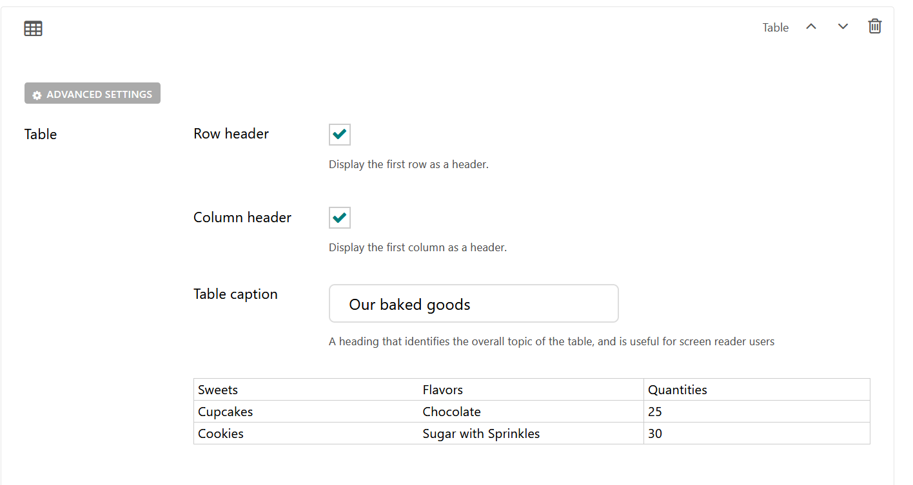

Table Block
===========

Allows the user to create a table with row and column headers. 

Field Reference
---------------

Fields and purposes:

* **Row Header** - If selected, displays the first row in the table as a header

* **Column Header** - If selected, displays the first column in the table as a header

* **Table Caption** - A heading that identifies the overall topic of the table, and is useful for screen reader users

* **Table Content** - A visual table for adding Content

* **Advanced Settings** - Add custom CSS classes or a CSS ID to style the block with your custom CSS 

The default table block is only 3 x 3, as shown here.

    A table block and its settings.

.. figure:: img/table_published.png
    :alt: A published table

    A published table
