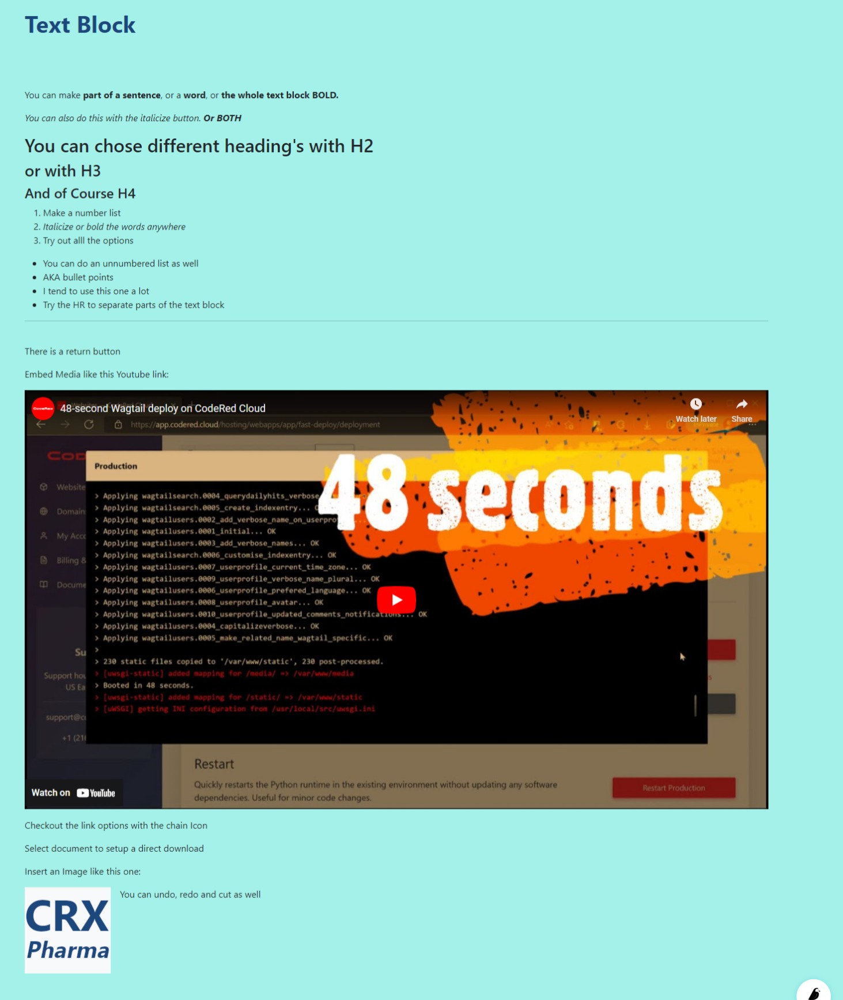

Text Block
==========

The text block allows the user to create formatted text with headers, lists, links, and media.
This is one of the most versatile editors.  It's best to try out all the options to get a feel for what all it can do.
Below is an example

Example: See Below

Field Reference
---------------

The text block does not have specific fields. It has a space for writing content with formatting options
in the format bar, such as:

* bold or italic -- font style formatting

* H2, H3, H4 -- titles and subtitles

* numbered list or bullet list

* horizontal line or line break

* embed, link, document, or image -- media content that can be embedded in the block

* undo and redo -- helpful in case you make a mistake or change your mind while writing

    A text block with some text.

    The text block the above editor produced.
