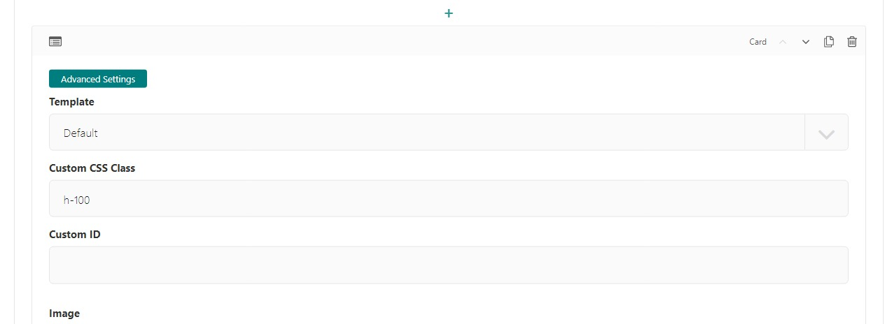
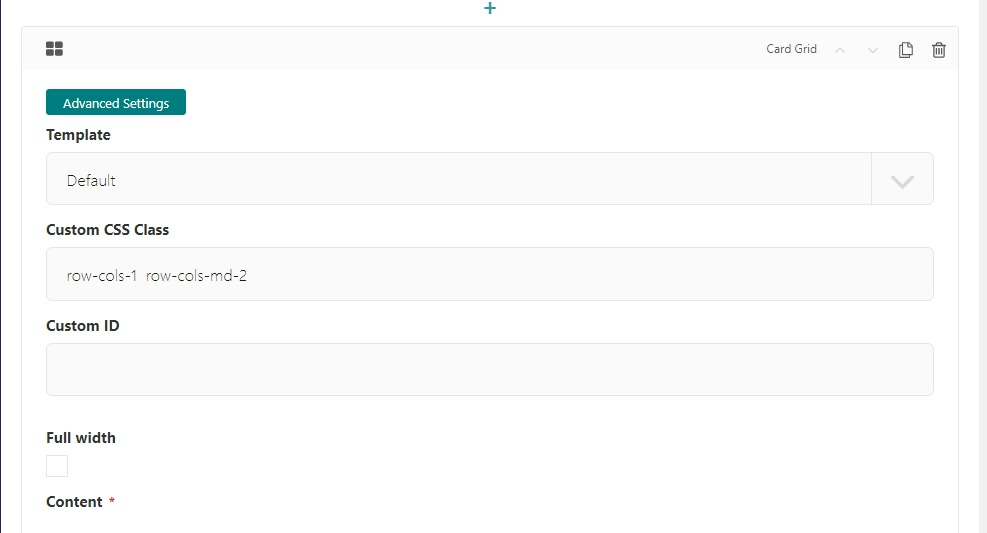
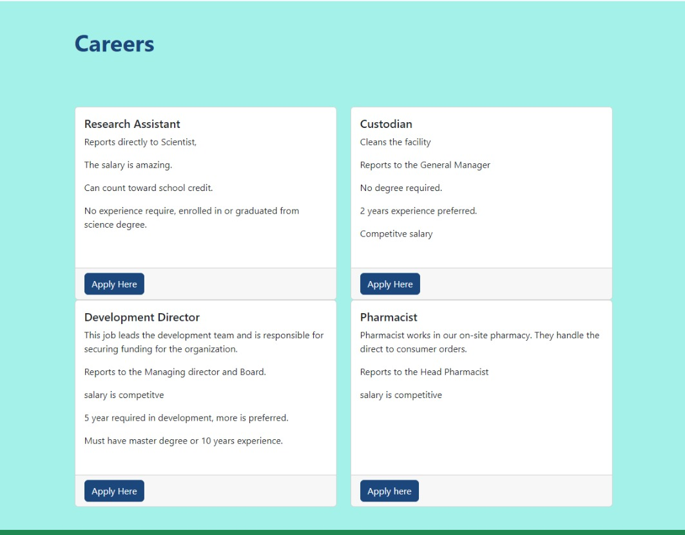
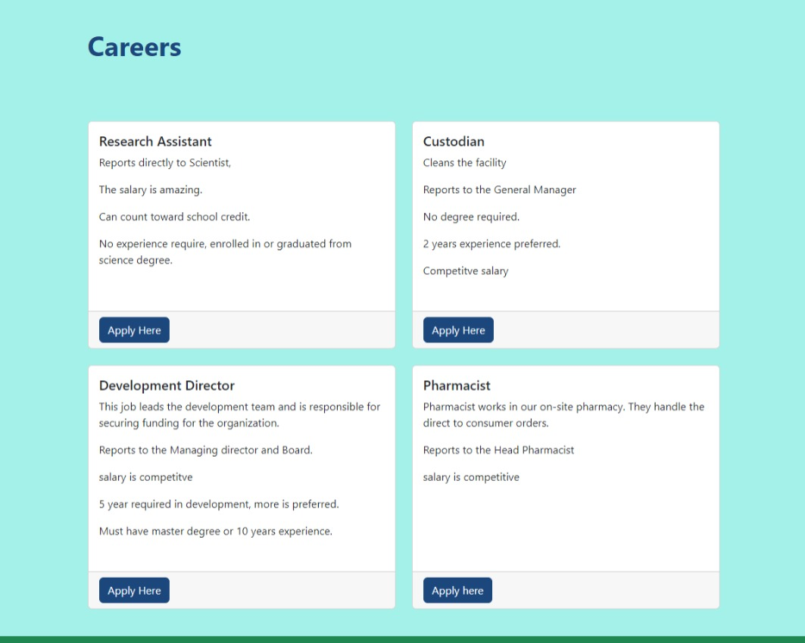

.. _card-grid:

Card Grid Block
===============

Creates a card grid layout with content and button options.  Card Grid puts cards in a row by default,
however you can use bootstrap classes to achieve specific layouts.  Take a look at our example.
See bootstrap `docs <https://getbootstrap.com/docs/5.2/components/card/#grid-cards>`_ for more information.

Field Reference
---------------

Fields and purposes:

* **Full Width** - If selected, sets whether the card grid spans the entire width of the screen

* **Content** - The individual cards in the grid.  See :ref:`card-block` for more on cards.

Example
-------

In your page editor (we used the "career" page we setup in the getting start tutorial):

* Choose **Card Grid**
* Select the **Card**
* Enter some info about in the card
* Make at least 4 cards total.

    4 cards in a row with different heights.

We can see here that the cards, show up in a row, and the height fits the content.
If we look at the `docs <https://getbootstrap.com/docs/5.2/components/card/#grid-cards>`_,
we'll see you can add "h-100" to each card and they will be the same height.  Let's try it.

In the page editor, go to each card and open the advanced settings.  Add "h-100" to the Custom CSS Class.

.. figure:: img/h100.jpeg
    :alt: Card block with h-100 added to Custom CSS Class

    Card block with h-100 added to Custom CSS Class

Save and preview

    Card grid with bootstrap class h-100 added to every card.

Cool. Let's make this a 2 by 2 grid.  Looking at the docs we see, the card grid uses specific classes
to determine how many cards should be in each row, based on a screen size.
For our example, we'll add `row-cols-1 row-cols-md-2`.  So the smallest screen size will have 1 card per row
and medium (tablet size) and up will have 2 per row.  Let's take a look.

In the page editor, open the advanced settings on the card grid.
Add `row-cols-1 row-cols-md-2` to the Custom CSS Class field.
Save and preview.

    The page editor screen with Custom CSS Class on the Card Grid Block

    Preview of Custom CSS Class on the Card Grid Block

The last thing we will look at is gutters.  The bootstrap card grid has built in classes that make
spaces uniform between the card.
These are known as `gutters <https://getbootstrap.com/docs/5.2/layout/gutters/#how-they-work>`_.
Let's add class `g-4` on our card grid and see what that looks like.  Our custom class now
looks like this `row-cols-1  row-cols-md-2 g-4`.  Save and Preview.

    Preview of Custom CSS Class on the Card Grid Block with gutters
