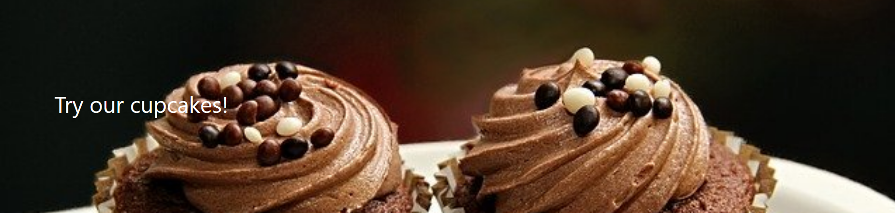

Hero Block
==========

A banner block with an image and some text, if desired.

Field Reference
---------------

Fields and purposes:

* **Full Width** - If selected, sets whether the hero spans the entire width of the screen

* **Parallax Effect** - If selected, background images scroll slower than foreground images, creating an illusion of depth.

* **Background Image** - Image chooser for the background image

* **Tile Background** - If selected, background image will be repeated in a tile pattern

* **Background Color** - Sets a background color to display with hexadecimal, RGBA, or CSS color notation (e.g. #ff0011)

* **Text Color** - Sets the color of the text for the entire hero block

* **Content** - Additional layout options such as a Responsive Grid Row, Card Grid, or HTML

.. note::
    If you want to use a hero block in place of the title/cover image on the web page, click on the LAYOUT tab
    in the editor and under Visual Design, choose the "Web page without title and cover image" template.

In the **Advanced Settings** you can add CSS classes. In our hero below, we added the Bootstrap class ``py-5`` to give
the hero image more padding and show more of the image. We also selected the focal point in the Image Editor.

    Our published hero block with padding