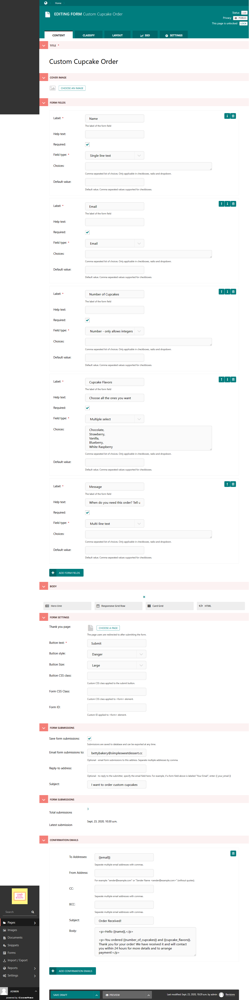

Form Pages
==========

Create a form that can be used to collect information from your users.

Usage
-----

First start by creating a "Form" (may be named differently on your specific website). Add content to this page as you would for a normal Web Page. 

Content Tab
~~~~~~~~~~~

* **Form Fields**: The data you want to collect on the form.  You can add as many fields as required ranging from all form input types like text, files, radio buttons, etc.

**Form Settings**

* **Thank You Page**: The page you want to redirect the user to after they successfully submit a form.
* **Button Text**: The text you want on the form submit button
* **Button Style**: The style you want on the form submit button.
* **Button Size**: The size you want the form submit button.
* **Button CSS Class**: Additional CSS classes you want to add to the button.
* **Form CSS Class**: Additional CSS classes you want to add to the form.
* **Form ID**: The HTML ID you want your Form to have.

**Form Submissions**

* **Save Form Submissions**: Toggles whether the form submissions are saved to your website's database.
* **Email Form Submissions to**: The email address you want the info you collect from your form to be sent to.
* **Reply-to Address**: The reply-to address you want the email to contain.
* **Subject**: The subject you want the email to use.

.. _confirmation-emails:

Confirmation Emails
-------------------

Click the "Add Confirmation Emails" button to add additional emails you want to send out when a form is submitted.

You can reference your form fields in the Confirmation Email's fields using Django bracket notation. For example, for the
**To Addresses:** you could reference your form field Email by using ``{{email}}``. 

The Django variable tags are generated automatically from the form fields that you create and are in lowercase letters, with any spaces indicated by an underscore.
If you had a form field with the label "Number of Cupcakes," the Django tag would be ``number_of_cupcakes`` which you would place in
curly brackets when referencing it in the Confirmation Email fields.

In the **Body** of the email, you can use HTML to design it as you like. Reference the form fields with Django tags to personalize it. See an example below:

    Our confirmation email is referencing the form fields that we created on a Custom Cupcake Order page. Review the full page
    to identify the references.

Settings Tab
~~~~~~~~~~~~

* **Form go live date/time**: The optional date/time the form will start appearing on the page.
* **Form expiry date/time**: The optional date/time the form will stop appearing on the page.
* **Spam Protection**: When toggled on, this will engage spam protection techniques to attempt to reduce spam form submissions.