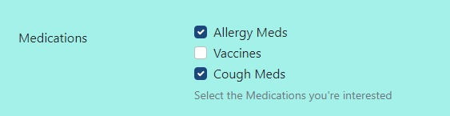

Form Pages
==========

Create a form that can be used to collect information from your users.

Usage
-----

First start by creating a "Form" (may be named differently on your specific website). Add content to this page as you would for a normal Web Page.

Content Tab
~~~~~~~~~~~

.. _form-fields:

Form Fields
-----------

* **Form Fields**: The data you want to collect on the form.  You can add as many fields as required ranging from all form input types like text, files, radio buttons, etc.

Each form field has multiple options as seen here:

    .. figure:: img/form_fields.jpeg
        :alt: The form field editing section

        The form field editing section

* **Label** Gives each form field a name.
* **Help text** is text directly underneath the input.
* **Required** this makes the form field required.  A user cannot submit a form if a required field is not filled out.  They can submit if the form field is blank and not required.
* **Field type** is the type of input you want for that form field.
* **Choices** are the default choices for any field type under the "Choice" drop down in the **Field type**
* **Default value** is a value that is automatically entered into the input, however the user can override it.

**Field type** dropdown:

    .. figure:: img/field_type_dropdown.jpeg
        :alt: field type dropdown

        The field type dropdown

**Field type** options

Text

    * Single line text: Provides a single line for text.  Ideal for a word or two input (like a name input)
    * Multi-line text: Provides a text-area or multiple lines for text.  Ideal for a short message.
    * Email: Provides a single line for an email.  Validates that the input data is in email format on submission.
    * Number: Allows numbers and a few special characters like - and .  Good for phone numbers, prices, any other numerical value.
    * URL: Provides a single line for text.  Validates that the input data is in URL format on submission.

Choice
    Choice inputs correspond with the **Choices** input field on the form builder.  Here is a simple example:

    Checkboxes selected as Field type, and three options in choices separated by commas.

    How the checkboxes display.

With default options selected:

    Checkboxes with default values selected in the editor

    Checkboxes with default values selected.

    * Checkboxes: Allows user to select zero to many options.
    * Dropdown: Allows user to select one option from a drop down menu
    * Radio Buttons:  Allows user to select one option with a circular indicator.
    * Multiple select: A Dropdown that allows a user to select more than one option
    * Single Checkbox: Does not use the choices field.  Just a "checked" or unchecked for a single line.

Date & time

    * Date: Single line input with calendar date picker built it.
    * Time: Single line input with clock for selecting time built it.

File Upload
    * Secure File - allows user to upload a file.

Other
    * Hidden Field: Form field hidden to users.  Aids in preventing bots from filling out the form.

Demo of different field types:

    Demo screenshot of each field type

**Form Settings**

* **Thank You Page**: The page you want to redirect the user to after they successfully submit a form.
* **Button Text**: The text you want on the form submit button
* **Button Style**: The style you want on the form submit button.
* **Button Size**: The size you want the form submit button.
* **Button CSS Class**: Additional CSS classes you want to add to the button.
* **Form CSS Class**: Additional CSS classes you want to add to the form.
* **Form ID**: The HTML ID you want your Form to have.

**Form Submissions**

* **Save Form Submissions**: Toggles whether the form submissions are saved to your website's database.
* **Email Form Submissions to**: The email address you want the info you collect from your form to be sent to.
* **Reply-to Address**: The reply-to address you want the email to contain.
* **Subject**: The subject you want the email to use.

.. _confirmation-emails:

Confirmation Emails
-------------------

Click the "Add Confirmation Emails" button to add additional emails you want to send out when a form is submitted.

You can reference your form fields in the Confirmation Email's fields using Django bracket notation. For example, for the
**To Addresses:** you could reference your form field Email by using ``{{email}}``.

The Django variable tags are generated automatically from the form fields that you create and are in lowercase letters, with any spaces indicated by an underscore.
If you had a form field with the label "First Name" the Django tag would be ``first_name`` which you would place in
curly brackets when referencing it in the Confirmation Email fields.

In the **Body** of the email, you can use HTML to design it as you like. Reference the form fields with Django tags to personalize it. See an example below:

    Our confirmation email is referencing the form fields that we created on the "Contact Us" page. Review the full page
    to identify the references.

.. figure:: img/form_fields_editor.jpeg
    :alt: The form fields on the contact us page

    Our confirmation email is referencing the form fields that we created on the "Contact Us" page. Here are the form fields on that page.

.. note::

    By default when running locally, confirmation emails are not sent, but are
    instead printed to the command line.

Settings Tab
~~~~~~~~~~~~

* **Form go live date/time**: The optional date/time the form will start appearing on the page.
* **Form expiry date/time**: The optional date/time the form will stop appearing on the page.
* **Spam Protection**: When toggled on, this will engage spam protection techniques to attempt to reduce spam form submissions.
