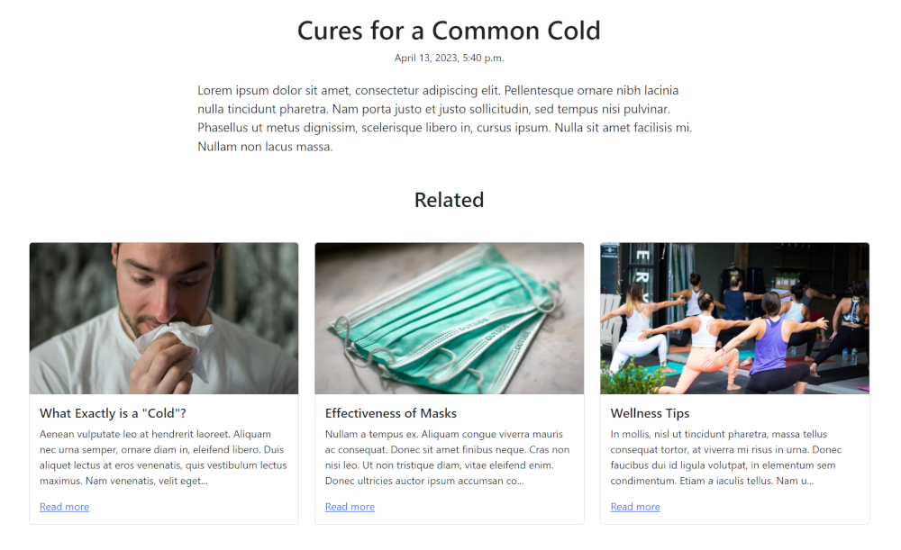

Related Pages
=============

Using the power of :doc:`/features/snippets/classifiers`, pages can automatically show a list of similarly classified pages. By default, this is enabled on :doc:`/features/page_types/article_pages`, but can be enabled on any page via the Wagtail Admin, or a 1-line code change on the page model.

   Related pages showing similarly classified articles.

Related page formatting
------------------------

Each related page is rendered using the page model's "miniview" template.
The template can be overridden per model with the ``miniview_template`` attribute, the default of which is `coderedcms/pages/page.mini.html <https://github.com/coderedcorp/coderedcms/blob/main/coderedcms/templates/coderedcms/pages/pages.mini.html>`_.

If related pages are enabled, a ``QuerySet`` of pages is added to the context as ``related_pages``. This ``QuerySet`` can also be retrieved by calling ``page.get_related_pages()``.

Related page customization
--------------------------

Each page can have related pages turned on or off via a toggle in the page editor, under the **Layout** tab. Pages based on ``CoderedArticlePage`` have this setting enabled by default when new pages are created. To toggle the default value when creating new pages, set ``related_show_default`` to ``True`` or ``False``. To retroactively toggle this setting on existing pages, set the related ``related_show`` field using a manual query or migration.

By default, sibling pages are queried and ordered based on the number of Classifier Terms in common. If you wish to query a different model --- for example to have Article pages show related Product pages instead --- set the ``related_query_pagemodel`` attribute to the desired content type.

.. code-block:: python

   class ProductPage(CoderedPage):

       # Custom template that will be used when a Product
       # is shown on an Article page (below).
       miniview_template = "website/pages/product.mini.html"

   class ArticlePage(CoderedPage):

       # Show related pages by default when creating new Articles.
       related_show_default = True

       # By default, related sibling Articles will be shown.
       # Show related Products instead.
       related_query_pagemodel = "website.ProductPage"

If you'd instead prefer to totally customize the related algorithm, override the ``get_related_pages()`` function. Just be sure to return a ``QuerySet`` of pages.

.. code-block:: python

   class ProductPage(CoderedPage):
       price = models.DecimalField(max_digits=9, decimal_places=2)

   class ArticlePage(CoderedPage):

       # Show related pages by default when creating new Articles.
       related_show_default = True

       def get_related_pages(self) -> models.QuerySet:
           """Show most expensive products first."""
           return ProductPage.objects.live().order_by("-price")

.. versionadded:: 2.1

   You must be on Wagtail CRX version 2.1 or higher to use related pages.
