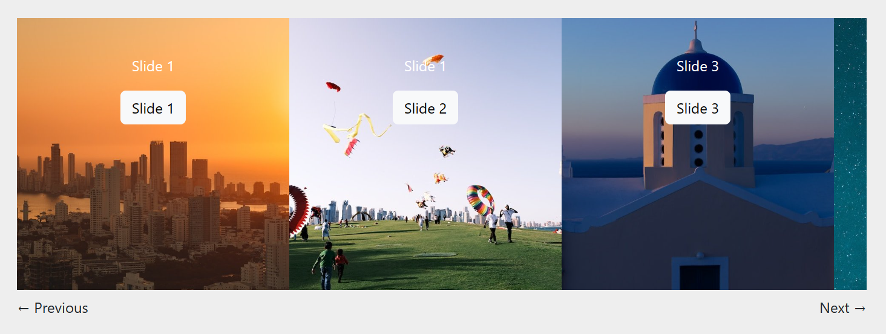

Film Strip
==========

A long horizontal row of scrollable panels, similar to a reel of film.

   The film strip block, with four panels (three fully visible).

Usage
-----

You define your film strips and their panels in the **Snippets > Film Strips** section of the admin.  Once defined, any page with a body streamfield can show that film strip by selecting it with a :doc:`/features/contentblocks/filmstrip`.

Fields
------

Slider
~~~~~~
**Name**: A unique name for your film strip.  It can be anything, it is just used as a personal reference to easily tell them apart within Wagtail.

Panels
~~~~~~

To add a slide to your carousel, click the "Add Slides" button.

**Background image**: An optional image that will fill the entire panel. May be cropped or scaled to fit.
**Background color**: An optional color that will fill the entire panel.
**Foreground color**: An optional color used for text in the panel.
**Custom CSS class**: If you need to add a specific CSS class for this panel, add it here.
**Custom ID**: If you need to add a specific ID for this panel, add it here.
**Content**: A streamfield that contains the content blocks for the panel.

.. versionadded:: 2.1

   You must be on Wagtail CRX version 2.1 or higher to use Film Strips.
