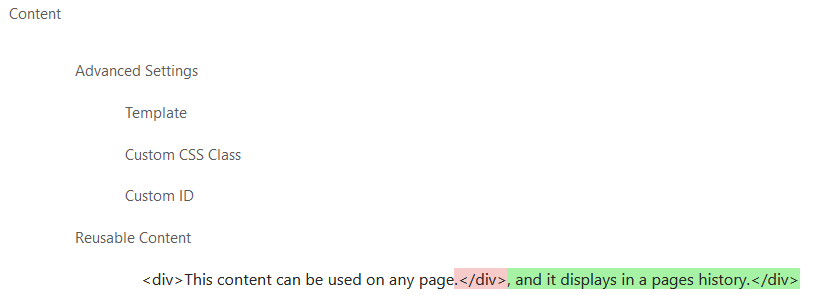

.. _reusable-content:

Reusable Content
================

A representation of content that you would like to repeat often on your pages.

Usage
-----

You define your content walls in the Snippets > Resusable Content section of the admin.  Once defined, any page with a body streamfield can show the reusable content by selecting it with a reusuable content block.

When a reusable content is saved in the admin, a revision will be created.  On the edit form for a reusable content, the status icon and history icon in the top right provide a way to get to the history of the reusable content.

If a reusable content is saved in the admin, and it is used on a page or by another reusable content, a revision will be created of the page or reusable content.  These revisions allow the history for the page or reusable content to display the contents of the reusable content or any changes made to it.

Fields
------

**Name**: A unique name for your footer.  It can be anything, it is just used as a personal reference to easily tell them apart.
**Content**: A streamfield that contains the layout blocks for the resusable content.
**Revisions**: A relation to the revisions that get created when a reusable content is saved.
