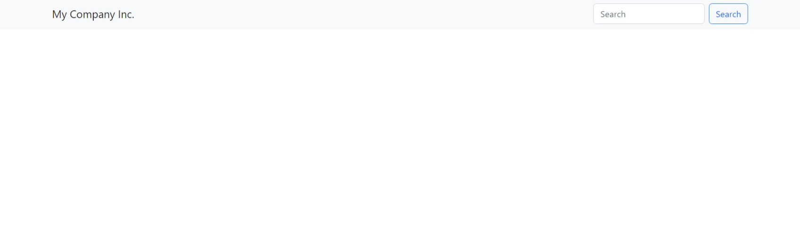

About The Tutorial
==================

It is recommended that you follow the tutorial as closely as possible. This allows you to troubleshoot most issues on your own.
If you find an errors, typos, or discrepancies, please let us know.

Screenshots
-----------
Visual Studio Code is used as the code editor for coding specific screenshots.  There are many extensions and themes available for Visual Studio Code.
It is likely that your code editor will look slightly different.

Sass support
------------

This tutorial uses sass support.  This allows us to easily override the bootstrap colors.
The few extra steps at the beginning saves us from writing more CSS to accomplish the same goal.
See:  :ref:`sass_install`

After following the installation guide and compiling the sass (step 7), your site should look like this:

    The Starting Page.

If it does not look like that:

* Make sure you compiled you followed :ref:`sass_install` and not the basic installation
* Check that your stylesheet is linked in `mysite/website/templates/coderedcms/pages/base.html`
* Hard refresh your browser to reload the CSS stylesheet.

.. note::
    Every time a change is made to the sass we have to compile it and hard refresh the browser.

Follow the tutorial: :doc:`tutorial01`.
