Tutorial Part 1: Site Name, Logo, and Global Colors
===============================================================

.. note::
   For this tutorial, we will assume the name of your project is ``mysite``.

After :doc:`install`, you are greeted with a bare-bones website.
Let's start filling things out.

Logging in
----------

Navigate in your browser to http://localhost:8000/admin/ and log in with the username
and password you created with the ``python manage.py createsuperuser`` command.

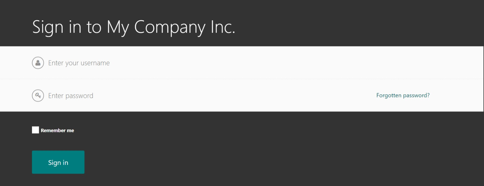

    The login Screen

After logging in, you will be taken to the admin dashboard - also known as the "Wagtail Admin".

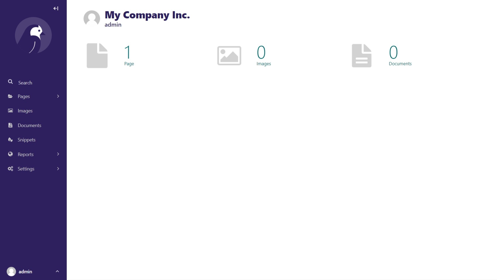

    The admin dashboard.

.. _site-name:

Changing your site name
-----------------------

By default, the site name shows up in many different places, including page titles in the browser tab.
To change the name, go to **Settings > Sites**, and click on the site that is there. Change the
**Site name** setting and click "Save".

.. note::
    There is also a ``WAGTAIL_SITE_NAME`` setting in the ``mysite/settings/base.py`` file. This is really
    only used for the login screen and on the main Wagtail Admin dashboard. The reason this setting exists
    is for use with multi-sites. For example, if you have a parent company that operates many separate
    brand websites within one CMS, then ``WAGTAIL_SITE_NAME`` would be the name of the parent company.

For my website, I'm going to change **Settings > Sites > Site name** to "CRX-Pharma".

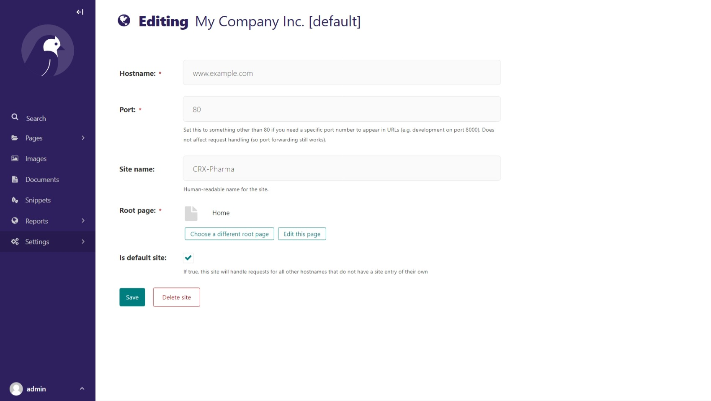

    Changing the site name.

And edit ``mysite/settings/base.py`` by changing ``WAGTAIL_SITE_NAME`` as so::

    WAGTAIL_SITE_NAME = 'CRX-Pharma'

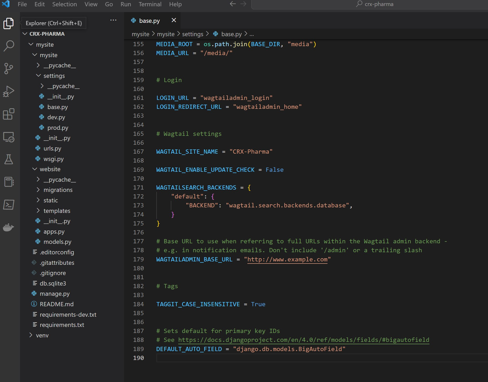

    Changing the site name in base.py

Now the admin dashboard and login page show "CRX-Pharma", and the Home page at http://localhost:8000/
will show "CRX-Pharma".

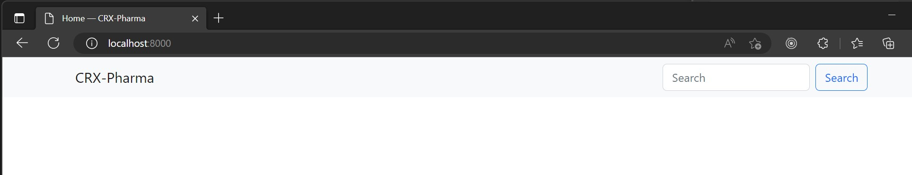

    Updated Settings

.. _logo:

Adding your logo
----------------

First, and most important, is the logo. Go to **Settings > CRX Settings**. Here are the site-wide
visual and design settings for your website. At the top are two settings for your logo and
favicon. Both will be scaled to fit wherever they are used, but we recommend
the following image parameters:

* **Logo:** probably does not need to be any larger than 500x500 pixels, unless you plan to have
  a giant logo. Any image ratio is fine, logos come in all shapes and sizes.

    .. figure:: images/tut01/CRX-Pharma.png
       :alt:  logo.

       Right click and download this image to follow along.

* **Favicon:** does not need to be any larger than 200x200 pixels. A 1:1 (square) image ratio is
  best here - if the image is not square, it will be scaled to a square.

    .. figure:: images/tut01/CRX-Pharma-favicon.png
        :alt:  logo.

        Right click and download this image to follow along.

.. note::
    We recommend PNG format at 300 DPI so that your logo will look sharp on high resolution
    mobile devices and retina displays. However, any image format will work.

After uploading your logo and favicon, click "Save". You should now instantly see your logo
applied in the dashboard. In a new tab, go to http://localhost:8000/ and you'll see that your
logo and favicon show up everywhere on your site.

    Adding the logo.

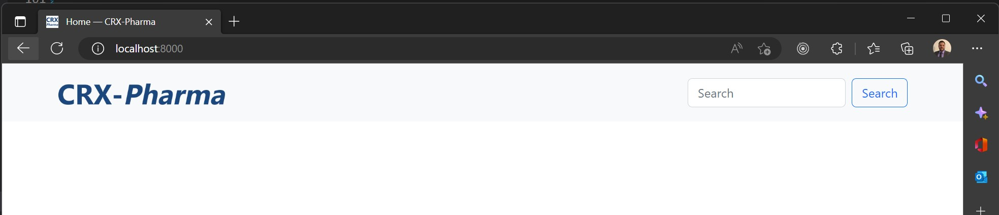

    The logo on our website.

.. _navbar-global:

Changing navbar and global site colors (Theme variant)
------------------------------------------------------

The default style is a light-colored navbar and the standard Bootstrap colors.
But if you have a white or light colored logo, you might prefer a dark navbar.
To change the navbar color, go to **Settings > CRX Settings** in the admin screen and alter the following settings:

* **Navbar color scheme:** Dark
* **Navbar CSS class:** ``bg-dark`` (or some other CSS class. See
  `Bootstrap color utilities <https://getbootstrap.com/docs/4.3/utilities/colors/#background-color>`_)

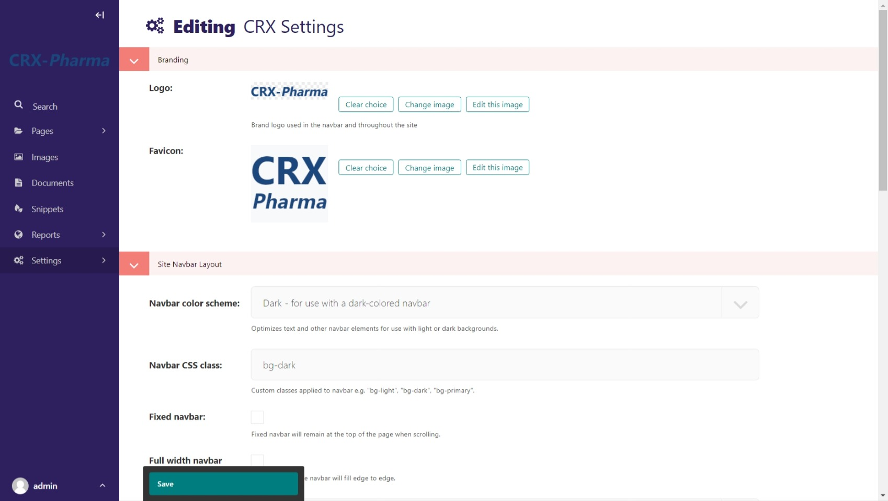

    Navbar settings at **Settings > CRX Settings**

Click "Save" and go to http://localhost:8000/ to see your new navbar. Great success! There are
many other settings here for controlling the layout of the navbar. Play with them and pick
what works best for you. Once again, most of these settings utilize default Bootstrap styles.

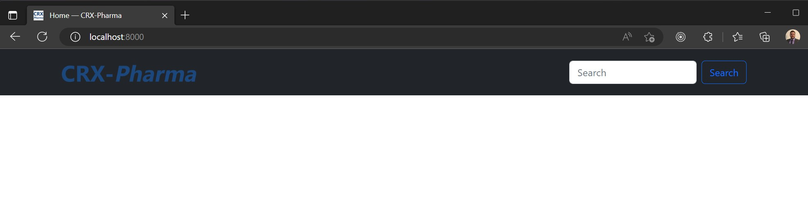

    Our site with a dark navbar.

This look isn't ideal for the CRX-pharma website, so in the admin screen lets navigate back to **Settings > CRX Settings**.
Then change our settings to:

 * **Navbar color scheme:** Light
 * **Navbar CSS class:** ``bg-light``

and **Save.**

**Theme Variant**

Beyond the navbar, you can swap out the entire Bootstrap CSS theme in use. We provide a few simple
themes from `Bootswatch <https://bootswatch.com/>`_. Select an option from the **Theme variant**
setting, click "Save", and view your site. Pick one that looks best to you. If you are going to be
doing a lot of heavy CSS customization, you might want to stick with the default to ensure
compatibility with the Bootstrap documentation.

Global Site Colors with Sass
----------------------------

For CRX-Pharma we will change the website's global colors with Sass.  This a great way to get the exact colors you want for your site.
In your file explorer, Navigate to **mysite>website>static>website>src>_variables.scss** .  In this file, we can override the primary and secondary colors.
*It's suggested you read through the comments on this page.*
We are going to make the following changes:

* "Uncomment out" line 22 and change `$blue` to  `#1b477d`
* "Uncomment out" line 23 and change `$gray-600` to  `#1e8752`
* "Uncomment out" line 36 and change `$white` to  `#a4f1e9`

The edited **_variables.scss** file show now look like this :

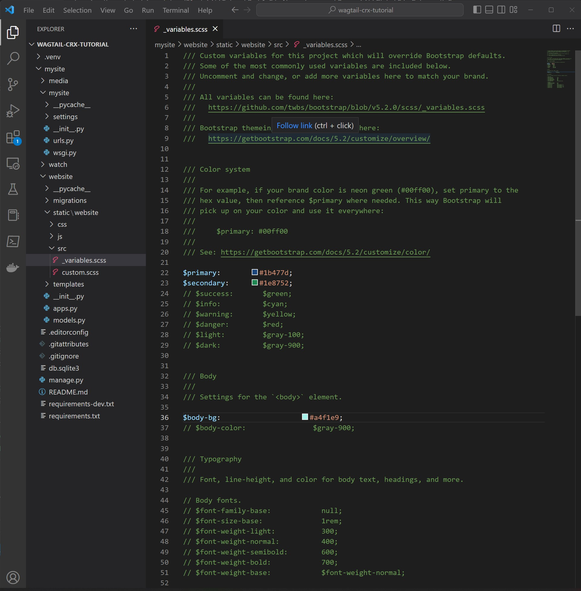

    This screenshot was taken in Visual Studio Code.  Your code editor may look different.

* The final step is to compile the sass. In your terminal:

    * Stop your server with `ctrl + c`.

    * Run:

.. code-block:: console

     $ python manage.py sass website/static/website/src/custom.scss website/static/website/css/custom.css

* Restart server with `python manage.py runserver`

This is what my terminal looked like following those steps:

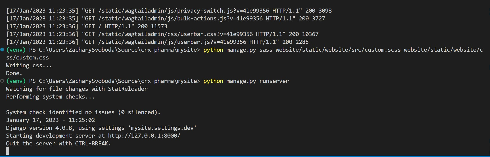

    This screenshot was taken on Windows using PowerShell.  Yours may look different.

Now hard refresh your browser at http://localhost:8000 and you should see the new background-color:

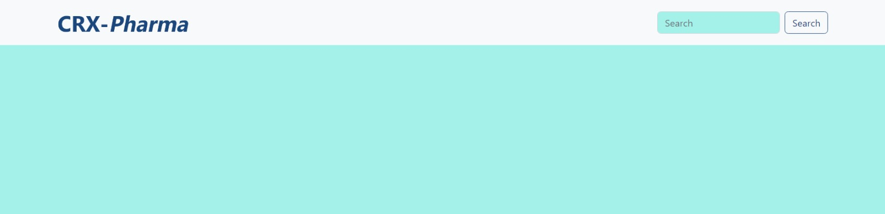

    The global colors have been updated!

.. note::
    The background color in the search input is not ideal and will be addressed in the part 3 of the tutorial.
    The goal of the this section was to demonstrate how to use bootstrap variables to change global properties.
    You can now use bootstrap classes with "primary" or "secondary" and our new colors will override the defaults.
    A great example of this is the buttons. The default buttons will be dark blue.

