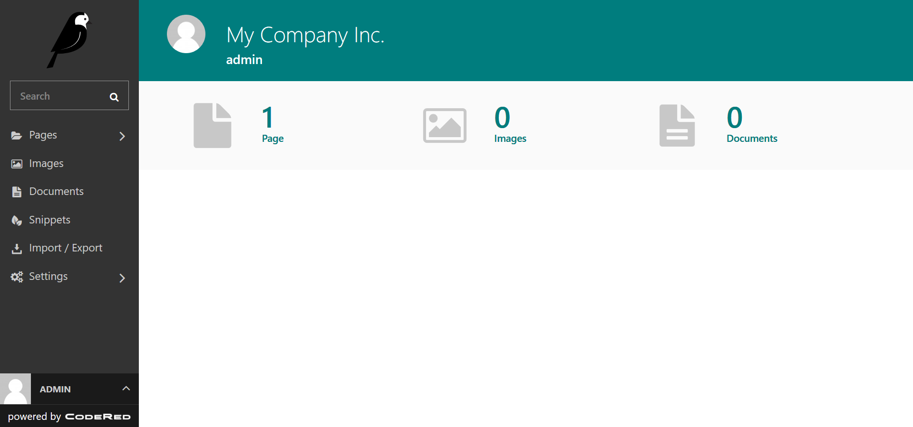
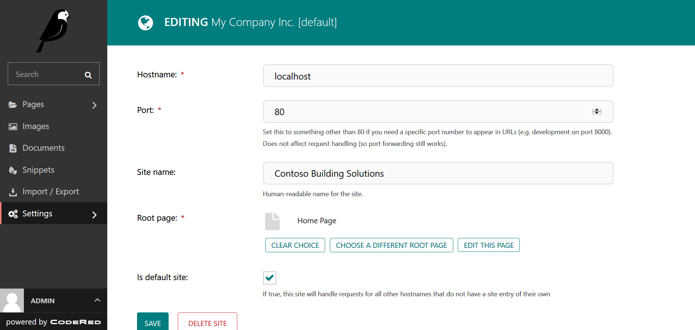
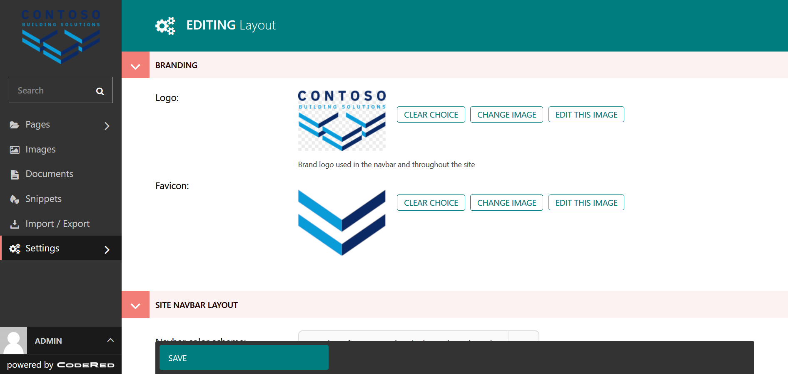
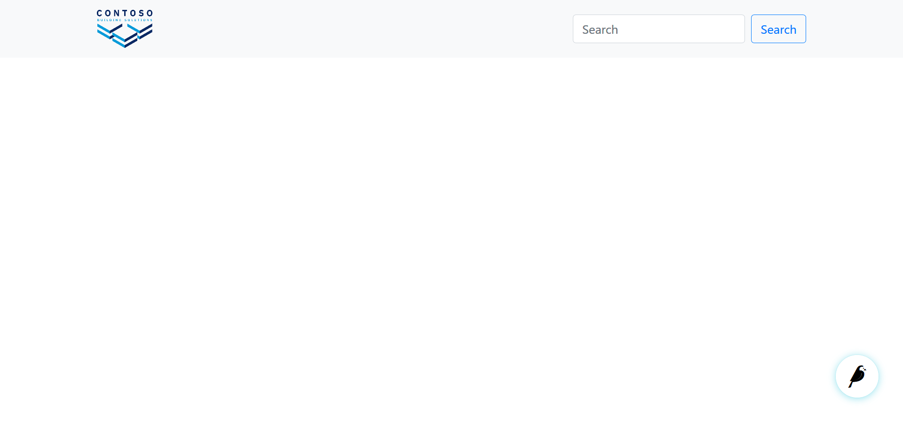
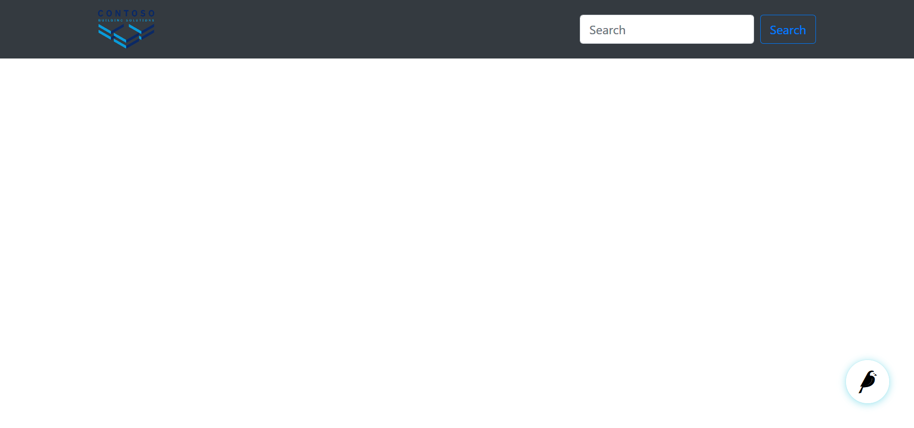

Your First CodeRed Website: Part 1
==================================

After :doc:`install`, you are greeted with a bare-bones website.
Let's start filling things out.

For this tutorial, we will assume the name of your project is ``mysite``.

Logging in
----------

Navigate to http://localhost:8000/admin/ and log in with the username
and password you created with the ``python manage.py createsuperuser`` command.

After logging in, you will be taken to the admin dashboard, also known as the "Wagtail Admin".

    The admin dashboard.

Changing your site name
-----------------------

By default, the site name shows up in many different places, including page titles in the browser tab.
To change the name, go to **Settings > Sites**, and click on the site that is there. Change the
**Site name** setting and click "Save".

.. note::
    There is also a ``WAGTAIL_SITE_NAME`` setting in the ``mysite/settings/base.py`` file. This is really
    only used for the login screen and on the main Wagtail Admin dashboard. The reason this setting exists
    is for use with multi-sites. For example, if you have a parent company that operates many separate
    brand websites within one CMS, then ``WAGTAIL_SITE_NAME`` would be the name of the parent company.

For my website, I'm going to change **Settings > Sites > Site name** to "Contoso Building Solutions".

    Changing the site name.

And edit ``mysite/settings/base.py`` by changing ``WAGTAIL_SITE_NAME`` as so::

    WAGTAIL_SITE_NAME = 'Contoso Ltd.'

Now the admin dashboard and login page show "Contoso Ltd.", and the Home page at http://localhost:8000/
will show "Contoso Building Solutions".

Adding your logo
----------------

First, and most important, is the logo. Go to **Settings > Layout**. Here are the site-wide
visual and design settings for your website. At the top are two settings for your logo and
favicon. Both will be scaled to fit wherever they are used, but we recommend
the following image parameters:

* **Logo:** probably does not need to be any larger than 500x500 pixels, unless you plan to have
  a giant logo. Any image ratio is fine, logos come in all shapes and sizes. 😀
* **Favicon:** does not need to be any larger than 200x200 pixels. A 1:1 (square) image ratio is
  best here - if the image is not square, it will be scaled to a square.

.. note::
    We recommend PNG format at 300 DPI so that your logo will look sharp on high resolution
    mobile devices and retina displays. However, any image format will work.

After uploading your logo and favicon, click "Save". You should now instantly see your logo
applied in the dashboard. In a new tab, go to http://localhost:8000/ and you'll see that your
logo and favicon show up everywhere on your site.

    Adding the logo.

    The logo on our website.

Changing navbar and global site colors
--------------------------------------

The default style is a light-colored navbar and the standard Bootstrap colors.
But if you have a white or light colored logo, you might prefer a dark navbar.
To change the navbar color, go to **Settings > Layout** and alter the following settings:

* **Navbar color scheme:** Dark
* **Navbar CSS class:** ``bg-dark`` (or some other CSS class. See
  `Bootstrap color utilities <https://getbootstrap.com/docs/4.3/utilities/colors/#background-color>`_)

Click "Save" and go to http://localhost:8000/ to see your new navbar. Great success! There are
many other settings here for controlling the layout of the navbar. Play with them and pick
what works best for you. Once again, most of these settings utilize default Bootstrap styles.

    Our site with a dark navbar.

Beyond the navbar, you can swap out the entire Bootstrap CSS theme in use. We provide a few simple
themes from `Bootswatch <https://bootswatch.com/>`_. Select an option from the **Theme variant**
setting, click "Save", and view your site. Pick one that looks best to you. If you are going to be
doing a lot of heavy CSS customization, you might want to stick with the default to ensure
compatibility with the Bootstrap documentation.

For my website, I'm going to change the navbar color scheme back to "Light", CSS class to ``bg-light``,
and leave the theme variant at the default.
