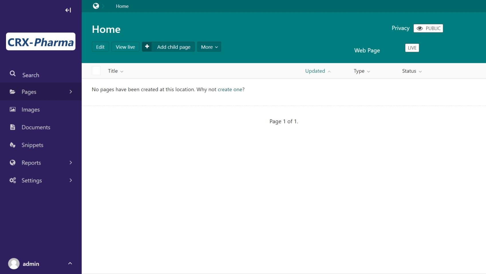
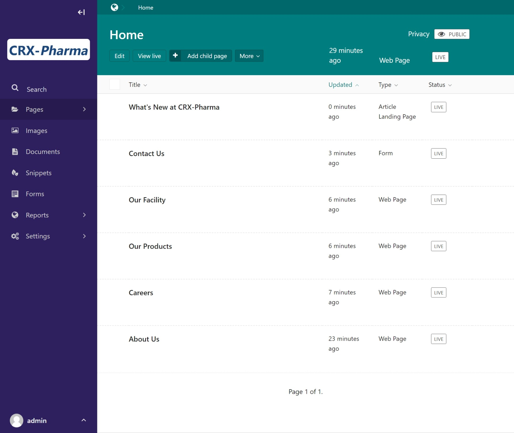
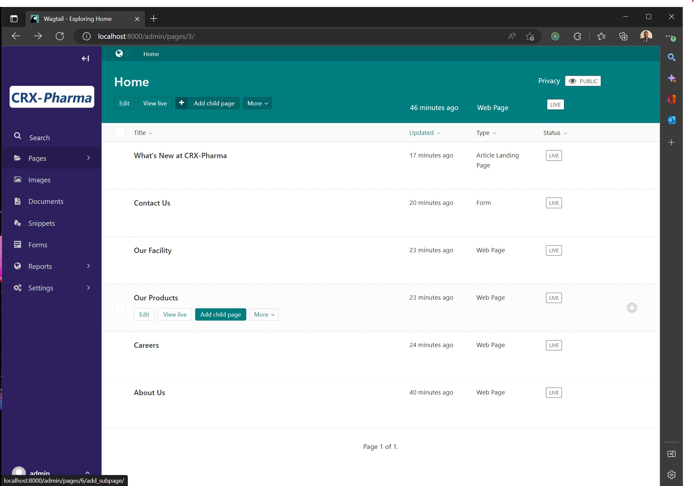

Tutorial Part 2: Adding Pages
=============================

We're going to add some placeholder pages to our project.
We will go in more detail and build these pages out later in the tutorial.
Having placeholder pages will help when we build out out the homepage, navbar, and footer.

* Go back to the admin screen http://localhost:8000/admin/
* In the side menu click **Pages** and then **Home**. This brings you here:

    The pages dashboard.

* Click add child pages
* Choose **Web Page** in the create-a-page screen. This action brings you to a new Web Page screen.
* Enter "About Us" in the title field.
* Click **Save draft** at the bottom of the browser.

 .. figure:: images/tut02/about_us.jpeg
    :alt: About Us Webpage start

    The About Us webpage editor

* Choose the up arrow ^ next to **Save draft**
* Choose **Publish**

  .. figure:: images/tut02/about_us_publish.jpeg
    :alt: About Us Webpage start

    The about us web page editor

* This will redirect you to the pages admin screen with the newly created About Us page.

  .. figure:: images/tut02/pages_home_about_us.jpeg
    :alt: The pages dashboard with the About Us Page

    The pages dashboard with the About Us Page

Repeat this process again for the following web pages:

* Careers
* Our Products
* Our Facility

In addition to those, we are going to add two different types of pages:

**Form**

* Add a child page
* Choose **Form**
* Enter "Contact Us" in the title field.
* **Save** and **Publish**

**Article Landing Page**

* Add a child page
* Choose **Article Landing Page**
* Enter "What's New at CRX-pharma" in the title field.
* **Save** and **Publish**

After adding the pages the dashboard should look like this:

    The pages dashboard with the all the pages

The last pages we will make are children of a child page.

* Hover over "Our Products"
* Choose **Add child page**

    Create a child page of Our Products

* Choose **Web Page**
* Enter "Direct to Consumer" in the title field.
* **Save** and **Publish**

You should be redirected to admin screen for the Our Products Page.  Here you can add the last page by

 * Choosing **Add child page**
 * Choose **Web Page**
 * Enter "Bulk Sales" in the title field.
 * **Save** and **Publish**

.. note::
    In the Pages Admin screen there are options for editing, viewing, deleting, unpublishing,
    and to see the History of changes made on pages.  Explore these powerful tools!

Now we have all these pages let's build out the rest of the site.
