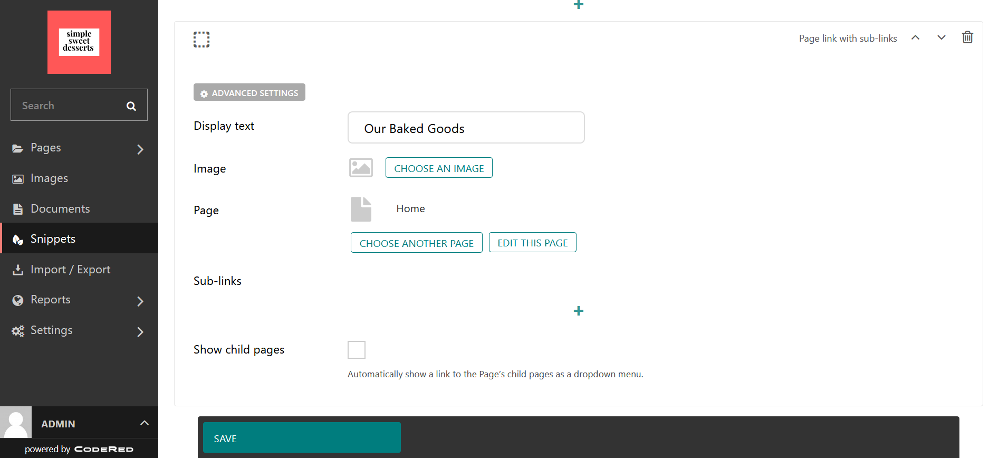
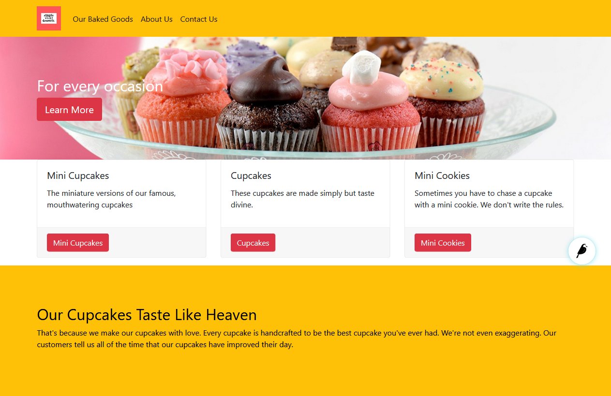
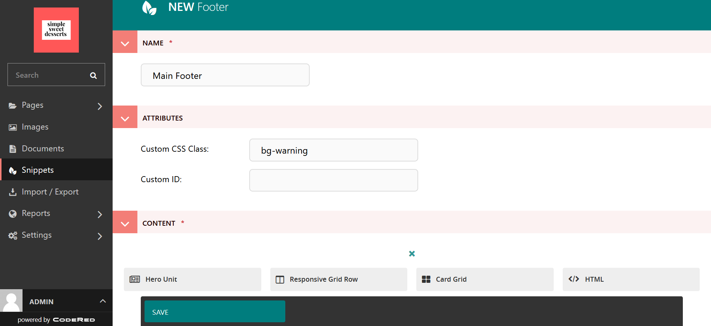
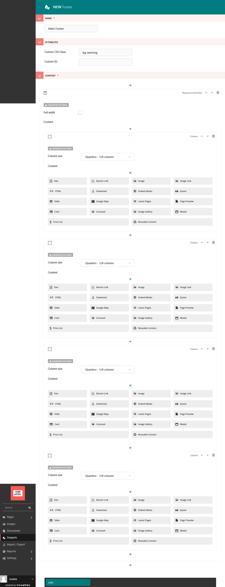

Tutorial Part 3: Navbar & Footer
================================

Let's begin to work on our navigation and footer setup.

.. _navbar:

Customizing the navigation
--------------------------

The general layout of your navbar can be found in the **Settings > Layout**
section of the Wagtail Admin. We previously discussed choosing a dark or
light navbar and adding Bootstrap classes, but you can also add/remove the
Search bar, set it to fixed (stays at the top even when you scroll) or full-width,
decide on which screen size it will collapse into a menu hamburger, and whether to
center the logo at the top or keep it toward the left-hand side.

.. note::
    In Layout, we added the Bootstrap background color class ``bg-warning`` but you can choose whatever
    you like for your site. We also decided to remove the Search Bar from the Navbar by de-selecting the
    option to show the Search Bar. It's recommended to review all of the available settings, and go ahead
    and play around with them!

Create your menus
-----------------

Your navbar will have links to your other pages or external content that you want
to share. To build your menu, go to **Snippets > Navigation Bars**.

In the top right-hand corner is a button that says **Add Navigation Bar**.
Click on this button to start! (Alternatively, you can also click on the link that says "Why not add one?")

.. figure:: img/tutorial_new_nav_edit1.png
    :alt: The edit screen for adding a navbar.

    The edit screen for adding a new navbar

Name your navbar. In this case, this will be our main navigation bar so we have simply named it
Main Nav.

There are three types of links that you can add to your navbar. Let's briefly describe each one:

* **Page link with sub-links** - Add links to pages from within your website. Add sub-links for dropdown items.

* **External link with sub-links** - Add external links from other websites to your site, as well as sub-links.

* **Document link with sub-links** - Add document links with sub-links to your navbar.

We don't have any other pages set up yet, but we can still create our menu. For now, we will just link to
the Home page and update it once we have more pages.

    The edit screen with our first navbar item.

Continue to add as many navbar items as you want for your website. You can always edit your menu and add more
top-level items or dropdowns as you make more pages. We are going to start with our three most important ones
for our sweets shop!

    The website with our menu added. Also note that we are using some Bootstrap colors on the site.

Site Navbars Settings
---------------------

After you create your navbar, go to **Settings > Layout** and scroll down to **Site Navbars**. Click on the plus sign
to select your new navbar and add it to your site. The Save.

.. _footer:

Customizing the Footer
----------------------

Now, let's head down to work on the footer, which is another menu of links. You can add more links in the footer
that maybe won't belong in the main navigation but are still important. Go to **Snippets > Footers** to begin
working on the footer. In the top right-hand corner is a button that says **Add Footer**. Click on this button to start!
(Alternatively, you can also click on the link that says "Why not add one?")

Give your footer a name. We choose Main Footer since this will be the main footer for our site.

Let's get some practice with Responsive Grid Rows and Columns! We want to make a 4-column footer with our logo in the
first column, our sub-page links in the second column, our main page links in the third column, and contact
information in the fourth column. Don't worry - This is actually going to be easy!

.. note::
    To keep up with our color scheme, we have also added a Bootstrap background color class to the
    Attributes section. See `Bootstrap color utilities <https://getbootstrap.com/docs/4.3/utilities/colors/#background-color>`_.

    The edit screen as we prepare to begin adding the layout for the footer.

To set up our 4-column footer, choose **Responsive Grid Row** from the layout choices at the bottom. Now click on
**Add Column**. You can specify the column size in the dropdown that says **Column size**. Since we want to have
four evenly sized columns, we are going to choose a 1/4 Column size.

.. note::
    Bootstrap uses a 12-column grid, and our footer is going to span the entire 12 columns. To figure out
    how to size our columns, we do some math. We are slicing up the 12-column grid into fourths to have four columns,
    so our columns need to be 1/4 each. Read more about Bootstrap grids and columns here: `Bootstrap Grid <https://getbootstrap.com/docs/4.0/layout/grid/>`_.

From within the Responsive Grid Row block, keep selecting the + sign below your **Column** until you have all of
the columns that you need. Then remember to make sure to choose the size of the column if you have a particular
layout in mind. Otherwise, it will automatically size on its own.

    The edit screen as we set up our layout for the footer.

Add Content to the Footer
-------------------------

Now that we have our layout, let's begin adding content! You see that there are several different choices for content
available within the column block.

1. We're going to choose the **Image Link** block in the first column so that we can add
our logo and link to the Home page.

    .. figure:: img/tutorial_imagelink_example.png
        :alt: Our logo added as an image, the Home page linked, and Alt Text added.

        The edit screen for the Image Link block in our first column.

2. In the second through fourth columns, we are going to choose the Text block and list the Pages that we want to
link to and our contact information. You can add links in the text block by highlighting the text and selecting the chain-link icon,
then choosing which page or external link you want. See our example below:

    .. figure:: img/tutorial_footer_edit3.png
        :alt: Our footer with our text blocks and page links added.

        The edit screen for our footer with our content added.

3. Once you're happy with your Footer, hit **Save**. Let's see what it looks like!

    .. figure:: img/tutorial_footer_previews.png
        :alt: What our footer looks like on the website.

        What our footer looks like on the website.
        Remember, we have done minimal styling on the site.

Site Footers Settings
---------------------

After you create your footer, go to **Settings > Layout** and scroll down to **Site Footers**. Click on the plus sign
to select your new footer and add it to your site. The Save.
