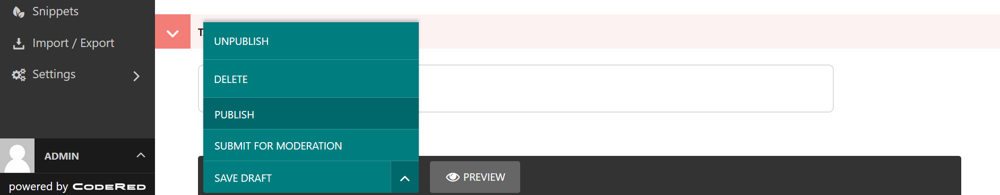

Tutorial Part 3: Adding Content, Custom CSS
===========================================

Now let's start adding some content to our site.

Adding a hero unit to the home page
-----------------------------------

In the admin dashboard, select **Pages >**. This will open a tree-style view of all the pages
on our site. You will see all the pages we added. Click the pencil icon to edit the home page, or click
"Home" and then the "Edit" button.

Here in the body section is where we can add our content. Each component in this section is called
a "block" and provides a different format of content. Wagtail CRX is heavily based on Bootstrap CSS
and its grid system, which means all content is based in rows and columns that dynamically stack depending
on the visitor's screen size.

First, let's make a big flashy hero unit. A hero unit in Wagtail CRX is a block that allows for
a full-width background image or background color, and has lots of padding by default.

Select the **Hero Unit** block. Next set a background image or color - we are going to download and use
`this image <https://pixabay.com/photos/laboratory-analysis-chemistry-2815641/>`_ from `Pixabay <https://pixabay.com>`_.

Now to add content to our hero unit, under the Content field select **Responsive Grid Row** and then
a **Column**. Inside our column, we will add **Text** and format it.

Next, click the small "+" icon directly below the text field. This will let you add another block
directly below the text, but still in the same column.

Select the **Button Link** block. There are a few options here.  We are going to do Page Link and link it to
"What's happening at CRX-Pharma" page. Change the only required field **Button Title** to "Read Our Blog", and change the **Button Size** to large.

My editing page now looks like this (ignore the misplaced side menu, that is just a result of the screenshot):

.. figure:: images/tut03/hero_unit_editor.jpeg
    :alt: The home page editor after adding a hero unit.

    The home page editor after adding a hero unit.

Next click the **Preview** button at the bottom, which will open up a preview of the home page in a new tab.
Great success!

.. figure:: images/tut03/hero_unit.jpeg
    :alt: The home page preview after adding a hero unit.

    The home page preview after adding a hero unit.

Custom CSS
----------

You may have noticed that the white text in our hero was a little hard to read.
Let's add text shadow to the text with CSS to make it stand out from the backdrop.

* In your file explorer go to **mysite>website>static>website>src>custom.scss**
* Add the following code under *// Add your custom styles here.* (line 26) :

.. code-block::

    .text-shadow {
        text-shadow: $dark 1px 1px 12px;
    }

* We will also add this :

.. code-block::

    body {
        background-color: #a4f1e9;
    }

* Next we will remove the global body color (line 36) in the **mysite>website>static>website>src>_variables.scss** file
because it's changing the background-color of the inputs.  This is another way to alter the colors of the site.  We will see a few more
examples throughout the tutorial.

* Compile the sass. In your terminal:

    * Stop your server with `ctrl + c`.

    * Run:

.. code-block:: console

     $ python manage.py sass website/static/website/src/custom.scss website/static/website/css/custom.css

* Restart server with `python manage.py runserver`

Lets use that CSS class *text-shadow* we just made.
* Back to the home page editor screen, in the column block, click **Advanced Settings**
* Enter "text-shadow" in the Custom CSS Class field.  See below :

.. figure:: images/tut03/custom_css.jpeg
    :alt: adding custom CSS

    Adding a custom class

* **Save** and **Publish**

.. figure:: images/tut03/hero_unit_shadow.jpeg
    :alt: Hero with shadow

    The hero unit with text shadow and the search input background no longer is teal.

Adding cards to the home page
-----------------------------

Next, let's say our company offers three different baked goods, and we would like to add three
uniformly-sized cards on the home page representing that. Go back to the tab with the home page
editor. All the way at the bottom of the page, click the "+" icon directly below the "Hero Unit" block.
This will add a new block directly below the hero unit.

Select the **Card Grid** block. The select **Card** to add the first card. Now fill out the **Title**,
**Body**, and add a **Button Link** at the bottom.

Next add and fill out two more cards by clicking the "+" icon directly below our current card block.

The editing page now looks like this (ignore the misplaced side menu, that is just a result of the screenshot):

.. figure:: img/tutorial_edit_home2.png
    :alt: The home page editor after adding a card grid with three cards.

    The home page editor after adding a card grid with three cards.

Next click the **Preview** button at the bottom, which will open up a preview of the home page in a new tab.
Lookin' good!

    The home page preview after adding the card grid.

Adding more content to the home page
------------------------------------

Continue following this pattern to add content. While the **Hero Unit** and **Card Grid** provide
"special" content formats, the **Responsive Grid Row** is the most general purpose block for adding content,
and you will probably find yourself using it the most all throughout your site. Of course, there is also an
**HTML** block for inserting raw HTML if needed.

When you are finished editing the home page, click the arrow next to the "Save Draft" button and select **Publish**.

    Publishing a page.
