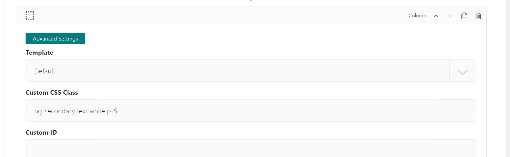

Tutorial Part 3: Adding Content, Custom CSS
===========================================

Now let's start adding some content to our site.

Adding a hero unit to the home page
-----------------------------------

In the admin dashboard, select **Pages >**. This will open a tree-style view of all the pages
on our site. You will see all the pages we added. Click the pencil icon to edit the home page, or click
"Home" and then the "Edit" button.

Here in the body section is where we can add our content. Each component in this section is called
a "block" and provides a different format of content. Wagtail CRX is heavily based on Bootstrap CSS
and its grid system, which means all content is based in rows and columns that dynamically stack depending
on the visitor's screen size.  `Read more here. <https://getbootstrap.com/docs/5.2/layout/grid/>`_

First, let's make a big flashy hero unit. A hero unit in Wagtail CRX is a block that allows for
a full-width background image or background color, and has lots of padding by default.

* Select the **Hero Unit** block.
* Be sure full-width is selected.  (It should be selected by default when using a Hero Unit block)
* Next set a background image - we are going to download and use `this laboratory image <https://pixabay.com/photos/laboratory-analysis-chemistry-2815641/>`_ from `Pixabay <https://pixabay.com>`_.
* Enter "white" in the Text color field

Let's add content to our hero unit. Under the **Content** field:

* Select **Responsive Grid Row**
* Select **Column**. Inside our column,
* Add **Text** block
* Enter "Building a Healthier World" as an H2 in bold.
* Enter "Research. Discovery. Manufacturing." as an H4 in italics in the same text editor.

Next, click the small "+" icon directly below the text field. This will let you add another block
directly below the text, but still in the same column.

* Select the **Button Link** block. There are a few options here.
* Choose **Page Link** and link it to "What's Happening at CRX-Pharma" page.
* Change the **Button Title** field to "Read Our Blog"
* Change the **Button Size** to large.

My editing page now looks like this:

.. figure:: images/tut03/hero_unit_editor.jpeg
    :alt: The home page editor after adding a hero unit.

    The home page editor after adding a hero unit.

Next click **Save draft** and then **Preview** button at the bottom, which will open up a preview of the home page in a new tab.
Great success!

    The home page preview after adding a hero unit.

Custom CSS
----------

You may have noticed a few issues with our page. The white text in our hero is a little hard to read and the search input is light teal.
Let's add text-shadow to the text with our own custom CSS class to make it stand out from the backdrop, and change how we are giving the body a background-color.

* In your file explorer go to *mysite>website>static>website>src>custom.scss*
* Add the following code under *// Add your custom styles here.* (line 26) :

.. code-block::

    .text-shadow {
        text-shadow: $dark 1px 1px 12px;
    }

* We will also add this :

.. code-block::

    body {
        background-color: #a4f1e9;
    }

    custom.scss after adding custom classes.  Be sure to save this file!

* Next we will remove or comment out the global body color $bg-body (line 36) in the *mysite>website>static>website>src>_variables.scss* file
  because it's changing the background-color of the inputs.  Using the HTML body tag is another way to alter the background color of the site.

.. figure:: images/tut03/body_commented_out.jpg
    :alt: $bg-body commented out.

    $bg-body commented out in mysite>website>static>website>src>_variables.scss.  Be sure to save this file!

* Compile the sass. In your terminal:

    * Stop your server with `ctrl + c`.

    * Run:

.. code-block:: console

     $ python manage.py sass website/static/website/src/custom.scss website/static/website/css/custom.css

* Restart server with `python manage.py runserver`

Lets use the *text-shadow* class we just made.

* Back to the home page editor screen, in the column block, click **Advanced Settings**
* Enter "text-shadow" in the Custom CSS Class field.  See below :

    Adding a custom class

* **Save** and **Publish**

    The hero unit with text shadow and the search input background no longer is light teal.

Awesome.  The inputs are no longer have the light teal background and our text in the Hero Unit has a shadow that makes it stand out from the backdrop.

Adding cards to the home page
-----------------------------

.. note::
    We used these images from pixabay in our cards.  You'll need to download them.

    * `stethoscope <https://pixabay.com/photos/laboratory-analysis-chemistry-2815641/>`_
    * `lab equipment <https://pixabay.com/photos/laboratory-apparatus-equipment-217041/>`_
    * `colorful brain <https://pixabay.com/illustrations/brain-mind-psychology-idea-drawing-2062057/>`_

Let's add three cards to highlight CRX-pharma's strengths. Go back to the tab with the home page editor.
All the way at the bottom of the page, click the "+" icon directly below the "Hero Unit" block.
This will add a new block directly below the hero unit.

* Select the **Card Grid** block.
* Select **Card** to add the first card.
* Add an image (stethoscope)
* Fill out the **Title** with "Industry Leader in Innovations"
* Fill out the **Body** with a few sentences of text
* Add a **Button Link** at the bottom
* Use **Page Link** and link it to the "About Us" page created in Part 2
* Fill out **Button Title** with "Our History"

Next add and fill out two more cards by scrolling down and clicking the "+" icon directly below our current card block.
The second card should have:

* An image (lab equipment)
* **Title** "Unparalleled Manufacturing"
* **Body** with a few sentences of text
* **Button Link** with:
*   **Page Link** to "Our Facility" Page
*   **Button Title** "Our Facility"

The third card should have:

* An image (colorful brain)
* **Title** "Our Philosophy"
* **Body** with a few sentences of text
* **Button Link** with:
*    **Page Link** to "Our Products" Page
*    **Button Title** "Shop With Us"

The editing page now looks like this:

    The home page editor after adding a card grid with three cards 1 of 2.

    The home page editor after adding a card grid with three cards 2 of 2.

**Save draft** and click the **Preview** button at the bottom, which will open up a preview of the home page in a new tab.
Lookin' good!

    The home page preview after adding the card grid.

.. note::
 At this point you may notice that the cards aren't the same height.  You can fix this two ways.  One you can add the bootstrap
 CSS class of h-100 to each card, two you can add `$card-height: 100%` in the _variables.scss.  If you use the sass option remember to compile the sass files.
 This is the most basic use case of card-grid check out :ref:`card-grid` for more information.

We added h-100 to each card as seen here:

    Card block with custom class of h-100.  Be sure to do this to each card.

    The home page preview with the same size cards.

Adding more content to the home page
------------------------------------

We'll continue following this pattern to add content. While the **Hero Unit** and **Card Grid** provide
"special" content formats, the **Responsive Grid Row** is the most general purpose block for adding content. There is also an
**HTML** block for inserting raw HTML if needed.

Let's look at this in practice.

* Add a **Responsive Grid Row** below the **Card Grid**
* Select **Column**
* Change **Column size** to "Half - 1/2 column"
* Select **Text**
* Enter "Our Products" and make it an H2.
* Enter a few sentences of text under the "Our Products" in the same text editor.
* Add a **Button link** linked to the "Direct to Consumer". (child of Our Products).  Be sure to give a Title.
* Add a **Button link** linked to the "Bulk Sales". (child of Our Products).  Be sure to give a Title.
* Below the Column Block (second to last "+") Add another **Column**
* Change **Column size** to "Half - 1/2 column"
* Add an **Image**  We used `this one <https://pixabay.com/photos/medications-tablets-medicine-cure-1853400/>`_

    Our Products editing Page.

* **Save** and **Preview**

    Home Page with Our Products added.

We are going to do another more **Responsive Grid Rows**

* Add another Responsive Grid Row
* Add a Column set it to 1/2 column with this `image <https://pixabay.com/photos/building-hospital-white-modern-2654823/>`_
* Add a Column set it to 1/2 column add text for Our Facility
* Add a Button Link under the text block that is linked to Our Facility.

* **Save** and **Preview**

    Home Page with Our Facility added

For the Last two **Responsive Grid Rows** you are on your own reference the image last image on this page as a guide.
Follow these links to get the images. (note: I cropped my images square):

* `doctor 1 <https://pixabay.com/photos/doctor-gray-hair-experience-2337835/>`_
* `doctor 2 <https://pixabay.com/photos/woman-doctor-surgeon-physician-2141808/>`_

To get the green background, white text, and proper padding you will want to put "bg-secondary text-white p-5"
in the Custom CSS field on each column with text.  These are bootstrap classes that come pre-loaded in Wagtail-CRX.

    Bootstrap classes on columns

Hopefully you were able to follow along and your page looks like this:

    home page after tutorial part 3 (note: the images of the doctors were cropped to be square)

Next we will look at building a Navbar and Footer
