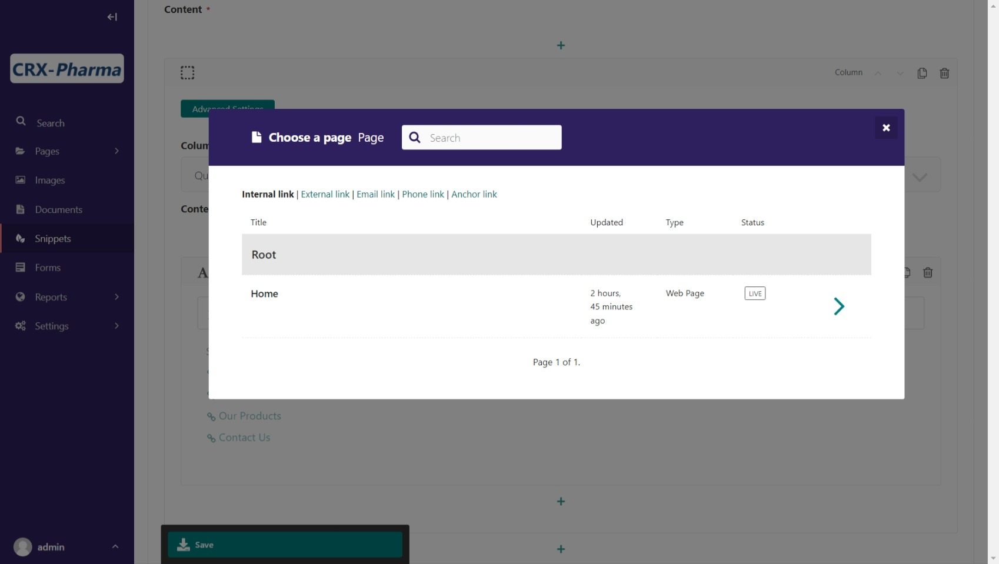
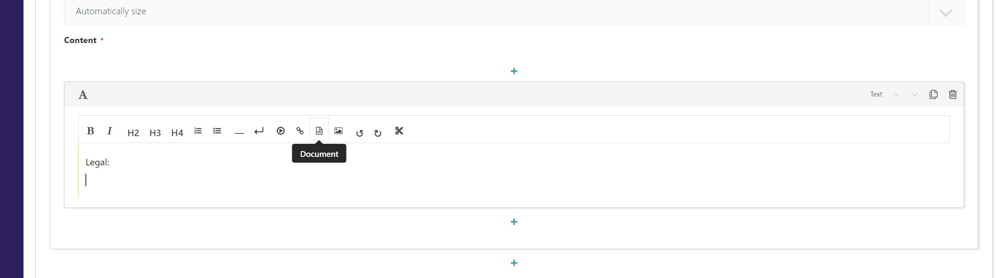
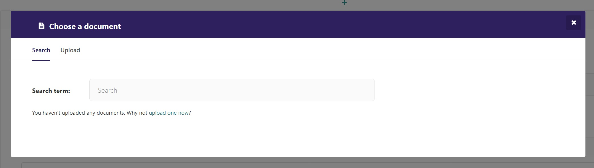
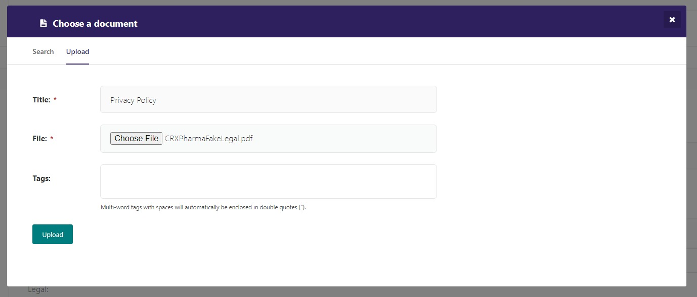
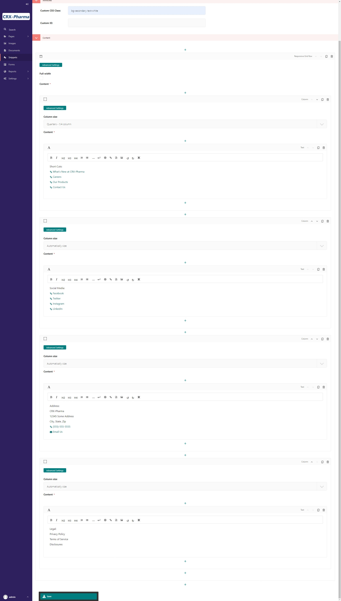
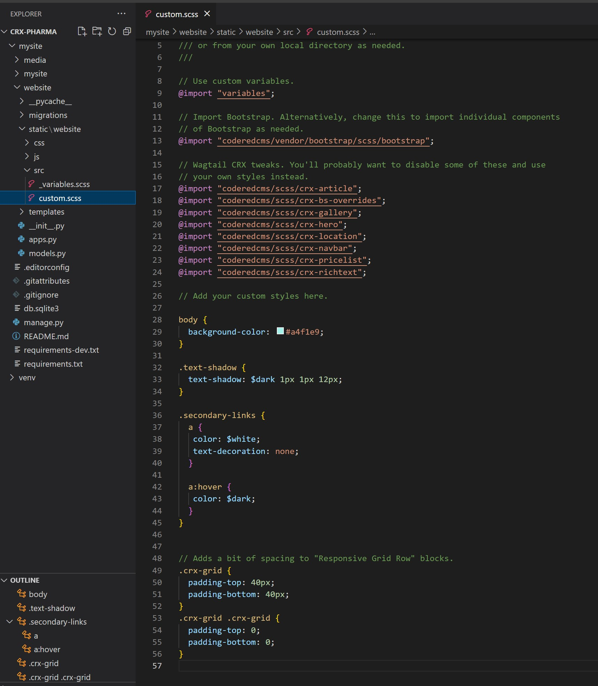
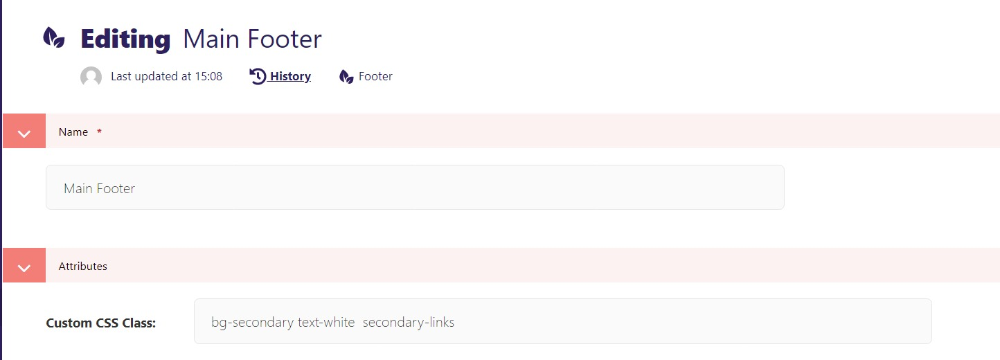
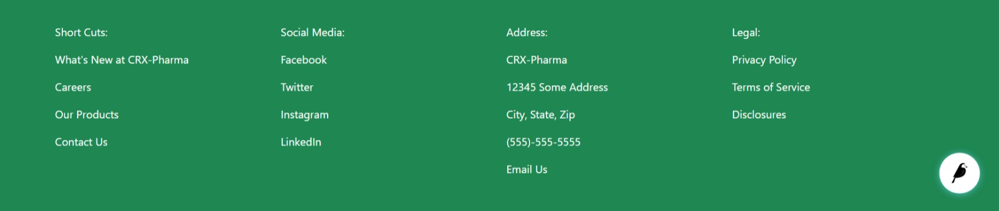
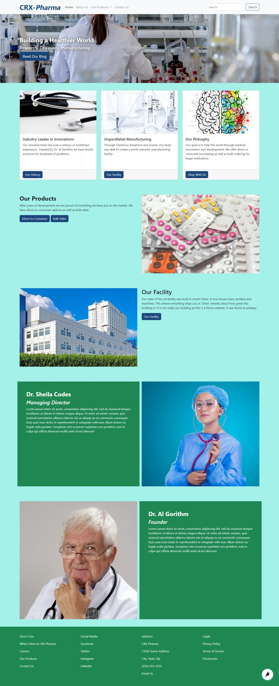

Tutorial Part 4: Navbar & Footer
================================

While CRX comes with a very rudimentary Navbar and Footer, the ``pro`` project template comes with a more realistic customizable Navbar and Footer in your local project. In this guide, we will look at how to customize the ``pro`` Navbar and Footer.

.. _navbar:

Navbar and Footer Source Code
-----------------------------

Your project has a custom implemented navbar and footer, the associated files are:

* Wagtail snippets at bottom of ``website/models.py``
* Starting point: ``website/templates/coderedcms/snippets/navbar.html`` and ``footer.html``. These override the built-in navbar and footer from CRX, and will therefore be present on all pages automatically.
* A few custom blocks in: ``website/templates/website/blocks/navbar_link.html`` and ``navbar_dropdown.html``.

Create your Navbar
------------------

Your navbar will have links to your other pages or external content that you want
to share. To build your Navbar, go to **Snippets > Navigation Bars**.

There is a button in the top right corner named **Add Navigation Bar**.
Click on this button to start! (Alternatively, you can also click on the link that says "Why not add one?")

Giving the navbar a name is required. Also note, as you use different editing interfaces in Wagtail, required fields are marked with a red asterisk (*).
Since, this will be a site wide navigation bar we have named it Main Nav Bar.

* The **Link** blocks are the ``NavbarLinkBlock`` defined in ``website/models.py``.
* The **Dropdown** block is defined in ``NavbarDropdown`` in ``website/models.py``.
* You can see from looking at the ``Navbar`` snippet in ``website/models.py``, that it is defining fields with StreamBlocks of these.

Let's add **Links** to our navigation bar.

* Click "choose page" and link to "Home"
* Add another by selecting the "+" at the bottom of the page.
* Click "choose page" and link to "About Us"
* Add another by selecting the "+" at the bottom of the page.
* Click "choose page" and link to "Our Products"
* Add another by selecting the "+" at the bottom of the page.
* Click "choose page" and link to "Contact Us"
* **Save**

The new navbar will now automatically be loaded into the ``website/templates/coderedcms/snippets/navbar.html`` by calling the ``get_website_navbars`` template tag defined in: ``website/templatetags/website_tags.py``.

.. _footer:

Customizing the Footer
----------------------

Let's work on the footer, which is another menu of links. You can add more links in the footer
that maybe won't belong in the main navigation but are still important. Go to **Snippets > Footers** to begin
working on the footer. In the top right-hand corner is a button that says **Add Footer**. Click on this button to start!
(Alternatively, you can also click on the link that says "Why not add one?")

Give your footer a name. We chose Main Footer since this will be the main footer for our site.

Let's get some practice with Responsive Grid Rows and Columns! We want to make a 4-column footer with sub-page links in the first column,
external links to social media in the second, an address in the third, and links for legal disclosures in the last column.

.. note::
    To keep up with our design, we have also added a few Bootstrap classes to our footer.  In the Custom CSS Class field, add "bg-secondary text-white".
    This will change the footer's background color to the green we set in Part 01 and uses a built in Bootstrap class to make the text white.

To set up our 4-column footer:

* Choose **Responsive Grid Row** from the layout choices at the bottom.
* Click on **Add Column**. You can specify the column size in the dropdown that says **Column size**.
* Choose a 1/4 Column size for all 4 columns.

.. note::
    Bootstrap uses a 12-column grid, and our footer is going to span the entire 12 columns. To figure out
    how to size our columns, we do some math. We are slicing up the 12-column grid into fourths to have four columns,
    so our columns need to be 1/4 each. Read more about Bootstrap grids and columns here: `Bootstrap Grid <https://getbootstrap.com/docs/4.0/layout/grid/>`_.

From within the Responsive Grid Row block, keep selecting the + sign below your **Column** until you have all of
the columns that you need. Then remember to make sure to choose the size of the column.  Otherwise, it will automatically size on its own.

Add Content to the Footer
-------------------------

Now that we have our layout, let's begin adding content! You see that there are several different choices for content
available within the column block.

We will be using a text block in all 4 columns.  In the first column's text block:

* Enter "Short Cuts:" and hit enter to make a new line (alternatively you can click the right angled arrow to get a new line.)
* Click on the chain link symbol which should bring up this screen:

    Link editing screen.

* Choose "What's New at CRX-Pharma" page
* Do this a few more times choosing the "Careers", "Our Products", "Contact Us" pages.

For the second column's text block:

* Enter "Social Media:" and hit enter to make a new line.
* Click on the chain link symbol which should bring up the link modal.
* Click **External Link**
* Enter "www.facebook.com" in the URL field.
* Enter "Facebook" in the Link text field.
* Click **Insert link**
* Do this a few more times for other Social Media sites, such as twitter, linkedIn, and Instagram

For the third column's text block:

* Enter "Address:" and hit enter to make a new line.
* Enter an address (format it to your liking)
* Click on the chain link symbol which should bring up the link modal.
* Click **Phone Link**
* Enter a Phone number in the field and leave the other blank, click **Insert link**.
* Click on the chain link symbol which should bring up the link modal.
* Click **Email Link**
* Enter an Email address in that field and "Email Us" in the Link text, click **Insert link**.

For the fourth column's text block let's add a document link.
Here's a fake legal disclosure we can use: :download:`fake legal pdf <images/tut04/CRXPharmaFakeLegal.pdf>`.
Download that file.  Remember it's location on your computer. In the fourth column's text editor:

* Enter "Legal:" and hit enter to make a new line.
* Choose document (next to the chain link)

    Text editor with document link highlighted

* This opens the document management modal

    document management modal

* Select the Upload Tab
* Choose the file provided above.
* Change the Title to "Privacy Policy"

    document management modal with document selected

* Select Upload.
* And now you see the document link in your text editor.
* For the rest of the legal section, we are going use placeholder text (meaning no links).  We put a line for Terms of Use, and Disclosures

Our Editing Page:

    Footer Editing Page

Once you're happy with your Footer, hit **Save**. Let's see what it looks like!

Let's change the Bootstrap default blue links by adding custom CSS to give it a nicer look.

* In your file explorer go to **mysite>website>static>website>src>custom.scss**
* Add the following code under *// Add your custom styles here.* (line 26) :

.. code-block::

    .secondary-links {
     a {
        color: $white;
        text-decoration: none;
     }

     a:hover {
        color: $dark;
      }
    }

Our custom.scss now looks like this:

    custom.scss file with secondary link class added

Remember to compile your sass:

* Stop your server with `ctrl + c`.

    * Run:

.. code-block:: console

     $ python manage.py sass website/static/website/src/custom.scss website/static/website/css/custom.css

* Restart server with `python manage.py runserver`
* Go to back to **Snippets > Footers**
* Edit "Main Footer"
* Add "secondary-links" the new css class along side "bg-secondary text-white" in the Custom CSS Class field.

    secondary-link class added to Custom CSS Class field

* **Save**
* Navigate to the Home page at http://localhost:8000/
* Be sure to hard refresh and load the current CSS stylesheet.

    footer with new class secondary-link class

Take a moment to hover over the link text and see it changes color.  Now the homepage is starting to feel like a
professional site.

    The homepage with navbar and footer

Now let's look at building a blog landing page and blog pages.
