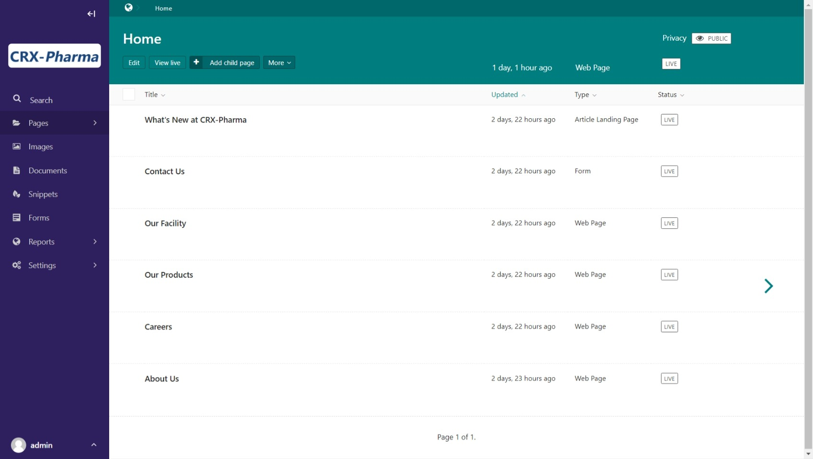
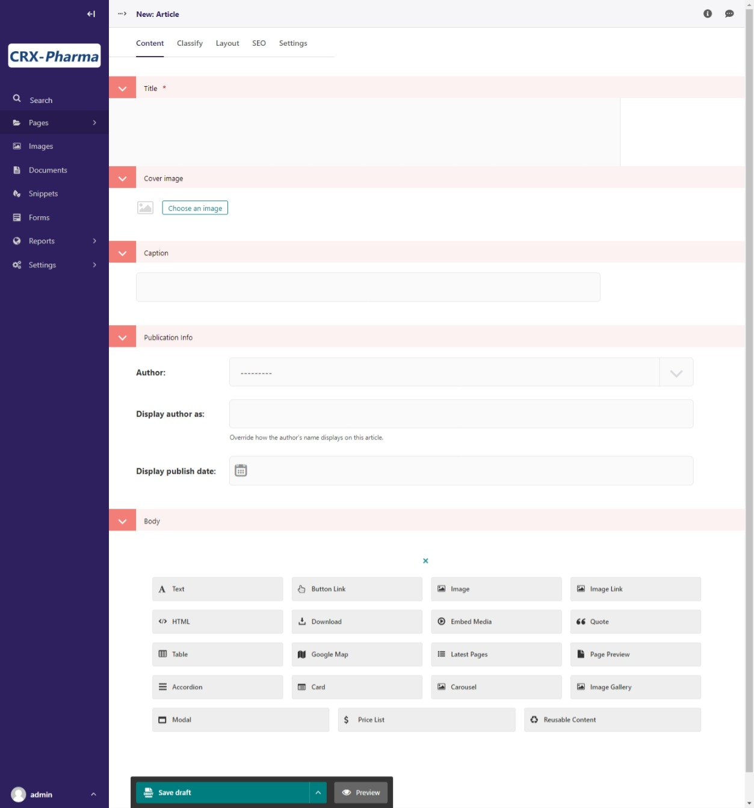
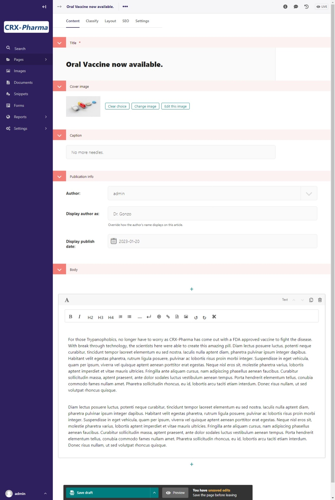
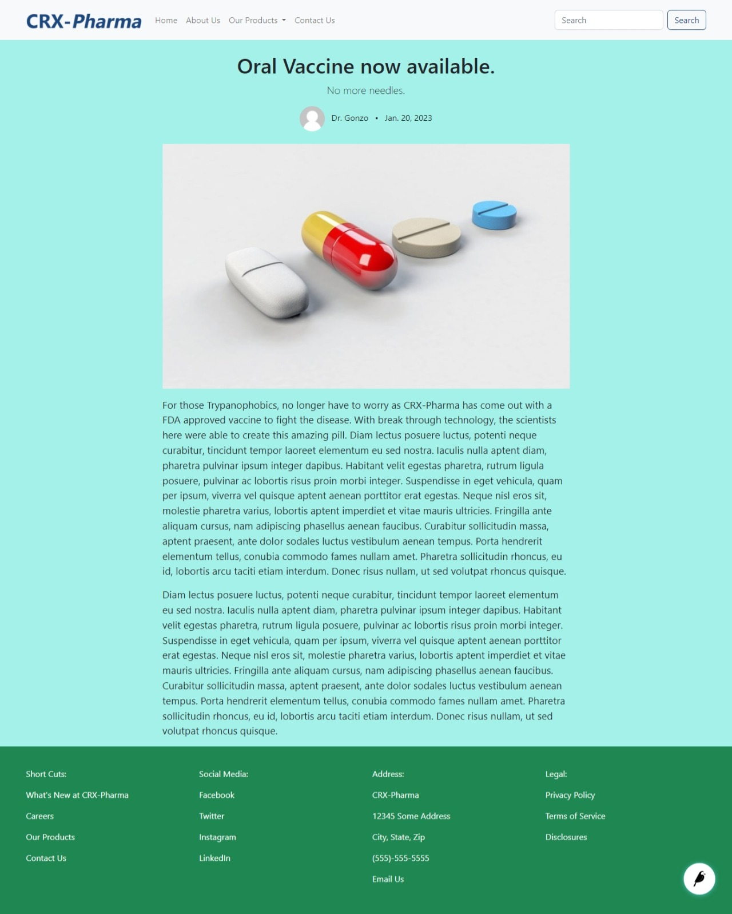
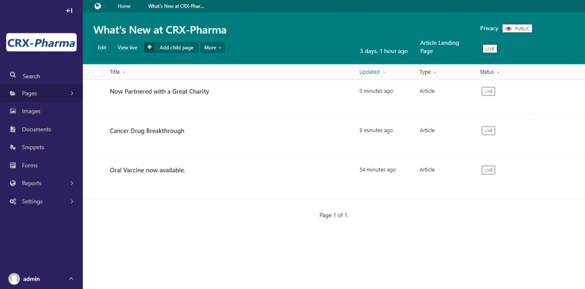
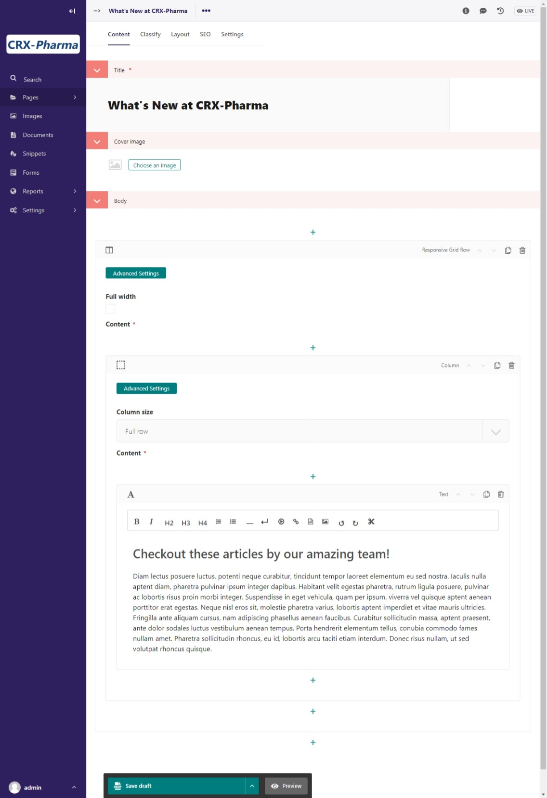
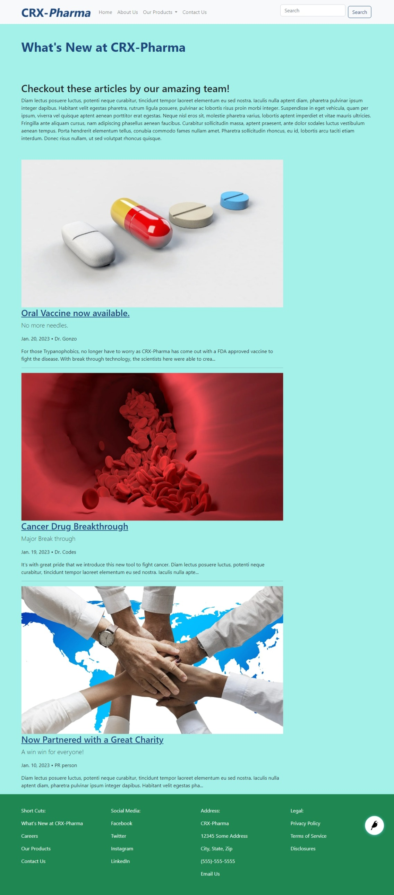
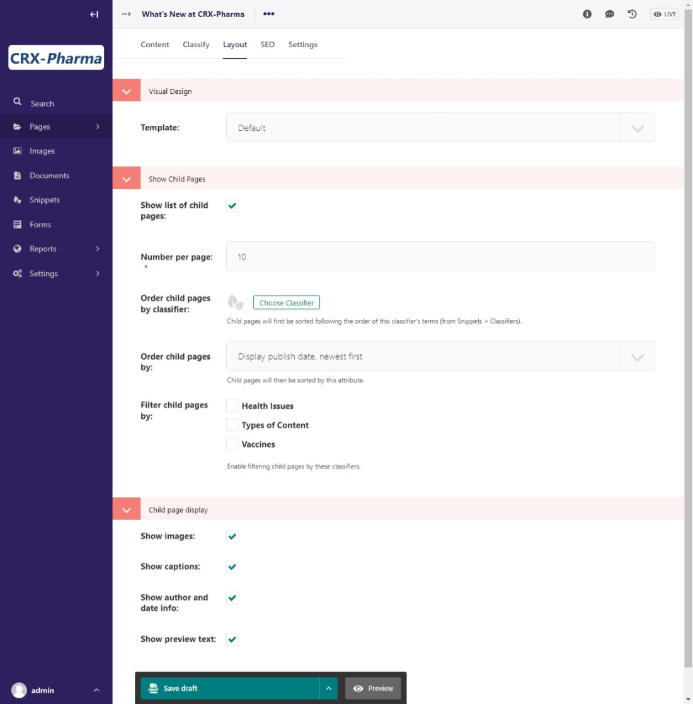

Tutorial Part 5: Creating a Blog
================================

We want to add a blog to our site, so let's get some practice with Article Pages!
Then we will get some practice building a basic web page as well.

Adding articles to the site
---------------------------

Okay, Articles will be child pages (also known as sub-pages) for the **Article Landing Page**. This
is important to remember because sub-pages can be accessed by the parent page (also known as the
landing page).

.. note::
    We are going to use the "What's Happening at CRX-Pharma" page for our blog.

Go to **Pages > Home** in wagtail admin. This screen will allow you to create child pages as seen in Part 02 of the tutorial.
Ours looks like this:

    The admin screen for adding pages under the Home page.

You should see the Article Landing with titled "What's New at CRX-Pharma". Hover over it to reveal more options.
These options include: **Edit, View Live, Add child page, and More**.  If you click on **More** you'll see a drop down menu
with **Move, Copy, Delete, Unpublish, and History**.

* **Move** allows you to change where that page is in site's tree structure.
* **Copy** will make a copy of the page.
* **Delete** removes the page from the project.
* **Unpublish** keep the page but it will no longer be accessible live.
* **History** allows you to see changes made to the page.

For now, We want to add a few posts, so select **Add Child Page**. This will
take you to the Article page type for editing!  Seen here:

    The edit screen for an article page.

The anatomy of an Article Page
------------------------------

The Article Page has several built-in fields to make it easy to publish an article, or blog as in our
case. We will want to fill in the following:

* **Title** - Title of the article or blog

* **Cover Image** - Not required but can add interest to your page

* **Caption** - The sub-title for the article or blog

* **Publication Info** - Here we add the author, the display name for the author if different, and the Publication date

* **Body** - Content for our article or blog

Let's write a short blog about the story about a fictious vaccine that CRX-Pharma created. Once we fill in the information we want to add above, we
can select what we want to add to the body of the blog post. We will choose a **Text** block.
We added `this image <https://pixabay.com/illustrations/pill-capsule-medicine-medical-1884775/>`_ in our text block with the Image tool in the text editor.
This is what our editor looks like:

    The edit screen for our first blog post.

Now publish it and see what it looks like! This is what our blog post looks like:

    Our first published blog post.

Add a few more blog posts to get some practice, then we will return to our Blog landing page.

    The admin view to edit our blog posts and our Blog landing page.

Completing our Blog landing page
--------------------------------

On the admin page, we can select to edit the main Blog page. Click the **Edit** button that is under the "What' New at CRX-Pharma".
Alternatively, you can find the Blog page in the Home page admin view or by clicking on Pages.

Just like on the other pages, we can add a cover image and build the layout. Let's do that! We will use
Responsive Grid Row and just one full-width column for an introduction. Then we will show you the different
ways to display your sub-pages on the landing page.

    The edit screen showing the introduction on our Blog landing page.

Publish and see what happens!

    The published Blog landing page.

Whoa! The blog posts are already showing up! What is this magic? Well, remember that this is a parent page type
and the blog posts were children of this page. The option to "show children" is already pre-selected in the edit mode
for the landing pages. We should go take a look at that now.

Ways to display sub-pages on a landing page
-------------------------------------------

Go back into the editor for the Blog landing page. You should see the following tabs at the top:

* **Content**

* **Classify**

* **Layout**

* **SEO**

* **Settings**

We want the **Layout** tab. Click on that tab and you'll see something like this:

    The Layout tab for the Blog landing page.

We are using the default template, so skip over that for now. The sections titled
**"Show Child Pages"** and **"Child Page Display"** contain the settings for whether or not
the sub-pages (blogs in this case) are automatically pulled onto the page, how many
of them to show, and what fields or pieces of them to show as a preview.

.. note::
    The "Show Child Pages" setting in Layout is the simplest and easiest way to display
    your sub-pages on a landing page.

But we said that there are other ways to do this! Well, yes, there are. De-select "Show Child Pages"
in Layout so that we can try the other way of displaying your sub-pages. Then go back to the Content area.

You can add more content below the Text block with our introduction, or make a new column for content, or start
a new Responsive Grid Row to add a column with content.

What we want to look at is the **Latest Pages** block. The Latest Pages block is extra powerful because you can access
the sub-pages of **any landing page on the site**! You can look at it for now, but we are going to just use the "Show Child Pages"
in Layout after all. We will go into more depth about this block and other content blocks in the future.

Remember to re-select "Show Child Pages" in Layout before publishing it.
