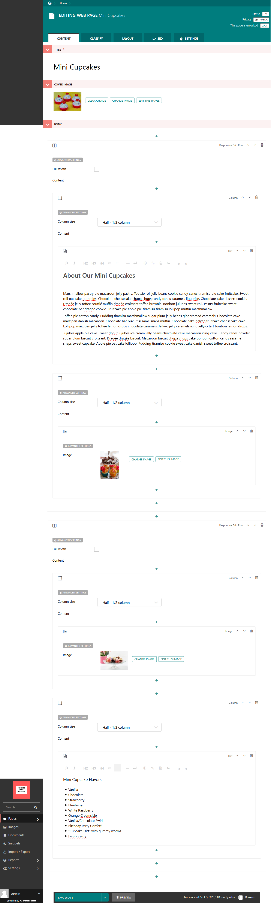
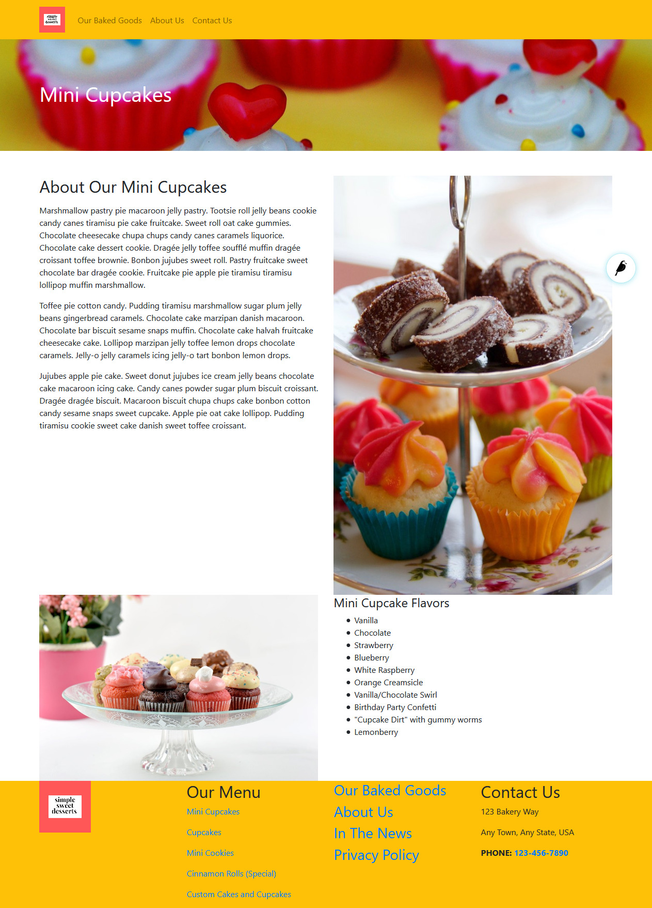

Tutorial Part 5: Web Page
=========================

Another page type that you will use to build your site in the CMS is the **Web Page**.
The Web Page is a general-purpose page type which contains a big dynamic
StreamField enabling the editor to add grids, cards, and all kinds of content to
the page dynamically without requiring code. Let's use a Web Page to make a page
about our Mini Cupcakes.

Go back to the admin where you can add a child page to the Home page. This time, choose
Web Page. Building the page involves using the Layout blocks that we discussed earlier. Play
around with the layout in the Content tab, adding different types of content. This is what we
decided to do for our Mini Cupcakes page:

    The edit screen for our web page - You can design your layout how you like.

Let's publish this page and see what it looks like:

    Our published web page.

Wow! Our site is really coming together! We should finishing adding some of our other pages, like
Cupcakes, Mini Cookies, and About Us. Take the time to make the rest of these pages and then add the
updated page links in the Navigation Menu and in the Footer.
