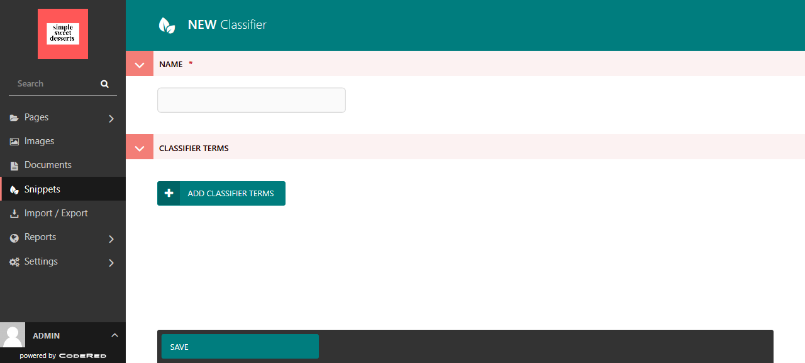
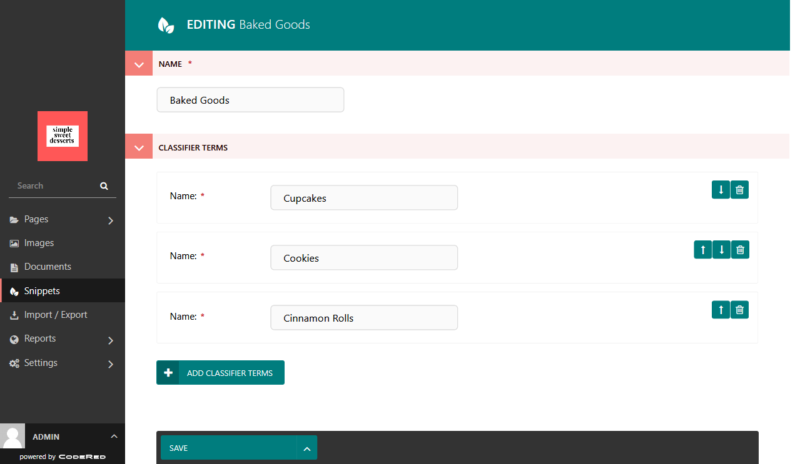
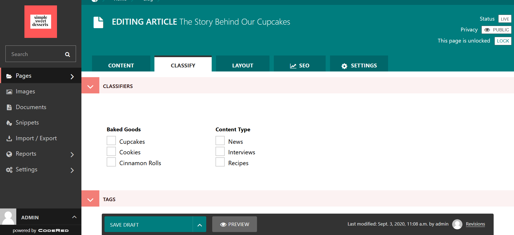
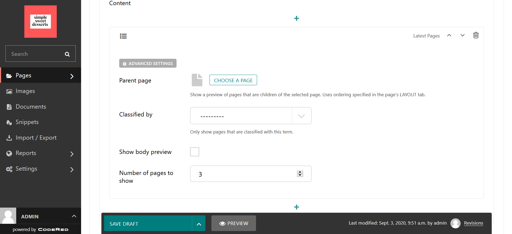
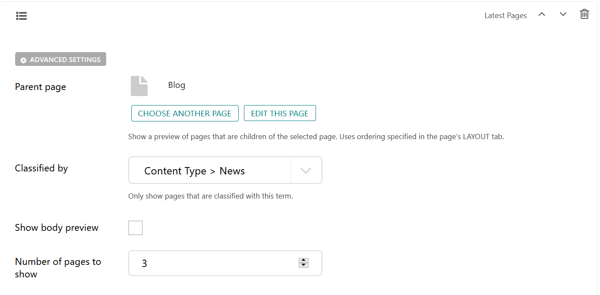
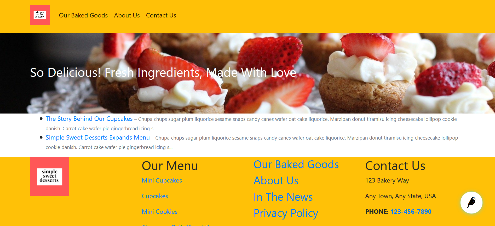

Tutorial Part 6: Create Categories with Classifiers
===================================================

Now we actually want to go back to our blog posts and organize them. We can do
that by adding **Classifiers** to our pages so that we can access them via their
category.

What are Classifiers?
---------------------

Classifiers are essentially categories that you give to an item. For our sweets shop,
classifiers that we might use could be something like:

* **Flavors:** Strawberry, Vanilla, Chocolate, etc.

* **Types of baked goods:** Cupcakes, Cookies, Muffins, Cinnamon Rolls, etc.

* **Types of content:** News, Press, Interviews, Recipes, etc.

Adding Classifiers in the CMS
-----------------------------

You can start adding Classifiers by going to **Snippets > Classifiers**. Select that you want to add a new
Classifier, and you would do this for each Classifier that you want to add.

For the purposes of this tutorial, we are going to add a Content Types classifier and a Baked Goods
classifier.

    The admin screen for adding a new Classifier.

The first Classifier we are adding is the Baked Good ones. For Name, we would put Baked Goods because this is the
generalized heading for the category. Then we would click the **Add Classifier Terms** button to begin adding the
sub-categories below that main term.

    The edit screen for the Classifiers that we added.

However, we realize that you could decide that you want to add Classifiers in the middle of building your pages.
If you have not already added Classifiers in Snippets, you can click the Classify tab in the page editor and
select that you want to create Classifiers. It will take you to the Snippets editor for Classifiers to do so.

Selecting Classifiers for your pages
------------------------------------

Okay, now we have some Classifiers to work with. Let's head back to our blog posts and start categorizing them.
The Classify tab in our blog posts now show the Classifiers! Take a look at ours:

    The edit screen for the Classifiers that we can choose from in a blog post.

You can choose as many Classifiers as you think make sense. For our blog on The Story Behind Our Cupcakes, we
are going to choose Cupcakes (beneath Baked Goods) and News (beneath Content Type).

Using Classifiers across the site
---------------------------------

One of the places where you might use the Classifiers is in a **Latest Pages** content block. For practice and
to see this in action, let's add a Latest Pages to our Home page. Make sure to add Classifiers to each of your
blog posts first.

    The Latest Pages content block.

We could **Choose a Page**, like the Home page and get every sub-page pulled in, or the Blog page and pull in the
sub-pages under Blog. Then we can filter by the Classifiers in the **Classified by** setting. There will be a dropdown
of available Classifiers to choose from.

In this example, we are going to choose the Blog as our **Parent Page** and choose **Content Type > News** for our Classifier.

    The Latest Pages with Parent Page and Classifier filter selected

We can choose to also **Show Body Preview** of the pages and the number of pages in this category to show.

When we publish the page, the pages that we selected will show as a list on the page where we added the Latest
Pages block. This is useful for creating a list that automatically updates content if you write more posts with
the Classifier filter that you used.

    The Latest Pages published on a web page

You can also use Classifiers on an Article Landing Page. If we go to our Blog page and look at the Layout tab in
editor mode, we can see our Classifiers in the **Show Child Pages** setting. If we only only wanted to show blog
posts that were under the Baked Goods classifier, for example, we could select that and then the front page for
Blogs would only list our child pages (blog posts) that have been marked as a Baked Goods category.

.. note::
    If you're coming from WordPress, you can think of Classifiers as equivalent to WordPress Categories
    and Classifier Terms as equivalent to WordPress Taxonomies.

For more info on classifiers, see: :doc:`/features/snippets/classifiers`.
