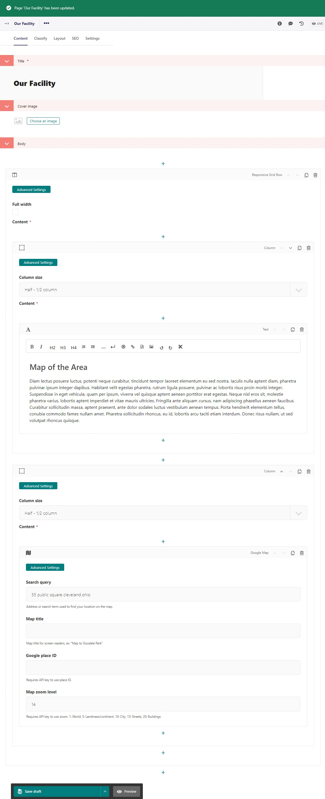

Tutorial Part 6: Web Page and  Google Map
=========================================

Another page type that you will use to build your site in the CMS is the **Web Page**.
The Web Page is a general-purpose page type which contains a big dynamic
StreamField enabling the editor to add grids, cards, and all kinds of content to
the page dynamically without requiring code. Our Home Page is a Web Page.

Go back to the admin page screen. Use the side menu and select **Pages > Home**.
Let's build out the "Our Facility" web page we setup in Part 02.  Hover over Our Facility and click edit.

* In the body select **Responsive Grid Row**
* Add a **column**
* Choose "1/2 column" in **column size**"
* Choose **Text**
* Enter "Map of the Area" as H2
* Enter placeholder text for this demo
* Add another **column**
* Choose "1/2 column" in column size"
* Choose **Google Map**
* In **search query** enter an address, or if you know the Google place ID enter that.

    The edit screen for our web page with a google map

Let's publish this page and see what it looks like:

    Our published web page.

Our site is really coming together!  Here a challenge for you.
Let's make all the h1 headings blue and bold(font-weight: 700).
Try on your own.  Here is the CSS you need.

.. code-block::

    h1 {
        color: $primary;
        font-weight: 700;
    }

You'll need to go to custom.scss in the file explorer and add that CSS with the rest of the CSS code we already wrote.
Here is what my code editor looks like:

    I put the h1 tag just under the body tag and above the custom classes.  This a preference to organize the code. HTML Tags then custom css classes.

Remember to compile the sass and refresh your page.  Now the h1 headings (titles of each web page) will match our theme.

