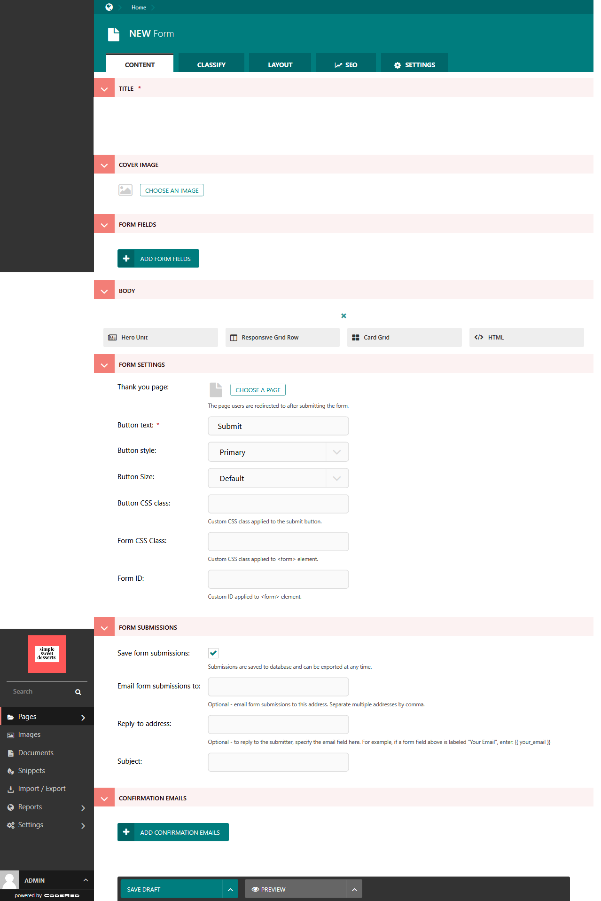
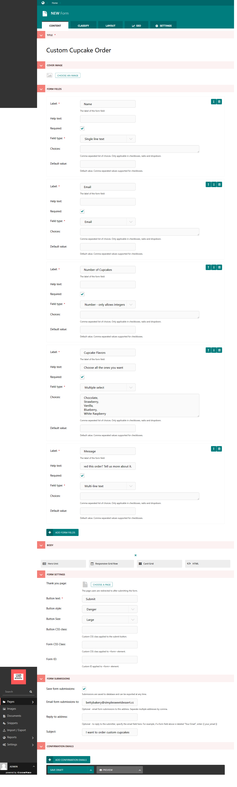
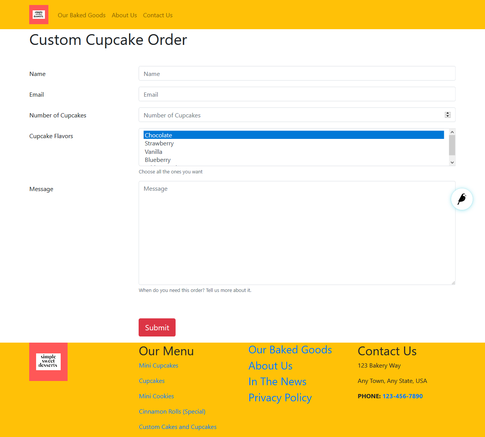
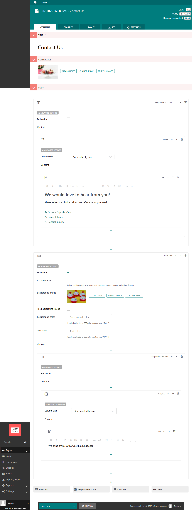
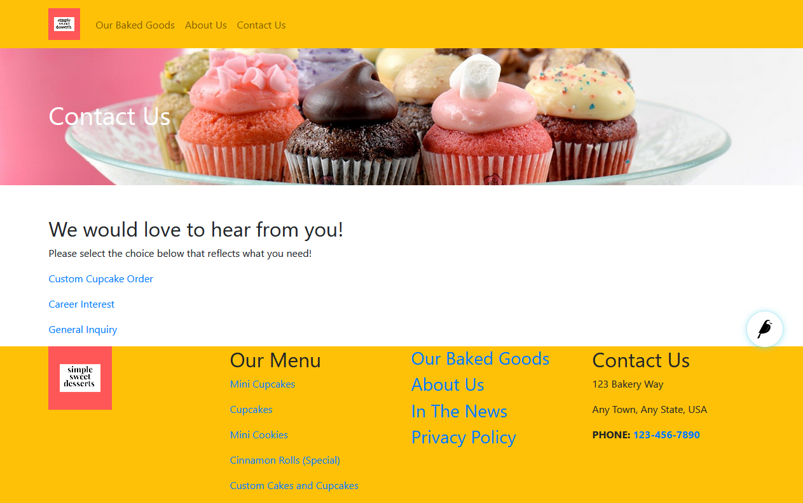

Tutorial Part 7: Forms & Contact Pages
======================================

Now we need a way for our customers to contact us. We could just make a simple
web page with our address, phone number, and email, but we want to make some forms
that specify what our customers are looking for. Good thing there is a special page type
just for forms!

Adding a Form page to your site
-------------------------------

Just like before, we will go to the admin to make a new page under Home page. This time we are
going to select **Form** for our page type. This is what a new Form page looks like:

    A new Form page ready for us to build.

Creating the Form page
----------------------

1. Give your form a name.

2. Add a cover image if you want to include one.

3. Begin adding your fields. Select the **Add Form Fields**.

4. **Label** and **Field Type** are required, while the others are optional.

5. Make a field required or not. Some fields that should be required are Name, Phone, Email, and Message.

6. The **Field Types** available include: Text, Choice, Date & Time, File Upload, and Other.

7. For fields like Name, you would choose **single-line text**.

8. For fields like Message, you would choose **multi-line text.**

9. Custom field types such as **Email** and **URL** are available.

10. After you build the Form Fields, you can add more page content.

11. In **Form Settings**, you can select a Thank You page (if you've made one).

12. Choose the **Button Text** and **Button Style**.

13. In **Form Submissions**, add the email address (or addresses) where you want the submissions to go. You can also add a prepared subject line here.

14. Save and/or publish the form.

    A Form page with fields and settings.

Then this is what the form looks like on the frontend:

    Our published form page.

For practice, make a few more forms. We probably need some Forms for General Inquiries,
Career Interest, Special Event Requests, etc.

Setting up Confirmation Emails
------------------------------

Confirmation emails would be a good way to provide great customer service. So, we have decided to also add a Confirmation
email after someone fills out the Custom Cupcake Order form. Scroll down to the last field on the Form Page in editor
mode for the **Confirmation Emails** section.

Our From Address will be our email address that is designated for orders with a BCC to our bakery owner. We've added the
subject line "Order Received!" and a message that says "Thank you for your order! We have received it and will contact
you within 24 hours for more details and to arrange payment!"

Confirmation Emails uses Django template language and HTML for best results. To learn more, read :ref:`confirmation-emails`.

.. note::

    By default when running locally, confirmation emails are not sent, but are
    instead printed to the command line.

Creating our Contact Us page
----------------------------

You could use a single form as your Contact Us page, but we want to show you that you can add several forms
to your Contact Us page. We are going to add three forms to our contact page.

First, make a Web Page under Home page that has the title of Contact Us. Add a title, cover image, and a Responsive
Grid Row. Once we get to the content blocks, select the Text block and add the titles of your web forms, then link to
their pages. You can continue to add content to this page as you'd like. This is what we did:

    The edit screen for our Contact Us page.

Publish the page and see the result. This is how our Contact Us page looks so far:

    The published Contact Us page. We will customize the style later on.
