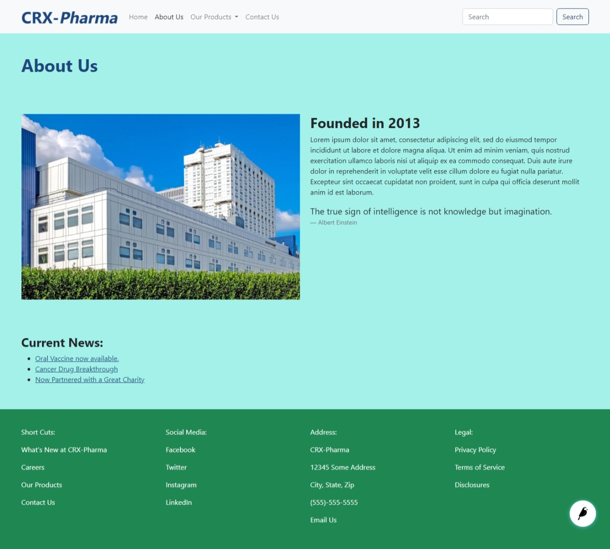

Tutorial Part 7: Create Categories with Classifiers
===================================================

Now we actually want to go back to our blog posts and organize them. We can do
that by adding **Classifiers** to our pages so that we can access them via their
category.

What are Classifiers?
---------------------

Classifiers are essentially categories that you give to an item. For our pharmaceutical company,
classifiers that we might use could be something like:

* **Vaccines:** Covid-19, Chickenpox, Tetanus, Monkeypox etc.

* **Types of health issues:** Cancers, Autoimmune, Heart Disease, Diabetes, etc.

* **Types of content:** News, Press, Interviews, FAQs, etc.

Adding Classifiers in the CMS
-----------------------------

You can start adding Classifiers by going to **Snippets > Classifiers**. Select that you want to add a new
Classifier, and you would do this for each Classifier that you want to add.

For the purposes of this tutorial, we are going to add a Content Types classifier and a Vaccines
classifier.

    The admin screen for adding a new Classifier.

The first Classifier we are adding will be for Vaccines. For Name, we would put Vaccines because this is the
generalized heading for the category. Then we would click the **Add Classifier Terms** button to begin adding the
sub-categories below that main term.

    The edit screen for the Classifiers that we added.

**Save** and Add more Classifiers for type of health issues and types of content if you so choose.

.. note::
    We realize that you could decide that you want to add Classifiers in the middle of building your pages.
    If you have not already added Classifiers in Snippets, you can click the Classify tab in the page editor and
    select that you want to create Classifiers. It will take you to the Snippets editor for Classifiers to do so.

Selecting Classifiers for your pages
------------------------------------

Okay, now we have some Classifiers to work with. Let's head back to our blog posts and start categorizing them.
In the admin screen ** Pages> Home > What's New at CRX-Pharma > Any Article Page ** click the pencil to go editing screen.  (alternatively, click the title and then edit).
Next click the Classify tab and now you'll see the classifiers we setup.

    The edit screen for the Classifiers that we can choose from in a blog post.

You can choose as many classifiers as you like. For our blog on Oral Vaccines now available, we
are going to choose Press Release, News, and Covid-19.  For the "Cancer Drug Breakthrough" article, we classified it as Cancer, Press Release, and News.
Additionally, we classified the "Now partnered with a great charity" with news and FAQs.

Using Classifiers across the site
---------------------------------

One of the places where you might use the Classifiers is in a **Latest Pages** content block. For practice and
to see this in action, let's add a Latest Pages to our About Us page. Make sure to add Classifiers to each of your
blog posts first.  Use the side menu in the admin screen to navigate to **Pages > Home > About Us**.

.. note::
    We could **Choose a Page**, like the Home page and get every sub-page pulled in, or like in this demo, the "What's new at CRX-Pharma" page and pull in the
    sub-pages under that page. Then we can filter by the Classifiers in the **Classified by** setting using the dropdown.

* Choose **Edit**
* Add a **Responsive Grid Row**
* Choose **Latest Pages**
* In the **Parent Page** Choose "What's New at CRX-Pharma"
* In **Classified by** choose "Types of Content > news"
* **Save draft** and **Preview**

    Editing the Latest Pages content block.

    About us page with News Classifier selected in latest page block.

Let's make a few changes to see the difference. In the editing screen,

* Change **classified by** to "Health Issues > Cancer"
* Select **Show body preview**
* **Save** and **Preview**

    About us page with cancer Classifier selected.

Notice that, Only pages with the correct classifier show up. What a powerful tool!  If you were to publish a new page with the selected classifier this page will
automatically update with the new post.  Also take a look at the advanced settings for the latest pages block.  There are different templates you can use for displaying article pages.

Using Classifiers on an Article Landing Page
--------------------------------------------

You can also use Classifiers on an Article Landing Page. If we go to the "What's New at CRX-Pharma" page and look at the Layout tab in
editor mode, we can see our Classifiers in the **Show Child Pages** setting. If we only wanted to show press releases for that pages we can select that option.
For now we we keep it as is.

.. note::
    If you're coming from WordPress, you can think of Classifiers as equivalent to WordPress Categories
    and Classifier Terms as equivalent to WordPress Taxonomies.

For more info on classifiers, see: :doc:`/features/snippets/classifiers`.

About Us Page Layout
--------------------

For the rest of this section we can just take a few minutes and build out the "About Us" page.  This gives us a chance to demonstrate that you can add content blocks above
blocks already on the page.

* Find the **Responsive Grid Row** block in the editing screen.
* Click on the "+" icon directly above it.  Now we can add a block above the Latest Pages we just setup.
* Choose **Responsive Grid Row** , then **Column**, then 1/2 Column for **Column size**
* Choose **Image link**
* Use **Page link** and select the "Our Facility" page
* Make another 1/2 column
* Choose **Text**
* Make an h2 heading with "Founded in 2013" and some placeholder text underneath.
* Click the "+" Directly under the text editor
* Choose "Quote"
* Enter this Albert Einstein quote: "The true sign of intelligence is not knowledge but imagination."
* Directly above the **Latest Pages** block (in the same column) add a **Text** block
* Enter "Current News:" as an H3
* **Save** and **Publish**

    About Us Page edit screen 1 of 2

    About Us Page edit screen 2 of 2

    About Us Page after editing.
