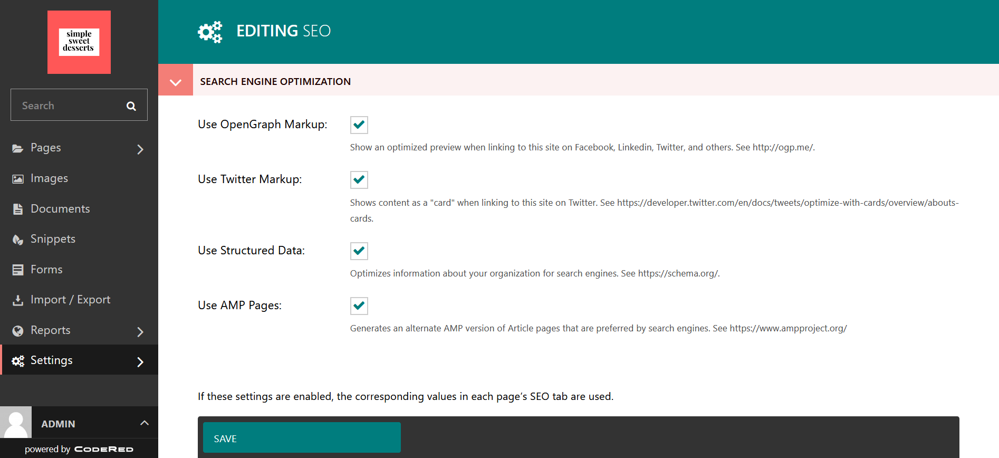
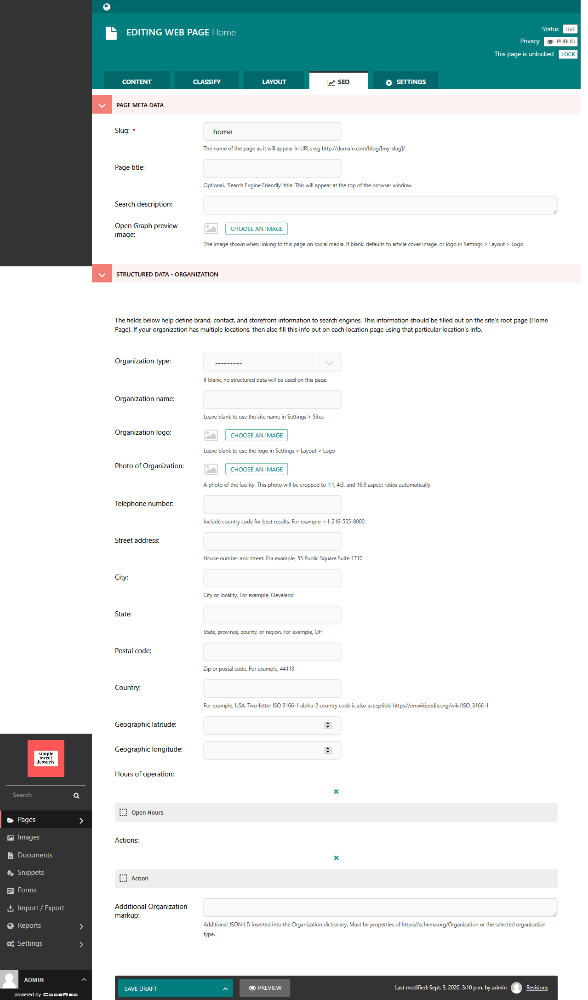

Your First CodeRed Website: Part 8 -- SEO Best Practices
========================================================

Let's do a brief lesson on SEO. This is important because it determines how search engines
rank and index your site on the web. You should consider SEO when you make your website, so 
that is why we want to cover it here. 

What is SEO?
------------

SEO stands for **Search Engine Optimization**. Basically, you want to optimize searching for your website.
While the algorithms for search engines like Google tend to remain mysterious, one of the ways that search engines
index your site for people to find it is through the use of **keywords**. 

Before you can begin working on the SEO for your site, you need to know what your site is about and who would benefit
from finding it. What kinds of questions would those potential customers or website visitors ask a search engine? Take the
time to write down these questions. 

Next, pinpoint the keywords that are in your search questions. For our Simple Sweets Desserts company, keywords might be
words like: cupcakes, cakes, bakery, cookies, desserts, sweet treats, etc. So these are the words that we are going to want 
to put in our **metadata** and throughout our site, where appropriate. 

.. note::
    Metadata is not visible on the frontend of the site, but it tells browsers and search engines important information
    about your site. 

Once you have your SEO strategy, you can begin adding it to your site in the CMS!

Adding Global SEO Settings to your site
---------------------------------------

For global SEO settings, go to **Settings > SEO**. This will take you to the SEO admin page.

    The Settings admin for SEO.

SEO settings for best practices are already selected for you, but you can change this if you would like.

Adding SEO to your pages
------------------------

Now you will want to add SEO metadata to your pages in the CMS. This can be easily done from the page editor.
In the admin, navigate to the page that you want to add SEO, click the Edit option, and go to the **SEO tab**
at the top of the page editor. These are the options that you will see in the page-level SEO editor for Home page:

    The page options for SEO in the Home page.

The most important section to fill out is the **Page Meta Data**. 

* **Slug**: This is part of the URL. For example, it would be yoursite.com/home, with the "home" being the slug.

* **Page Title**: You could just use your actual page title, but if you want something more specific or search-engine detailed, you can add one specifically for SEO.

* **Search Description**: This is a tagline or brief description of what the page is about. It should contain the most important keyword/s.

* **Open Graph Preview Image**: If people share your page on social media sites, this sets a small photo to display with the page link.

The Home page has additional options for the Organization, such as open hours, address, organization type, etc., which
search engines like Google use for pulling up company information to display on the search engine page or to find in map applications.

To save it, just **Publish** the page as normal.

Utilizing SEO in your page content
----------------------------------

Once you have your keywords ready and have set up your SEO page metadata, you can think about using SEO strategies
on your page. You do not want to just throw around your keywords without purpose, however; search engines rank 
by **quality of a web page** in addition to the keywords. These are just a few tips for making SEO work for your
pages, but you should read more about SEO and SEO Best Practices in this `SEO Starter Guide from Google <https://support.google.com/webmasters/answer/7451184?hl=en>`_.

1. Use your keyword in your first header or first paragraph of content.

2. Use your keywords appropriately - DO NOT OVERUSE YOUR KEYWORDS TO TRY TO "RIG" SEARCH RESULTS. It will backfire.

3. Write quality content that shows you as an authority for the topic or keyword. Be linkable as a resource for other sites.

4. Link to other high-ranking sites that are relevant to your topic but not your specific keyword. If your article contains research, link to the source.

5. Be truthful. If your page is about cupcakes, don't write about alligators on the same page just because "alligators" may have a higher search ranking. 

 