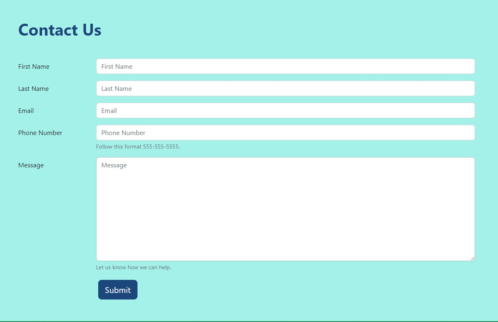

Tutorial Part 8: Forms & Contact Pages
======================================

Now we need a way for our customers to contact us. We could just make a simple
web page with our address, phone number, and email, but we want to make some forms
that specify what our customers are looking for. Good thing there is a special page type
just for forms!

Adding a Form page to your site
-------------------------------

Let's work on the "Contact Us" form we made in part 2 of the tutorial.  Using the side menu select **Pages > Home > Contact Us** Click the pencil or click the title and then edit.
This will take you to the editing screen.

    The editing screen for a form.

Creating the Form page
----------------------

Our contact form is going to be utilitarian, however you can add a hero unit or other content blocks in the body section. Our body section will remain blank.
Click add form fields. You will be presented with this block:

    Adding a form field

* **Label** is the title or name of the form.
* **Help Text** is a prompt or helper text that goes directly beneath the input
* **Required** is a checkbox to decide if the user has to put in a value.  HTML validation will not allow a user to submit a form that doesn't have all the required form fields filled out.
* **Field Type** has all the options for different types of inputs.  (For this demo we will be using different types of text inputs). To learn more, read :ref:`form-fields`
* **Choices** are for the values that checkbox, radio, or dropdown inputs use.
* **Default value** is a value that will be inside the input.

For the "Contact Us" form we want a First Name, Last Name, Email, Phone, and Message field. Notice that we changed **Field type** to match the type of input.
By selecting the correct field type, the input will have better validation.  For instance, the field type "email" will require the input data matches an email format before
it allows the user to submit.  Field type "number" will only allow numbers and some symbols like the dash "-" and ".". This is ideal phone numbers or prices.
Field type "Multi-line text" is great for messages as it gives more space on the page automatically.  Here's our editor and the form after we add these fields **Save draft** and **Preview**.

.. figure:: images/tut08/form_fields_editor.jpeg
    :alt:  form field editor with our inputs

    The form field editor with our inputs.

    Our Contact us form.

Cool, so now let's look at the rest of the settings on the from editing page. Scroll down to the Form Settings section directly below what we just worked on.

* **Thank you page:** you can select a Thank You page (if you've made one).  Here is what you get by default if you don't link a page:

    thank you default

* **Button text** is what the form's submit button says.  It has a default value of "Submit"
* **Button style** is the how the button looks.  Check out `bootstrap buttons <https://getbootstrap.com/docs/5.2/components/buttons/>`_
* **Button size** changes the size of the button.
* **Button CSS Class** A custom CSS style applied to the button.
* **Form CSS Class** A custom CSS class applied to <form> element.
* **Form CSS Class** A custom ID class applied to <form> element.

For CRX-Pharma, let's change the button size to large and leave the rest of the settings as they are.  Next let's look at Form Submissions:

* **Save form submissions** Submissions are saved to database and can be exported at any time.
* **Email form submissions to:** Use this to email form submissions to an email address(es). Separate multiple email addresses by a comma.
* **Reply-to-address** To reply to the submitter, specify the email field here. For example, if a form field above is labeled "Your Email", enter: {{ your_email }}
* **Subject** is to give the email a subject.

For CRX-Pharma, We will leave the email part blank but keep **Save form submissions** selected.

Setting up Confirmation Emails
------------------------------

There is also a section to setup confirmation emails.  Confirmation Emails uses Django template language and HTML for best results. To learn more, read :ref:`confirmation-emails`.

.. note::

    By default when running locally, confirmation emails are not sent, but are
    instead printed to the command line.

