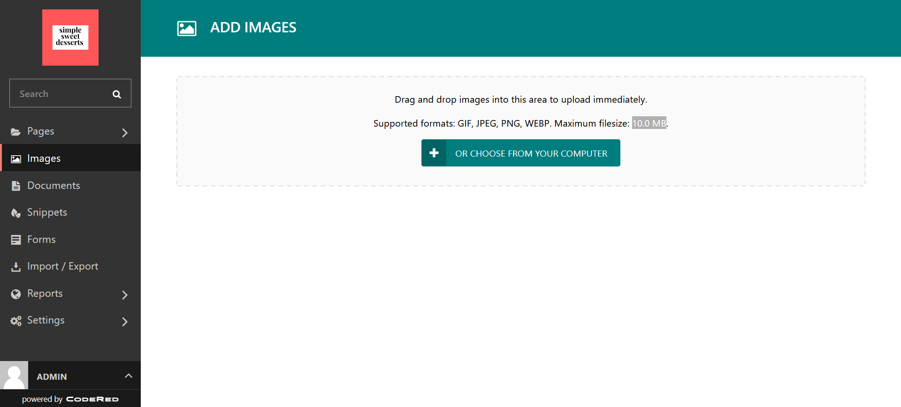
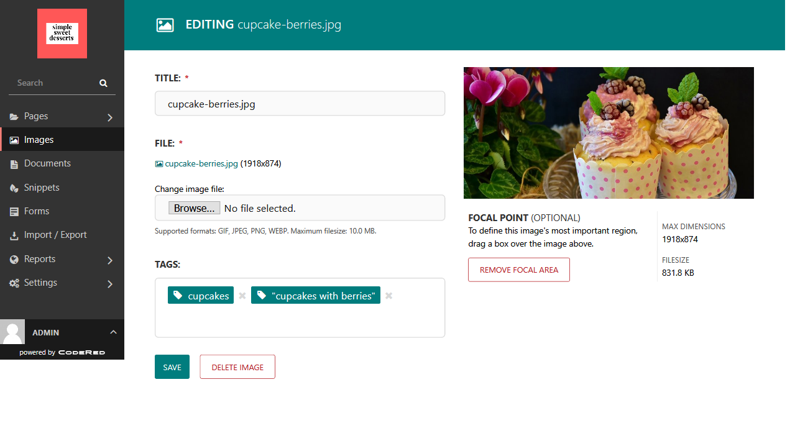

Tutorial Part 9: Images
=======================

The Media you add to your site in the CMS is an important part of your page design. Images catch people's eyes,
and good images make good impressions. Let's go over some ways that you can optimize your images for
your website.

Preparing your images for upload
--------------------------------

The CMS will accept the following file types for images:

* **GIF**

* **JPEG/JPG**

* **PNG**

* **WEBP**

If your image is not saved in any of these formats, you need to convert your image or save your image again
in one of these formats.

To keep your website fast, large image files should never be uploaded. If your
image file exceeds **10.0 MB**, it will not be able to be uploaded. You will
need to decrease the file size. This can be done using an editing program, like
Photoshop or `GIMP (free) <https://www.gimp.org/>`_. You can also use sites like
`BeFunky <https://www.befunky.com/>`_ to re-size your images. Make them smaller
by changing the dimensions of the image.

.. note::

    Photos should ideally be no larger than around 200KB to 300KB. A file size
    that is too large will slow down your site. Ideally, images published on a
    website should not be more than 2,000px for the width or the height. Check
    out this awesome tutorial on `Image Sizes from Shutterstock
    <https://www.shutterstock.com/blog/common-aspect-ratios-photo-image-sizes>`_
    to learn more.

In some cases, you may want to crop your image so that the part that you want to
focus on is more in the frame.

Ways to upload your images
--------------------------

While you have already practiced uploading images from within the page editors, you can also upload images in bulk.
Go to **Images** from the admin bar. There, you will be able to either drag and drop your images into the upload area,
or upload them from your computer using the upload button. Use descriptive names and/or image tags for the images so
that you can easily search for them and use them in your pages. These tags are for admin use only --- they do not appear
anywhere to visitors of your website.

    The upload admin for Images.

CMS editing tools for images
----------------------------

While the majority of your image editing should be done in an actual image editor, Wagtail does provide some tools to help you
optimize your images for your site.

    The CMS editor for Images.

The title can either be the name of the image or a custom title. You can also add tags to your images for easy searching in the CMS.
The **Focal Point** is optional, but it defines the image's most important region. Move your cursor over the image while you see a + sign,
then release your cursor or mouse when you have finished defining the focal point.
